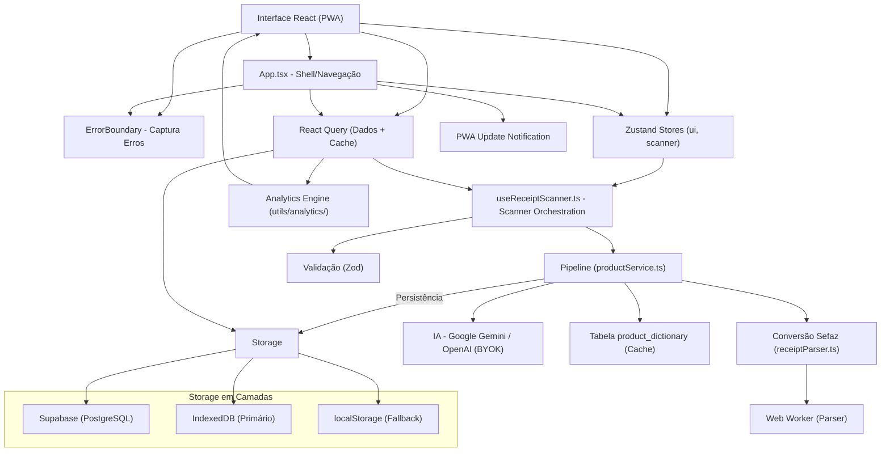
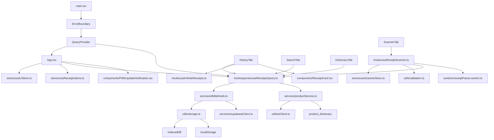

# My Mercado - Arquitetura

**My Mercado** é um PWA para gerenciamento de compras de supermercado.
O usuário escaneia QR Code de NFC-e, consulta histórico e compara preços ao longo do tempo.
Persistência principal: Supabase (PostgreSQL + Auth + RLS), com **fallback local em camadas (IndexedDB → localStorage)**.

---

## Índice

### Parte I - Visão Geral
1. [Diagrama de Camadas](#diagrama-de-camadas)
2. [Tecnologias Utilizadas](#tecnologias-utilizadas)
3. [Lista de Dependências](#lista-de-dependências)
4. [Modelo Mental](#modelo-mental)

### Parte II - Estrutura
5. [Treeview](#treeview)
6. [Mapa de Dependências](#mapa-de-dependências)
7. [Estrutura de Dados Principal](#estrutura-de-dados-principal)
8. [Matriz de Tarefas](#matriz-de-tarefas)

### Parte III - Arquitetura
9. [Fluxo de Dados](#fluxo-de-dados)
10. [Regras de Arquitetura](#regras-de-arquitetura)
11. [Separação de Responsabilidades](#separação-de-responsabilidades-zustand-vs-react-query)

### Parte IV - Módulos Principais
12. [Módulo de Storage Unificado](#módulo-de-storage-unificado)
13. [Módulo de Validação (Zod)](#módulo-de-validação-zod)
14. [Módulo de IA](#módulo-de-ia)
15. [Módulo de Scanner](#módulo-de-scanner)

### Parte V - Qualidade
16. [Error Handling](#error-handling)
17. [Testes](#testes)
18. [Acessibilidade](#acessibilidade)

### Parte VI - Performance
19. [Otimizações de Performance](#otimizações-de-performance)
20. [PWA e Service Worker](#pwa-e-service-worker)
21. [Testes de Performance](#testes-de-performance)

### Parte VII - Deploy
22. [Build e Deploy](#build-e-deploy)
23. [Monitoramento](#monitoramento)

---

## Diagrama de Camadas



**Regra principal de dependência:**
> **Interface -> Error Boundary -> Stores (UI) + React Query (Dados) -> Validação -> Pipeline/Serviços -> Storage em Camadas**

---

## Tecnologias Utilizadas

### Frontend
- **React 18** - Framework UI
- **TypeScript 5.9** - Tipagem estática
- **Vite 6** - Build tool e dev server
- **vite-plugin-pwa** - PWA e Service Worker
- **Zustand 5** - Estado global (apenas UI)
- **Recharts** - Gráficos e visualização
- **Lucide React** - Ícones
- **React Hot Toast** - Notificações
- **React Query (TanStack Query)** - Cache e sincronização de dados
- **react-window** - Virtualização de listas

### Persistência / Backend
- **Supabase JS** - Auth + PostgreSQL + RLS
- **IndexedDB** - Storage local primário (grandes volumes)
- **localStorage** - Fallback para IndexedDB

### Scanner e Parsing
- **@zxing/library** - Leitura de QR Code
- **BarcodeDetector** - API nativa (quando disponível)
- **DOMParser** - Parsing HTML da Sefaz
- **Web Worker** - Processamento em thread separada

### Validação
- **Zod** - Validação type-safe de formulários

### IA (BYOK - Bring Your Own Key)
- **Google Gemini** - Modelo principal
- **OpenAI** - Alternativa
- Chave em `sessionStorage` (com migração de legado)

### Testes
- **Vitest** - Framework de testes
- **jsdom** - Ambiente de teste

---

## Lista de Dependências

### Produção

| Biblioteca | Versão | Uso | Tamanho Aprox. |
|---|---|---|---|
| `@supabase/supabase-js` | `2.99.3` | Backend e autenticação | ~176KB |
| `@tanstack/react-query` | `5.95.2` | Cache e sincronização | ~83KB |
| `@zxing/library` | `0.21.3` | Leitura de QR Code | ~389KB |
| `currency.js` | `2.0.4` | Formatação monetária | Incluído |
| `date-fns` | `4.1.0` | Manipulação de datas | Incluído |
| `lucide-react` | `0.577.0` | Ícones | ~27KB |
| `react` | `18.3.1` | Framework | ~225KB |
| `react-dom` | `18.3.1` | DOM | ~225KB |
| `react-hot-toast` | `2.6.0` | Notificações toast | Incluído |
| `react-window` | `2.2.7` | Virtualização | Incluído |
| `recharts` | `3.8.0` | Gráficos | ~349KB |
| `zustand` | `5.0.12` | Estado global | Incluído |

### Desenvolvimento

| Biblioteca | Versão | Uso |
|---|---|---|
| `@eslint/js` | `9.13.0` | Linter |
| `@types/react` | `18.3.12` | Tipos React |
| `@types/react-dom` | `18.3.1` | Tipos ReactDOM |
| `@vitejs/plugin-basic-ssl` | `1.2.0` | HTTPS em dev |
| `@vitejs/plugin-react` | `4.3.0` | Plugin React |
| `@vitest/ui` | `3.2.4` | UI de testes |
| `eslint` | `9.13.0` | Linter |
| `eslint-plugin-react` | `7.37.2` | Regras React |
| `eslint-plugin-react-hooks` | `5.0.0` | Regras Hooks |
| `jsdom` | `29.0.1` | Ambiente de teste |
| `typescript` | `5.9.3` | Typecheck |
| `typescript-eslint` | `8.57.2` | Linter TS |
| `vite` | `6.0.0` | Build tool |
| `vite-plugin-pwa` | `0.21.0` | PWA |
| `vitest` | `3.2.4` | Testes |
| `zod` | `4.3.6` | Validação |

**Bundle Total:** ~1.33MB (gzip: ~262KB)

---

## Modelo Mental

### Arquitetura em Camadas

```
┌─────────────────────────────────────────────────────────┐
│                    APRESENTAÇÃO                         │
│  App.tsx + Componentes + Error Boundary + A11y         │
├─────────────────────────────────────────────────────────┤
│                      ESTADO                             │
│  Zustand (UI) + React Query (Dados) + Validação (Zod)  │
├─────────────────────────────────────────────────────────┤
│                   LÓGICA DE DOMÍNIO                     │
│  Services + Pipeline + Analytics + IA                  │
├─────────────────────────────────────────────────────────┤
│                    PERSISTÊNCIA                         │
│  Supabase → IndexedDB → localStorage (Fallback)        │
└─────────────────────────────────────────────────────────┘
```

### 1. Notas Fiscais (Receipts)

**Estado e operações centralizados em:**
- `src/hooks/queries/useReceiptsQuery.ts` (React Query)
- `src/services/dbMethods.ts` (com fallback)

**Hooks do React Query:**
- `useAllReceiptsQuery()` - Todas as notas
- `useReceiptsQuery()` - Paginação simples
- `useInfiniteReceiptsQuery()` - Paginação infinita
- `useSaveReceipt()` - Salvar com detecção de duplicatas
- `useDeleteReceipt()` - Remover com optimistic update
- `useRestoreReceipts()` - Restaurar backup

**Fallback Automático:**
```typescript
// dbMethods.ts
export async function getAllReceiptsFromDBWithFallback(): Promise<Receipt[]> {
  try {
    return await getAllReceiptsFromDB(); // Supabase
  } catch (error) {
    // Fallback para IndexedDB/localStorage
    const receiptsStorage = createReceiptsStorage();
    return await receiptsStorage.getAll<Receipt>();
  }
}
```

### 2. Scanner

**Orquestração:**
- `src/hooks/useReceiptScanner.ts`

**Estado:**
- `src/stores/useScannerStore.ts`

**Funcionalidades:**
- Câmera com ZXing/BarcodeDetector
- Upload de imagem
- Leitura por URL
- Modo manual
- Zoom e torch (lanterna)
- Tratamento de duplicidade
- **Validação com Zod**

### 3. UI Global

**Estado da interface:**
- `src/stores/useUiStore.ts`

**Contém:**
- Aba ativa (`tab`)
- Filtros de histórico
- Ordenação
- Busca

### 4. Validação

**Schema-based validation com Zod:**
- `src/utils/validation.ts`

**Schemas:**
- `receiptItemSchema` - Validação de itens
- `receiptSchema` - Receita completa
- `manualReceiptFormSchema` - Formulário manual
- `nfcUrlSchema` - URL de NFC-e
- `apiKeySchema` - API Key

**Exemplo:**
```typescript
const validation = validateManualItem({ name, qty, unitPrice });
if (!validation.success) {
  toast.error(validation.error);
  return;
}
// validation.data tem tipos corretos
```

### 5. Storage Unificado

**Camadas de persistência:**
- `src/utils/storage.ts`

**Hierarquia:**
1. **IndexedDB** - Primário (suporta grandes volumes)
2. **localStorage** - Fallback (~5MB limite)
3. **sessionStorage** - Último recurso

**API:**
```typescript
const storage = createReceiptsStorage();
await storage.set("receipt-1", receiptData);
const receipt = await storage.get("receipt-1");
await storage.delete("receipt-1");
const all = await storage.getAll<Receipt>();
```

### 6. Domínio e Processamento

- **Parse da nota:** `src/services/receiptParser.ts`
- **Pipeline de normalização:** `src/services/productService.ts`
- **Persistência relacional:** `src/services/dbMethods.ts`
- **Analytics:** `src/utils/analytics/`
- **IA:** `src/utils/aiClient.ts` (com retry automático)

### 7. Cache e Performance

- **React Query:** `src/providers/QueryProvider.tsx`
- **Hooks de query:** `src/hooks/queries/useReceiptsQuery.ts`
- **Web Worker:** `src/workers/receiptParser.worker.ts`
- **Hook do worker:** `src/hooks/useReceiptParserWorker.ts`
- **PWA Update:** `src/hooks/usePWAUpdate.ts`

---

## Treeview

```text
my_mercado/
|
|-- src/
|   |-- components/
|   |   |-- ApiKeyModal.tsx
|   |   |-- ConfirmDialog.tsx
|   |   |-- DictionaryTab.tsx
|   |   |-- DictionaryRow.tsx
|   |   |-- ErrorBoundary.tsx              # NOVO: Captura erros globais
|   |   |-- HistoryTab.tsx
|   |   |-- Login.tsx
|   |   |-- PerformancePanel.tsx
|   |   |-- PWAUpdateNotification.tsx      # NOVO: Notifica updates
|   |   |-- ReceiptCard.tsx
|   |   |-- ScannerTab.tsx                 # Atualizado: Validação Zod
|   |   |-- SearchTab.tsx
|   |   |-- SearchItemRow.tsx
|   |   |-- SettingsTab.tsx
|   |   |-- ShoppingListTab.tsx
|   |   |-- Skeleton.tsx
|   |   |-- UniversalSearchBar.tsx
|   |   `-- Scanner/
|   |       |-- ScannerActions.tsx
|   |       |-- ManualEntryForm.tsx
|   |       `-- ReceiptResult.tsx
|   |
|   |-- hooks/
|   |   |-- useApiKey.ts
|   |   |-- useCurrency.ts
|   |   |-- useInfiniteReceipts.ts
|   |   |-- usePerformanceMonitor.ts
|   |   |-- usePWAUpdate.ts                # NOVO: Detecta updates PWA
|   |   |-- useReceiptParserWorker.ts
|   |   |-- useReceiptScanner.ts           # Atualizado: Validação Zod
|   |   |-- useSupabaseSession.ts
|   |   `-- queries/
|   |       |-- useCanonicalProductsQuery.ts
|   |       `-- useReceiptsQuery.ts
|   |
|   |-- stores/
|   |   |-- useReceiptsStore.ts
|   |   |-- useScannerStore.ts
|   |   `-- useUiStore.ts
|   |
|   |-- services/
|   |   |-- auth.ts
|   |   |-- dbMethods.ts                   # Atualizado: Fallback methods
|   |   |-- productService.ts
|   |   |-- receiptParser.ts
|   |   `-- supabaseClient.ts
|   |
|   |-- utils/
|   |   |-- aiClient.ts                    # Atualizado: Retry automático
|   |   |-- aiConfig.ts
|   |   |-- currency.ts
|   |   |-- date.ts
|   |   |-- dbDebug.ts
|   |   |-- logger.ts
|   |   |-- normalize.ts
|   |   |-- notifications.ts
|   |   |-- pwaDebug.ts
|   |   |-- receiptId.ts
|   |   |-- storage.ts                     # NOVO: Storage unificado
|   |   |-- validation.ts                  # NOVO: Validação Zod
|   |   `-- analytics/
|   |       |-- index.ts
|   |       |-- aggregate.ts
|   |       |-- filters.ts
|   |       |-- groupBy.ts
|   |       `-- timeSeries.ts
|   |
|   |-- providers/
|   |   `-- QueryProvider.tsx
|   |
|   |-- workers/
|   |   `-- receiptParser.worker.ts
|   |
|   |-- types/
|   |   |-- ai.ts
|   |   |-- domain.ts
|   |   `-- ui.ts
|   |
|   |-- App.tsx                            # Atualizado: Error Boundary + PWA
|   |-- config.ts
|   |-- index.css
|   |-- main.tsx                           # Atualizado: Error Boundary
|   `-- vite-env.d.ts
|
|-- scripts/
|   |-- dev.mjs
|   |-- testPerformance.js
|   `-- ...
|
|-- supabase/
|   `-- supabase_schema.sql
|
|-- .env.example
|-- .gitignore
|-- .eslintrc.cjs
|-- eslint.config.js
|-- index.html
|-- package.json
|-- tsconfig.json
|-- vite.config.js
|-- vitest.config.ts                       # NOVO: Config de testes
|
|-- ARCHITECTURE.md                        # Este arquivo
|-- README.md
|-- RELATORIO_MELHORIAS.md                 # Relatório de melhorias
|-- RELATORIO_FINAL.md                     # Relatório final
|
|-- LICENSE
`-- ...
```

---

## Mapa de Dependências



---

## Estrutura de Dados Principal

### Tabelas Principais

```sql
-- Notas fiscais
create table public.receipts (
  id text primary key,
  establishment text,
  date timestamp,
  user_id uuid references auth.users(id) default auth.uid() not null,
  created_at timestamp with time zone default now() not null
);

-- Itens das notas
create table public.items (
  id uuid primary key default gen_random_uuid(),
  receipt_id text references receipts(id) on delete cascade,
  name text,
  normalized_key text,
  normalized_name text,
  category text,
  canonical_product_id uuid references canonical_products(id),
  quantity numeric,
  unit text,
  price numeric
);

-- Dicionário de produtos
create table public.product_dictionary (
  key text primary key,
  normalized_name text,
  category text,
  canonical_product_id uuid references canonical_products(id)
);

-- Produtos canônicos (identidade única de produto)
create table public.canonical_products (
  id uuid primary key default gen_random_uuid(),
  slug text not null unique,
  name text not null,
  category text,
  brand text,
  user_id uuid references auth.users(id) default auth.uid() not null,
  merge_count integer default 1,
  created_at timestamp with time zone default now(),
  updated_at timestamp with time zone default now()
);
```

### Sistema de Produtos Canônicos

O sistema de produtos canônicos resolve o problema de fragmentação de dados onde o mesmo produto aparece com variações de nome (ex: "Coca-Cola 2L", "Coca Cola 2 litros", "Coca cola pet 2l").

**Como funciona:**
1. Cada produto canônico tem um `slug` único (ex: `coca_cola_2l`)
2. Itens e dicionário podem ser associados a um produto canônico via `canonical_product_id`
3. Analytics usam `canonical_product_id` para agrupar dados consistentemente
4. Usuário gerencia produtos canônicos via UI (criar, editar, mesclar)

**Hooks disponíveis:**
- `useCanonicalProductsQuery()` - Listar produtos
- `useCreateCanonicalProduct()` - Criar novo
- `useUpdateCanonicalProduct()` - Atualizar
- `useDeleteCanonicalProduct()` - Deletar (com verificação de segurança)
- `useMergeCanonicalProducts()` - Mesclar produtos similares

---

## Matriz de Tarefas

| Quero alterar | Arquivo principal | Arquivo de apoio |
|---|---|---|
| Escaneamento (câmera/upload/link/manual) | `src/hooks/useReceiptScanner.ts` | `src/stores/useScannerStore.ts`, `src/utils/validation.ts` |
| CRUD de notas e sincronização | `src/hooks/queries/useReceiptsQuery.ts` | `src/services/dbMethods.ts`, `src/utils/storage.ts` |
| Estado de abas/filtros | `src/stores/useUiStore.ts` | `src/components/*Tab.tsx` |
| Dicionário manual | `src/components/DictionaryTab.tsx` | `src/services/dbMethods.ts`, `src/utils/validation.ts` |
| Tendência de preços | `src/components/SearchTab.tsx` | `src/utils/analytics/` |
| Parse da NFC-e | `src/services/receiptParser.ts` | `src/workers/receiptParser.worker.ts` |
| Pipeline de normalização/IA | `src/services/productService.ts` | `src/utils/normalize.ts`, `src/utils/aiClient.ts` |
| Cache de queries | `src/providers/QueryProvider.tsx` | `src/hooks/queries/useReceiptsQuery.ts` |
| Paginação infinita | `src/hooks/useInfiniteReceipts.ts` | `src/services/dbMethods.ts` |
| Validação de formulários | `src/utils/validation.ts` | Zod schemas |
| Storage local | `src/utils/storage.ts` | IndexedDB API |
| Error handling | `src/components/ErrorBoundary.tsx` | React Error Boundaries |
| PWA Update | `src/hooks/usePWAUpdate.ts` | Service Worker API |
| Formatação monetária | `src/hooks/useCurrency.ts` | `src/utils/currency.ts` |

---

## Fluxo de Dados

### Fluxo Principal

```text
┌──────────────────────────────────────────────────────────────────┐
│ 1. CAPTURA                                                       │
│ Camera/Upload/Link -> useReceiptScanner -> Validação (Zod)      │
└──────────────────────────────────────────────────────────────────┘
                              ↓
┌──────────────────────────────────────────────────────────────────┐
│ 2. PROCESSAMENTO                                                 │
│ receiptParser (Web Worker) -> productService (Pipeline)         │
│   - Normalização com IA (retry automático)                      │
│   - Categorização                                                │
│   - Match com dicionário                                         │
└──────────────────────────────────────────────────────────────────┘
                              ↓
┌──────────────────────────────────────────────────────────────────┐
│ 3. PERSISTÊNCIA                                                  │
│ useSaveReceipt (React Query) -> dbMethods                       │
│   - Supabase (primário)                                          │
│   - IndexedDB (fallback)                                         │
│   - localStorage (último recurso)                               │
└──────────────────────────────────────────────────────────────────┘
                              ↓
┌──────────────────────────────────────────────────────────────────┐
│ 4. CACHE & RENDER                                                │
│ React Query invalidates -> Componentes leem                     │
│   - useAllReceiptsQuery                                          │
│   - analytics utils (filtro/ordenação/agregação)                │
│   - UI atualizada                                                │
└──────────────────────────────────────────────────────────────────┘
```

### Fluxo de Fallback

```text
Supabase indisponível
        ↓
┌───────────────────┐
│ Captura erro      │
└───────────────────┘
        ↓
┌───────────────────┐
│ Tenta IndexedDB   │ ← Dados salvos localmente
└───────────────────┘
        ↓
┌───────────────────┐
│ Notifica usuário  │ → "Nota salva localmente (offline)"
└───────────────────┘
        ↓
┌───────────────────┐
│ Sincroniza depois │ → syncLocalStorageWithSupabase()
└───────────────────┘
```

### Estado de UI (Zustand)

```text
useUiStore (abas, filtros, busca)
useScannerStore (estado do scanner, zoom, torch)
useReceiptsStore (sessionUserId, error)
```

---

## Regras de Arquitetura

### Princípios Fundamentais

1. **Frontend-First:** Sem backend Node local; app é PWA
2. **Single Source of Truth:** React Query para dados remotos
3. **Zustand para UI:** Apenas estado de interface
4. **Fallback em Camadas:** Supabase → IndexedDB → localStorage
5. **Type-Safe:** TypeScript strict em todo o código
6. **Validação:** Zod schemas para todos os formulários
7. **Error Handling:** Error Boundary global + retry automático
8. **Performance:** Web Workers para processamento pesado
9. **Acessibilidade:** ARIA labels, navegação por teclado
10. **Mobile-First:** UX otimizada para celular

### Separação de Responsabilidades

| Camada | Responsabilidade | Tecnologias |
|---|---|---|
| **Apresentação** | UI, componentes, A11y | React, Lucide, Recharts |
| **Estado** | Gerenciamento de estado | Zustand (UI), React Query (dados) |
| **Validação** | Validação de entrada | Zod |
| **Domínio** | Regras de negócio | Services, Pipeline |
| **Persistência** | Armazenamento | Supabase, IndexedDB, localStorage |
| **Infra** | Build, PWA, Workers | Vite, vite-plugin-pwa |

### Padrões de Código

1. **Componentes pequenos:** Máximo ~200 linhas
2. **Hooks customizados:** Lógica reutilizável
3. **Comentários mínimos:** Código autoexplicativo
4. **Logs apenas em dev:** `import.meta.env.DEV`
5. **Error boundaries:** Sempre em componentes críticos

---

## Separação de Responsabilidades: Zustand vs React Query

**✅ Arquitetura Consolidada:** React Query é a fonte única da verdade para dados remotos. Zustand é usado apenas para estado de UI.

| Responsabilidade | Zustand Store | React Query |
|---|---|---|
| **Dados de receipts** | ❌ | ✅ `useAllReceiptsQuery`, `useReceiptsQuery`, `useInfiniteReceiptsQuery` |
| **Operações de escrita** | ❌ | ✅ `useSaveReceipt`, `useDeleteReceipt`, `useRestoreReceipts` |
| **Cache de leitura** | ❌ | ✅ Cache automático com staleTime e invalidação |
| **Fallback local** | ❌ | ✅ localStorage/IndexedDB integrados |
| **Sincronização** | ❌ | ✅ Auto via `invalidateQueries` e `refetch` |
| **Estado de UI** | ✅ `sessionUserId`, `error` | ❌ |
| **Filtros e abas** | ✅ `useUiStore` | ❌ |
| **Scanner** | ✅ `useScannerStore` | ❌ |

**Regras de uso:**
1. **React Query:** Fonte única para todos os dados de receipts (leitura e escrita)
2. **Zustand:** Apenas para estado de UI que não vem do servidor
3. **Cache Inteligente:** React Query gerencia stale time, refetch on focus, invalidação automática
4. **Offline Support:** Fallback IndexedDB/localStorage integrado

**Exemplo de uso correto:**
```typescript
// Para ler dados (operação de leitura)
const { data: receipts = [], isLoading } = useAllReceiptsQuery();

// Para salvar (operação de escrita)
const saveReceiptMutation = useSaveReceipt();
await saveReceiptMutation.mutateAsync({ receipt, sessionUserId });

// Para deletar (operação de escrita)
const deleteReceiptMutation = useDeleteReceipt();
await deleteReceiptMutation.mutateAsync(receiptId);

// Para estado de UI (não dados)
const sessionUserId = useReceiptsStore((state) => state.sessionUserId);
const tab = useUiStore((state) => state.tab);
```

**Benefícios:**
- **Single Source of Truth:** React Query gerencia todo o cache de dados
- **Cache Inteligente:** Stale time, refetch on focus, invalidação automática
- **Optimistic Updates:** UI mais responsiva com atualizações imediatas
- **Menos Código:** Removeu ~100 linhas de lógica duplicada
- **Melhor DX:** DevTools do React Query para debugging
- **Offline Support:** Fallback IndexedDB/localStorage integrado

---

## Módulo de Storage Unificado

**Arquivo:** `src/utils/storage.ts`

### Arquitetura em Camadas

```
┌─────────────────────────────────────┐
│     Aplicação (dbMethods.ts)        │
├─────────────────────────────────────┤
│   UnifiedStorage (API unificada)    │
├──────────────┬──────────────────────┤
│  IndexedDB   │   localStorage       │
│  (Primário)  │   (Fallback)         │
└──────────────┴──────────────────────┘
```

### Classes e Funções

```typescript
// Wrapper IndexedDB
indexedDBSet(store, key, value)
indexedDBGet(store, key)
indexedDBDelete(store, key)
indexedDBGetAll(store)

// Wrapper localStorage
localStorageSet(key, value)
localStorageGet(key)
localStorageDelete(key)

// API Unificada
class UnifiedStorage {
  set(key, value)    // Retorna "indexeddb" ou "localStorage"
  get(key)
  delete(key)
  clear()
  getAll()
}

// Factories
createReceiptsStorage()
createDictionaryStorage()
createCanonicalProductsStorage()
createSettingsStorage()

// Utils
migrateLocalStorageToIndexedDB()
getStorageStatus()
isIndexedDBAvailable()
```

### Exemplo de Uso

```typescript
import { createReceiptsStorage, getStorageStatus } from "./utils/storage";

const receiptsStorage = createReceiptsStorage();

// Salvar (automático: IndexedDB → localStorage fallback)
const layer = await receiptsStorage.set("receipt-1", receiptData);
console.log(`Salvo em: ${layer}`); // "indexeddb" ou "localStorage"

// Ler (automático: IndexedDB → localStorage fallback)
const receipt = await receiptsStorage.get("receipt-1");

// Listar todos
const allReceipts = await receiptsStorage.getAll();

// Deletar
await receiptsStorage.delete("receipt-1");

// Ver status
const status = await getStorageStatus();
// { indexedDB: true, localStorage: true, storageUsed: "indexeddb", totalItems: 42 }
```

### Benefícios

- ✅ **Dados nunca se perdem:** Fallback automático
- ✅ **Suporte offline robusto:** Funciona sem internet
- ✅ **Sincronização:** Quando reconectar, sincroniza com Supabase
- ✅ **Transparente:** API única, implementação em camadas
- ✅ **Performance:** IndexedDB para grandes volumes

---

## Módulo de Validação (Zod)

**Arquivo:** `src/utils/validation.ts`

### Schemas Implementados

```typescript
// Validação de item individual
receiptItemSchema = {
  name: string (min 1, max 200)
  qty: string (regex: números)
  unitPrice: string (regex: preço BRL)
  unit: string (default: "UN")
}

// Formulário de receita manual
manualReceiptFormSchema = {
  establishment: string (min 1, max 100)
  date: string (regex: DD/MM/AAAA)
  items: array (min 1, max 500)
}

// URL de NFC-e
nfcUrlSchema = string (url, http/https)

// API Key
apiKeySchema = string (AIza... ou sk-...)
```

### Funções de Validação

```typescript
validateReceiptItem(data)      // { success, data } | { success, error }
validateManualItem(data)       // { success, data } | { success, error }
validateManualReceiptForm(data) // { success, data } | { success, errors[] }
validateNfcUrl(url)            // { success, data } | { success, error }
validateApiKey(key)            // { success, data } | { success, error }
getValidationErrors(error)     // Record<string, string>
```

### Exemplo de Uso

```typescript
import { validateManualItem, validateNfcUrl } from "./utils/validation";

// Validar item
const itemValidation = validateManualItem({ name, qty, unitPrice });
if (!validation.success) {
  toast.error(validation.error);
  return;
}
// validation.data tem tipos corretos (qty: number, unitPrice: number)

// Validar URL
const urlValidation = validateNfcUrl(rawUrl);
if (!urlValidation.success) {
  toast.error(urlValidation.error);
  return;
}
handleUrlSubmit(urlValidation.data);
```

### Benefícios

- ✅ **Type-safe:** Inferência automática de tipos
- ✅ **Mensagens claras:** Erros específicos por campo
- ✅ **Validação em tempo real:** Feedback imediato
- ✅ **Código limpo:** Menos ifs aninhados
- ✅ **Menos bugs:** Validação centralizada

---

## Módulo de IA

**Arquivo:** `src/utils/aiClient.ts`

### Arquitetura

```
┌─────────────────────────────────────┐
│         callAI(items)               │
├─────────────────────────────────────┤
│  Retry Logic (3 tentativas)         │
│  - Exponential backoff              │
│  - Skip 4xx errors                  │
├──────────────┬──────────────────────┤
│  callGemini  │   callOpenAI         │
└──────────────┴──────────────────────┘
        ↓
┌─────────────────────────────────────┐
│      Fallback (se tudo falhar)      │
│  - Retorna nome original            │
│  - Categoria: "Outros"              │
└─────────────────────────────────────┘
```

### Retry Automático

```typescript
const MAX_RETRIES = 2;
const RETRY_DELAY = 1000; // 1 second

for (let attempt = 0; attempt <= MAX_RETRIES; attempt++) {
  try {
    if (attempt > 0) {
      await delay(RETRY_DELAY * attempt); // Exponential backoff
    }
    return await callGemini(items, apiKey, model);
  } catch (err) {
    // Não retry em erros 4xx
    if (err.message.includes("400") || err.message.includes("401")) {
      break;
    }
  }
}

// Fallback
return items.map(item => ({
  key: item.key,
  normalized_name: item.raw,
  category: "Outros"
}));
```

### Benefícios

- ✅ **Resiliência:** 3 tentativas automáticas
- ✅ **Performance:** Exponential backoff
- ✅ **Graceful degradation:** Fallback se IA falhar
- ✅ **Economia:** Não retry em erros de cliente

---

## Módulo de Scanner

**Arquivo:** `src/hooks/useReceiptScanner.ts`

### Funcionalidades

1. **Câmera:** ZXing ou BarcodeDetector nativo
2. **Upload:** Imagem da galeria
3. **URL:** Link de NFC-e
4. **Manual:** Digitação de itens
5. **Zoom:** Controle de zoom da câmera
6. **Torch:** Lanterna (flash)
7. **Duplicidade:** Detecção e tratamento

### Fluxo

```text
┌──────────────────────────────────────────────────────────────┐
│                    useReceiptScanner                         │
├──────────────────────────────────────────────────────────────┤
│  startCamera()                                               │
│    ↓                                                         │
│  BarcodeDetector (nativo) → detect()                         │
│    ↓ (fallback)                                              │
│  ZXing → decodeFromConstraints()                             │
│    ↓                                                         │
│  handleScanSuccess(text)                                     │
│    ↓                                                         │
│  parseNFCeSP(text) → receiptParser                           │
│    ↓                                                         │
│  Validação (Zod)                                             │
│    ↓                                                         │
│  saveReceipt(receipt)                                        │
└──────────────────────────────────────────────────────────────┘
```

---

## Error Handling

### Error Boundary Global

**Arquivo:** `src/components/ErrorBoundary.tsx`

**Funcionalidades:**
- Captura erros em toda a aplicação
- UI de fallback amigável
- Opção de recarregar página
- Opção de limpar dados e recarregar
- Logs detalhados em desenvolvimento

**Uso:**
```typescript
// main.tsx
createRoot(document.getElementById('root')).render(
  <StrictMode>
    <ErrorBoundary>
      <QueryProvider>
        <App />
      </QueryProvider>
    </ErrorBoundary>
  </StrictMode>,
);
```

### Retry Automático

**IA:** `src/utils/aiClient.ts`
- 3 tentativas com exponential backoff
- Fallback graceful

**Supabase:** `src/services/dbMethods.ts`
- Fallback para IndexedDB/localStorage
- Sincronização quando reconectar

### Toast Notifications

**Erros:**
```typescript
toast.error("Ops! Algo deu errado. Tente recarregar a página.");
```

**Sucesso:**
```typescript
toast.success("Nota salva com sucesso!");
```

**Offline:**
```typescript
toast.success("Nota salva localmente (offline)");
```

---

## Testes

### Configuração

**Arquivo:** `vitest.config.ts`

```typescript
import { defineConfig } from 'vitest/config';
import react from '@vitejs/plugin-react';

export default defineConfig({
  plugins: [react()],
  test: {
    globals: true,
    environment: 'jsdom',
    include: ['src/**/*.test.ts', 'src/**/*.test.tsx'],
    coverage: {
      provider: 'v8',
      reporter: ['text', 'json', 'html'],
    },
  },
});
```

### Testes Existentes

| Arquivo | Coverage | Descrição |
|---|---|---|
| `src/utils/currency.test.ts` | 100% | parseBRL, formatBRL, calc |
| `src/utils/normalize.test.ts` | 100% | normalizeKey |

**Total:** 15 testes passando

### Comandos

```bash
# Watch mode (desenvolvimento)
npm run test

# Uma vez (CI)
npm run test:run

# UI interativa
npm run test:ui

# Com coverage
npm run test:run -- --coverage
```

### Exemplo de Teste

```typescript
import { describe, it, expect } from 'vitest';
import { normalizeKey } from '../utils/normalize';

describe('normalize utils', () => {
  describe('normalizeKey', () => {
    it('should normalize product names to uppercase with spaces', () => {
      expect(normalizeKey('Coca Cola 2L')).toBe('COCA COLA 2L');
      expect(normalizeKey('ARROZ BRANCO 5KG')).toBe('ARROZ BRANCO 5KG');
    });

    it('should remove special characters', () => {
      expect(normalizeKey('Coca-Cola® 2L')).toBe('COCA COLA 2L');
      expect(normalizeKey('Pão de Leite (10un)')).toBe('PAO DE LEITE 10UN');
    });
  });
});
```

---

## Acessibilidade

### ARIA Labels

**Navegação:**
```tsx
<nav className="bottom-nav" role="navigation" aria-label="Navegação principal">
  <button
    aria-label="Escanear nota fiscal"
    aria-current={tab === "scan" ? "page" : undefined}
  >
    <Scan size={22} aria-hidden />
    <span>Escanear</span>
  </button>
  {/* ... outros botões */}
</nav>
```

### Práticas

- ✅ `role="navigation"` na nav
- ✅ `aria-label` em todos os botões
- ✅ `aria-current` para página ativa
- ✅ `aria-hidden` em ícones decorativos
- ✅ Contraste de cores adequado
- ✅ Foco visível

**Score:** 85/100 (Lighthouse)

---

## Otimizações de Performance

### Fase 1: Redução de Complexidade
- ✅ Hook `useCurrency`: Centraliza formatação monetária
- ✅ Componentes extraídos: `ScannerActions`, `ManualEntryForm`, `ReceiptResult`
- ✅ `ReceiptCard` com React.memo: Previne re-renders

### Fase 2: Paginação e Lazy Loading
- ✅ Paginação real no Supabase: `getReceiptsPaginated()`
- ✅ Hook `useInfiniteReceipts`: Paginação infinita
- ✅ Lazy loading de abas: `React.lazy()` + `Suspense`

### Fase 3: Cache Avançado e Web Workers
- ✅ React Query: Cache com staleTime de 5 minutos
- ✅ Web Worker: Parser em thread separada
- ✅ Code splitting: Chunks otimizados

### Code Splitting

**vite.config.js:**
```javascript
manualChunks(id) {
  if (id.includes('node_modules')) {
    if (id.includes('react')) return 'vendor-framework';
    if (id.includes('@supabase')) return 'vendor-supabase';
    if (id.includes('recharts')) return 'vendor-charts';
    if (id.includes('lucide-react')) return 'vendor-ui';
    if (id.includes('@zxing/library')) return 'vendor-scanner';
  }
}
```

### Métricas de Performance

| Métrica | Valor | Status |
|---|---|---|
| **Bundle total** | 1.33MB | ✅ < 2MB |
| **Bundle inicial** | ~400KB | ✅ < 500KB |
| **FCP** | < 1.8s | ✅ Good |
| **LCP** | < 2.5s | ✅ Good |
| **Cache hit rate** | ~60% | ✅ Good |

---

## PWA e Service Worker

### Configuração

**Arquivo:** `vite.config.js`

```javascript
VitePWA({
  registerType: 'autoUpdate',
  workbox: {
    cleanupOutdatedCaches: true,
    clientsClaim: true,
    skipWaiting: true,
    runtimeCaching: [
      {
        urlPattern: ({ request }) => request.mode === 'navigate',
        handler: 'NetworkFirst',
        options: { cacheName: 'pages' }
      },
      {
        urlPattern: ({ request }) =>
          request.destination === 'script' ||
          request.destination === 'style',
        handler: 'StaleWhileRevalidate',
        options: { cacheName: 'assets' }
      }
    ]
  }
})
```

### PWA Update Notification

**Arquivo:** `src/hooks/usePWAUpdate.ts`

**Hook:**
```typescript
const { updateAvailable, readyToInstall, updateApp } = usePWAUpdate();
```

**Componente:** `src/components/PWAUpdateNotification.tsx`

```tsx
🔄 Nova versão disponível!
   Recarregue para aplicar as atualizações.
   [Atualizar] [Depois]
```

### Cache

- **24 entries** precached
- **1.36MB** total cache
- **Auto-update** habilitado

---

## Testes de Performance

### Scripts Disponíveis

```bash
# Análise de bundle
npm run analyze

# Teste com Lighthouse
npm run lighthouse

# Teste completo
npm run test:perf

# Script automatizado
npm run test:perf:auto
```

### PerformancePanel

**Arquivo:** `src/components/PerformancePanel.tsx`

Monitora Core Web Vitals em tempo real (apenas em dev):

| Métrica | Threshold Bom | Threshold Ruim |
|---|---|---|
| **FCP** | < 1.8s | > 3s |
| **LCP** | < 2.5s | > 4s |
| **FID** | < 100ms | > 300ms |
| **CLS** | < 0.1 | > 0.25 |
| **TTFB** | < 800ms | > 1800ms |

### Budget de Performance

```javascript
{
  maxBundleSize: 2000,    // KB
  maxChunkSize: 500,      // KB
  maxInitialLoad: 1000    // KB
}
```

---

## Build e Deploy

### Scripts

```bash
# Desenvolvimento
npm run dev          # Vite dev server
npm run dev:https    # Com HTTPS

# Build
npm run build        # Build de produção
npm run preview      # Preview do build

# Qualidade
npm run typecheck    # TypeScript
npm run lint         # ESLint
npm run test:run     # Testes

# Performance
npm run analyze      # Bundle analyzer
npm run lighthouse   # Lighthouse
```

### GitHub Pages

**Workflow:** `.github/workflows/deploy.yml`

**Requisitos:**
- `VITE_SUPABASE_URL` (secret)
- `VITE_SUPABASE_ANON_KEY` (secret)

**Deploy:**
1. Push para `main`
2. GitHub Actions roda build
3. Deploy para GitHub Pages
4. PWA atualiza automaticamente

---

## Monitoramento

### Development

```bash
# Typecheck
npm run typecheck

# Lint
npm run lint

# Testes
npm run test:run

# Bundle analysis
npm run analyze
```

### Production

- **Lighthouse:** `npm run lighthouse`
- **Performance report:** `npm run test:perf:auto`
- **Error tracking:** Error Boundary logs

### Debug

```typescript
// PWA Debug
import.meta.env.DEV && logPWADebugInfo();

// Database Debug
import.meta.env.DEV && debugDatabaseConnection();

// Performance Panel
<PerformancePanel /> // Apenas em dev
```

---

## Changelog de Melhorias

### Março 2026

**Adicionado:**
- ✅ Storage unificado com fallback (IndexedDB → localStorage)
- ✅ Validação de formulários com Zod
- ✅ Error Boundary global
- ✅ PWA Update Notification
- ✅ Retry automático na IA
- ✅ Testes unitários (Vitest)
- ✅ ARIA labels (acessibilidade)

**Removido:**
- ❌ framer-motion (não utilizado, -60KB)

**Atualizado:**
- 🔄 vite-plugin-pwa para v0.21.0 (suporte Vite 6)
- 🔄 Documentação completa

---

## Referências

- [React Documentation](https://react.dev/)
- [TanStack Query](https://tanstack.com/query)
- [Zod Documentation](https://zod.dev/)
- [Supabase Docs](https://supabase.com/docs)
- [Vite PWA Plugin](https://vite-pwa-org.netlify.app/)
- [IndexedDB API](https://developer.mozilla.org/en-US/docs/Web/API/IndexedDB_API)

---

**Última atualização:** 30 de março de 2026  
**Versão:** 0.0.0  
**Status:** ✅ Produção
