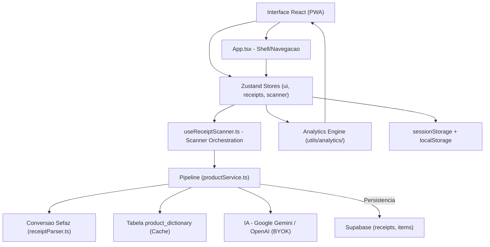
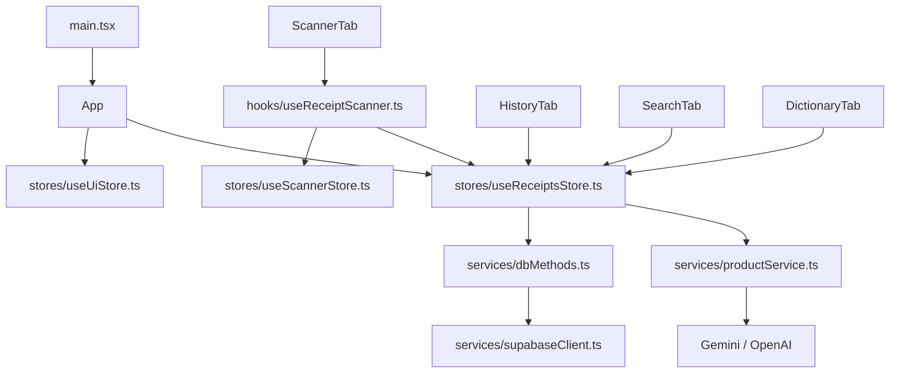

# My Mercado - Arquitetura

**My Mercado** e um PWA para gerenciamento de compras de supermercado.
O usuario escaneia QR Code de NFC-e, consulta historico e compara precos ao longo do tempo.
Persistencia principal: Supabase (PostgreSQL + Auth + RLS), com fallback local.

---

## Indice
1. [Diagrama de Camadas](#diagrama-de-camadas)
2. [Tecnologias Utilizadas](#tecnologias-utilizadas)
3. [Lista de Dependencias](#lista-de-dependencias)
4. [Modelo Mental](#modelo-mental)
5. [Treeview](#treeview)
6. [Mapa de Dependencias](#mapa-de-dependencias)
7. [Estrutura de Dados Principal](#estrutura-de-dados-principal)
8. [Matriz de Tarefas](#matriz-de-tarefas)
9. [Fluxo de Dados](#fluxo-de-dados)
10. [Regras de Arquitetura](#regras-de-arquitetura)

---

## Diagrama de Camadas



Regra principal de dependencia:
**Interface -> Stores/Hook de Scanner -> Analytics -> Pipeline/Servicos -> Supabase/Proxies**

---

## Tecnologias Utilizadas

### Frontend
- React 18
- TypeScript 5.9
- Vite 6
- vite-plugin-pwa
- Zustand 5 (estado global)
- Framer Motion
- Recharts
- Lucide React
- React Hot Toast

### Persistencia / Backend
- Supabase JS (Auth + Postgres + RLS)

### Scanner e Parsing
- @zxing/library
- BarcodeDetector nativo (quando disponivel)
- Parsing HTML da Sefaz via `DOMParser`

### IA (BYOK)
- Google Gemini / OpenAI
- Chave em `sessionStorage` (migracao de legado quando necessario)

---

## Lista de Dependencias

| Biblioteca | Versao |
|---|---|
| `@supabase/supabase-js` | `2.99.3` |
| `@zxing/library` | `0.21.3` |
| `framer-motion` | `12.38.0` |
| `lucide-react` | `0.577.0` |
| `react` | `18.3.1` |
| `react-dom` | `18.3.1` |
| `react-hot-toast` | `2.6.0` |
| `recharts` | `3.8.0` |
| `zustand` | `5.0.12` |

---

## Modelo Mental

### 1. Notas (Receipt)
Estado e operacoes de notas estao centralizados em:
- `src/stores/useReceiptsStore.ts`

Esse store concentra:
- carregamento (`loadReceipts`)
- salvamento (`saveReceipt`)
- remocao (`deleteReceipt`)
- fallback local (`@MyMercado:receipts`)
- sincronizacao por usuario autenticado (`sessionUserId`)

### 2. Scanner
Orquestracao:
- `src/hooks/useReceiptScanner.ts`

Estado do scanner:
- `src/stores/useScannerStore.ts`

Inclui camera, upload, leitura por link, modo manual, zoom/torch e tratamento de duplicidade.

### 3. UI Global
Estado de interface em:
- `src/stores/useUiStore.ts`

Inclui aba ativa, filtros de historico, ordenacao e busca.

### 4. Dominio e processamento
- Parse da nota: `src/services/receiptParser.ts`
- Pipeline de normalizacao/categorizacao: `src/services/productService.ts`
- Persistencia relacional: `src/services/dbMethods.ts`
- Analytics puro: `src/utils/analytics/`

---

## Treeview

```text
my_mercado/
|
|-- src/
|   |-- components/
|   |   |-- ApiKeyModal.tsx
|   |   |-- ConfirmDialog.tsx
|   |   |-- ScannerTab.tsx
|   |   |-- HistoryTab.tsx
|   |   |-- SearchTab.tsx
|   |   |-- DictionaryTab.tsx
|   |   `-- UniversalSearchBar.tsx
|   |
|   |-- hooks/
|   |   |-- useApiKey.ts
|   |   |-- useReceiptScanner.ts
|   |   `-- useSupabaseSession.ts
|   |
|   |-- stores/
|   |   |-- useUiStore.ts
|   |   |-- useReceiptsStore.ts
|   |   `-- useScannerStore.ts
|   |
|   |-- services/
|   |   |-- auth.ts
|   |   |-- dbMethods.ts
|   |   |-- productService.ts
|   |   `-- receiptParser.ts
|   |
|   |-- utils/
|   |   |-- aiConfig.ts
|   |   |-- currency.ts
|   |   |-- date.ts
|   |   `-- analytics/
|   |
|   |-- App.tsx
|   `-- index.css
|
|-- ARCHITECTURE.md
|-- package.json
`-- vite.config.js
```

---

## Mapa de Dependencias



---

## Estrutura de Dados Principal

```sql
create table public.receipts (
  id text primary key,
  establishment text,
  date timestamp,
  user_id uuid references auth.users(id) default auth.uid() not null,
  created_at timestamp with time zone default now() not null
);

create table public.items (
  id uuid primary key default gen_random_uuid(),
  receipt_id text references receipts(id) on delete cascade,
  name text,
  normalized_key text,
  normalized_name text,
  category text,
  quantity numeric,
  unit text,
  price numeric
);

create table public.product_dictionary (
  key text primary key,
  normalized_name text,
  category text
);
```

---

## Matriz de Tarefas

| Quero alterar | Arquivo principal | Arquivo de apoio |
|---|---|---|
| Escaneamento (camera/upload/link/manual) | `src/hooks/useReceiptScanner.ts` | `src/stores/useScannerStore.ts` |
| CRUD de notas e sincronizacao | `src/stores/useReceiptsStore.ts` | `src/services/dbMethods.ts` |
| Estado de abas/filtros | `src/stores/useUiStore.ts` | `src/components/*Tab.tsx` |
| Dicionario manual | `src/components/DictionaryTab.tsx` | `src/services/dbMethods.ts` |
| Tendencia de precos | `src/components/SearchTab.tsx` | `src/utils/analytics/` |
| Parse da NFC-e | `src/services/receiptParser.ts` | - |
| Pipeline de normalizacao/IA | `src/services/productService.ts` | `src/utils/normalize.ts` |

---

## Fluxo de Dados

```text
Camera/Upload/Link -> useReceiptScanner -> receiptParser
-> productService (normaliza/categoriza)
-> useReceiptsStore.saveReceipt
-> dbMethods -> Supabase (receipts + items)

Historico/Pesquisa/Dicionario
-> componentes leem stores (ui + receipts)
-> analytics utils para filtro/ordenacao/agregacao
-> render da UI
```

---

## Regras de Arquitetura

1. Sem backend Node local; app continua frontend-first (PWA).
2. Estado global compartilhado fica em stores Zustand.
3. Componentes de tela nao devem concentrar regra de negocio de persistencia.
4. Parse e logica de dominio ficam em `services/` e hooks tipados.
5. `localStorage` e fallback; fonte principal e Supabase.
6. Mobile-first e UX consistente (confirmacoes, feedback por toast, navegacao inferior).
