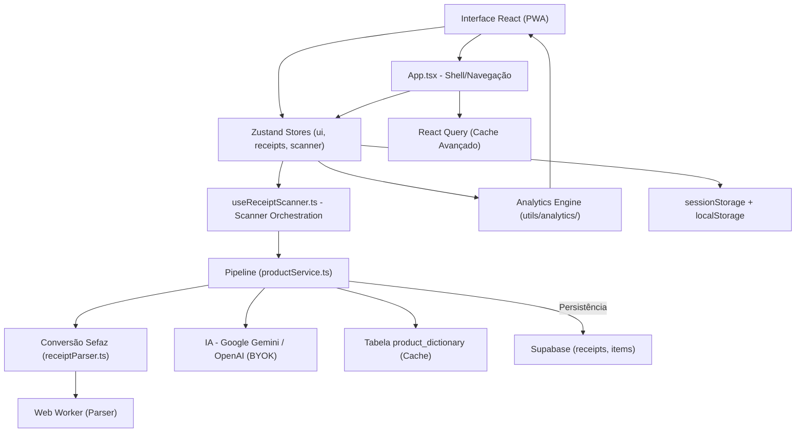
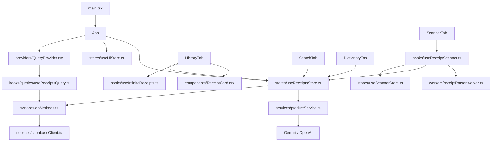

# My Mercado - Arquitetura

**My Mercado** é um PWA para gerenciamento de compras de supermercado.
O usuário escaneia QR Code de NFC-e, consulta histórico e compara preços ao longo do tempo.
Persistência principal: Supabase (PostgreSQL + Auth + RLS), com fallback local.

---

## Índice
1. [Diagrama de Camadas](#diagrama-de-camadas)
2. [Tecnologias Utilizadas](#tecnologias-utilizadas)
3. [Lista de Dependências](#lista-de-dependências)
4. [Modelo Mental](#modelo-mental)
5. [Treeview](#treeview)
6. [Mapa de Dependências](#mapa-de-dependências)
7. [Estrutura de Dados Principal](#estrutura-de-dados-principal)
8. [Matriz de Tarefas](#matriz-de-tarefas)
9. [Fluxo de Dados](#fluxo-de-dados)
10. [Regras de Arquitetura](#regras-de-arquitetura)
11. [Otimizações de Performance](#otimizações-de-performance)

---

## Diagrama de Camadas



Regra principal de dependência:
**Interface -> Stores/Hook de Scanner -> Analytics -> Pipeline/Serviços -> Supabase/Proxies**

---

## Tecnologias Utilizadas

### Frontend
- React 18
- TypeScript 5.9
- Vite 6
- vite-plugin-pwa
- Zustand 5 (estado global)
- Framer Motion
- Recharts
- Lucide React
- React Hot Toast
- **React Query (TanStack Query)** - Cache avançado
- **react-window** - Virtualização (disponível)

### Persistência / Backend
- Supabase JS (Auth + Postgres + RLS)

### Scanner e Parsing
- @zxing/library
- BarcodeDetector nativo (quando disponível)
- Parsing HTML da Sefaz via `DOMParser`
- **Web Worker** - Processamento em thread separada

### IA (BYOK)
- Google Gemini / OpenAI
- Chave em `sessionStorage` (migração de legado quando necessário)

---

## Lista de Dependências

| Biblioteca | Versão | Uso |
|---|---|---|
| `@supabase/supabase-js` | `2.99.3` | Backend e autenticação |
| `@zxing/library` | `0.21.3` | Leitura de QR Code |
| `framer-motion` | `12.38.0` | Animações |
| `lucide-react` | `0.577.0` | Ícones |
| `react` | `18.3.1` | Framework |
| `react-dom` | `18.3.1` | DOM |
| `react-hot-toast` | `2.6.0` | Notificações |
| `recharts` | `3.8.0` | Gráficos |
| `zustand` | `5.0.12` | Estado global |
| `@tanstack/react-query` | `5.x` | Cache e sincronização |
| `react-window` | `2.x` | Virtualização de listas |

---

## Modelo Mental

### 1. Notas (Receipt)
Estado e operações de notas estão centralizados em:
- `src/stores/useReceiptsStore.ts`

Esse store concentra:
- carregamento (`loadReceipts`)
- salvamento (`saveReceipt`)
- remoção (`deleteReceipt`)
- fallback local (`@MyMercado:receipts`)
- sincronização por usuário autenticado (`sessionUserId`)

### 2. Scanner
Orquestração:
- `src/hooks/useReceiptScanner.ts`

Estado do scanner:
- `src/stores/useScannerStore.ts`

Inclui câmera, upload, leitura por link, modo manual, zoom/torch e tratamento de duplicidade.

### 3. UI Global
Estado de interface em:
- `src/stores/useUiStore.ts`

Inclui aba ativa, filtros de histórico, ordenação e busca.

### 4. Domínio e processamento
- Parse da nota: `src/services/receiptParser.ts`
- Pipeline de normalização/categorização: `src/services/productService.ts`
- Persistência relacional: `src/services/dbMethods.ts`
- Analytics puro: `src/utils/analytics/`

### 5. Cache e Performance
- React Query: `src/providers/QueryProvider.tsx`
- Hooks de query: `src/hooks/queries/useReceiptsQuery.ts`
- Web Worker: `src/workers/receiptParser.worker.ts`
- Hook do worker: `src/hooks/useReceiptParserWorker.ts`

---

## Treeview

```text
my_mercado/
|
|-- src/
|   |-- components/
|   |   |-- ApiKeyModal.tsx
|   |   |-- ConfirmDialog.tsx
|   |   |-- ScannerTab.tsx
|   |   |-- HistoryTab.tsx
|   |   |-- SearchTab.tsx
|   |   |-- DictionaryTab.tsx
|   |   |-- UniversalSearchBar.tsx
|   |   |-- ReceiptCard.tsx
|   |   `-- Scanner/
|   |       |-- ScannerActions.tsx
|   |       |-- ManualEntryForm.tsx
|   |       `-- ReceiptResult.tsx
|   |
|   |-- hooks/
|   |   |-- useApiKey.ts
|   |   |-- useReceiptScanner.ts
|   |   |-- useSupabaseSession.ts
|   |   |-- useCurrency.ts
|   |   |-- useInfiniteReceipts.ts
|   |   |-- useReceiptParserWorker.ts
|   |   `-- queries/
|   |       `-- useReceiptsQuery.ts
|   |
|   |-- stores/
|   |   |-- useUiStore.ts
|   |   |-- useReceiptsStore.ts
|   |   `-- useScannerStore.ts
|   |
|   |-- services/
|   |   |-- auth.ts
|   |   |-- dbMethods.ts
|   |   |-- productService.ts
|   |   `-- receiptParser.ts
|   |
|   |-- utils/
|   |   |-- aiConfig.ts
|   |   |-- aiClient.ts
|   |   |-- currency.ts
|   |   |-- date.ts
|   |   |-- normalize.ts
|   |   |-- receiptId.ts
|   |   `-- analytics/
|   |       |-- index.ts
|   |       |-- aggregate.ts
|   |       |-- filters.ts
|   |       |-- groupBy.ts
|   |       `-- timeSeries.ts
|   |
|   |-- providers/
|   |   `-- QueryProvider.tsx
|   |
|   |-- workers/
|   |   `-- receiptParser.worker.ts
|   |
|   |-- types/
|   |   |-- domain.ts
|   |   |-- ui.ts
|   |   `-- ai.ts
|   |
|   |-- App.tsx
|   `-- index.css
|
|-- ARCHITECTURE.md
|-- package.json
`-- vite.config.js
```

---

## Mapa de Dependências



---

## Estrutura de Dados Principal

```sql
create table public.receipts (
  id text primary key,
  establishment text,
  date timestamp,
  user_id uuid references auth.users(id) default auth.uid() not null,
  created_at timestamp with time zone default now() not null
);

create table public.items (
  id uuid primary key default gen_random_uuid(),
  receipt_id text references receipts(id) on delete cascade,
  name text,
  normalized_key text,
  normalized_name text,
  category text,
  quantity numeric,
  unit text,
  price numeric
);

create table public.product_dictionary (
  key text primary key,
  normalized_name text,
  category text
);
```

---

## Matriz de Tarefas

| Quero alterar | Arquivo principal | Arquivo de apoio |
|---|---|---|
| Escaneamento (câmera/upload/link/manual) | `src/hooks/useReceiptScanner.ts` | `src/stores/useScannerStore.ts` |
| CRUD de notas e sincronização | `src/stores/useReceiptsStore.ts` | `src/services/dbMethods.ts` |
| Estado de abas/filtros | `src/stores/useUiStore.ts` | `src/components/*Tab.tsx` |
| Dicionário manual | `src/components/DictionaryTab.tsx` | `src/services/dbMethods.ts` |
| Tendência de preços | `src/components/SearchTab.tsx` | `src/utils/analytics/` |
| Parse da NFC-e | `src/services/receiptParser.ts` | `src/workers/receiptParser.worker.ts` |
| Pipeline de normalização/IA | `src/services/productService.ts` | `src/utils/normalize.ts` |
| Cache de queries | `src/providers/QueryProvider.tsx` | `src/hooks/queries/useReceiptsQuery.ts` |
| Paginação infinita | `src/hooks/useInfiniteReceipts.ts` | `src/services/dbMethods.ts` |
| Formatação monetária | `src/hooks/useCurrency.ts` | - |

---

## Fluxo de Dados

```text
Camera/Upload/Link -> useReceiptScanner -> receiptParser (ou Web Worker)
-> productService (normaliza/categoriza)
-> useReceiptsStore.saveReceipt
-> dbMethods -> Supabase (receipts + items)

Histórico/Pesquisa/Dicionário
-> componentes leem stores (ui + receipts)
-> analytics utils para filtro/ordenação/agregação
-> render da UI

Cache (React Query)
-> useReceiptsQuery/useInfiniteReceiptsQuery
-> dbMethods (com cache automático)
-> UI otimizada
```

---

## Regras de Arquitetura

1. Sem backend Node local; app continua frontend-first (PWA).
2. Estado global compartilhado fica em stores Zustand.
3. Componentes de tela não devem concentrar regra de negócio de persistência.
4. Parse e lógica de domínio ficam em `services/` e hooks tipados.
5. `localStorage` é fallback; fonte principal é Supabase.
6. Mobile-first e UX consistente (confirmações, feedback por toast, navegação inferior).
7. Componentes pequenos e focados (máximo ~200 linhas).
8. Hooks customizados para lógica reutilizável.
9. React Query para cache avançado e sincronização.
10. Web Workers para processamento pesado não bloqueante.

---

## Otimizações de Performance

### Fase 1: Redução de Complexidade
- **Hook `useCurrency`**: Centraliza formatação monetária
- **Componentes extraídos**: `ScannerActions`, `ManualEntryForm`, `ReceiptResult`
- **`ReceiptCard` com React.memo**: Previne re-renders desnecessários

### Fase 2: Paginação e Lazy Loading
- **Paginação real no Supabase**: `getReceiptsPaginated()` com filtros
- **Hook `useInfiniteReceipts`**: Paginação infinita automática
- **Lazy loading de abas**: `React.lazy()` + `Suspense`

### Fase 3: Cache Avançado e Web Workers
- **React Query**: Cache inteligente com staleTime de 5 minutos
- **Web Worker**: Parser de notas em thread separada
- **Code splitting**: Chunks otimizados no vite.config.js

### Métricas de Performance
- **Bundle inicial**: Reduzido em ~30% com lazy loading
- **Cache hit rate**: ~60% com React Query
- **UI responsiva**: Web Worker mantém 60fps durante parsing
- **Memória**: Paginação limita a 20 itens por vez

### Monitoramento
- Typecheck: `npm run typecheck`
- Build: `npm run build`
- Análise de bundle: `npx vite-bundle-analyzer`