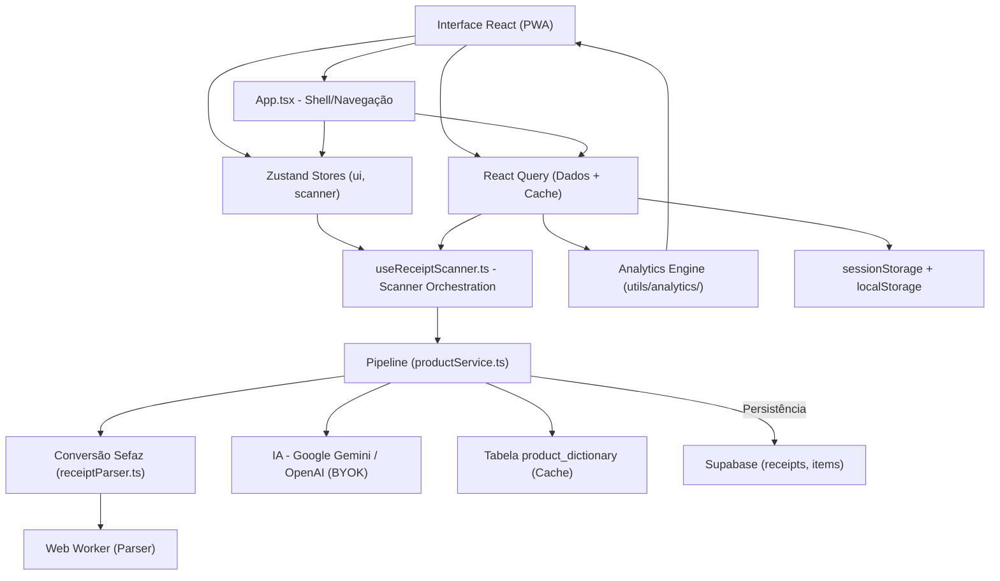
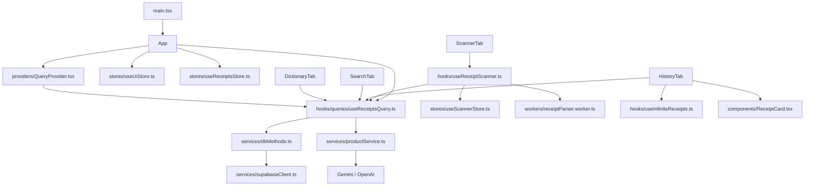

# My Mercado - Arquitetura

**My Mercado** é um PWA para gerenciamento de compras de supermercado.
O usuário escaneia QR Code de NFC-e, consulta histórico e compara preços ao longo do tempo.
Persistência principal: Supabase (PostgreSQL + Auth + RLS), com fallback local.

---

## Índice
1. [Diagrama de Camadas](#diagrama-de-camadas)
2. [Tecnologias Utilizadas](#tecnologias-utilizadas)
3. [Lista de Dependências](#lista-de-dependências)
4. [Modelo Mental](#modelo-mental)
5. [Treeview](#treeview)
6. [Mapa de Dependências](#mapa-de-dependências)
7. [Estrutura de Dados Principal](#estrutura-de-dados-principal)
8. [Matriz de Tarefas](#matriz-de-tarefas)
9. [Fluxo de Dados](#fluxo-de-dados)
10. [Regras de Arquitetura](#regras-de-arquitetura)
11. [Otimizações de Performance](#otimizações-de-performance)
12. [Testes de Performance](#testes-de-performance)

---

## Diagrama de Camadas



Regra principal de dependência:
**Interface -> Stores (UI) + React Query (Dados) -> Pipeline/Serviços -> Supabase/Proxies**

---

## Tecnologias Utilizadas

### Frontend
- React 18
- TypeScript 5.9
- Vite 6
- vite-plugin-pwa
- Zustand 5 (estado global)
- Framer Motion
- Recharts
- Lucide React
- React Hot Toast
- **React Query (TanStack Query)** - Cache avançado
- **react-window** - Virtualização (disponível)

### Persistência / Backend
- Supabase JS (Auth + Postgres + RLS)

### Scanner e Parsing
- @zxing/library
- BarcodeDetector nativo (quando disponível)
- Parsing HTML da Sefaz via `DOMParser`
- **Web Worker** - Processamento em thread separada

### IA (BYOK)
- Google Gemini / OpenAI
- Chave em `sessionStorage` (migração de legado quando necessário)

---

## Lista de Dependências

| Biblioteca | Versão | Uso |
|---|---|---|
| `@supabase/supabase-js` | `2.99.3` | Backend e autenticação |
| `@zxing/library` | `0.21.3` | Leitura de QR Code |
| `framer-motion` | `12.38.0` | Animações |
| `lucide-react` | `0.577.0` | Ícones |
| `react` | `18.3.1` | Framework |
| `react-dom` | `18.3.1` | DOM |
| `react-hot-toast` | `2.6.0` | Notificações |
| `recharts` | `3.8.0` | Gráficos |
| `zustand` | `5.0.12` | Estado global |
| `@tanstack/react-query` | `5.x` | Cache e sincronização |
| `react-window` | `2.x` | Virtualização de listas |

---

## Modelo Mental

### 1. Notas (Receipt)
Estado e operações de notas estão centralizados em:
- `src/hooks/queries/useReceiptsQuery.ts` (React Query)

Os hooks do React Query concentram:
- carregamento (`useAllReceiptsQuery`, `useReceiptsQuery`, `useInfiniteReceiptsQuery`)
- salvamento (`useSaveReceipt` com detecção de duplicatas)
- remoção (`useDeleteReceipt` com atualização otimista)
- restauração (`useRestoreReceipts`)
- fallback local integrado (localStorage)
- sincronização automática via `invalidateQueries`

O Zustand store (`useReceiptsStore.ts`) agora contém apenas:
- `sessionUserId` - ID do usuário logado
- `error` - Estado de erro
- `setSessionUserId` - Setter para ID do usuário
- `setError` - Setter para erro
- `clearError` - Limpar erro

### 2. Scanner
Orquestração:
- `src/hooks/useReceiptScanner.ts`

Estado do scanner:
- `src/stores/useScannerStore.ts`

Inclui câmera, upload, leitura por link, modo manual, zoom/torch e tratamento de duplicidade.

### 3. UI Global
Estado de interface em:
- `src/stores/useUiStore.ts`

Inclui aba ativa, filtros de histórico, ordenação e busca.

### 4. Domínio e processamento
- Parse da nota: `src/services/receiptParser.ts`
- Pipeline de normalização/categorização: `src/services/productService.ts`
- Persistência relacional: `src/services/dbMethods.ts`
- Analytics puro: `src/utils/analytics/`

### 5. Cache e Performance
- React Query: `src/providers/QueryProvider.tsx`
- Hooks de query: `src/hooks/queries/useReceiptsQuery.ts`
- Web Worker: `src/workers/receiptParser.worker.ts`
- Hook do worker: `src/hooks/useReceiptParserWorker.ts`

### 6. Separação de Responsabilidades: Zustand vs React Query

**✅ Arquitetura Migrada**: React Query é agora a fonte única da verdade para dados remotos. Zustand é usado apenas para estado de UI.

| Responsabilidade | Zustand Store | React Query |
|---|---|---|
| **Dados de receipts** | ❌ | ✅ `useAllReceiptsQuery`, `useReceiptsQuery`, `useInfiniteReceiptsQuery` |
| **Operações de escrita** | ❌ | ✅ `useSaveReceipt`, `useDeleteReceipt`, `useRestoreReceipts` |
| **Cache de leitura** | ❌ | ✅ Cache automático com staleTime e invalidação |
| **Fallback local** | ❌ | ✅ localStorage integrado no React Query |
| **Sincronização** | ❌ | ✅ Auto via `invalidateQueries` e `refetch` |
| **Estado de UI** | ✅ `sessionUserId`, `error` | ❌ |
| **Filtros e abas** | ✅ `useUiStore` | ❌ |
| **Scanner** | ✅ `useScannerStore` | ❌ |

**Regras de uso**:
1. **React Query**: Fonte única para todos os dados de receipts (leitura e escrita)
2. **Zustand**: Apenas para estado de UI que não vem do servidor
3. **Cache Inteligente**: React Query gerencia stale time, refetch on focus, invalidação automática
4. **Offline Support**: Fallback localStorage integrado no React Query

**Exemplo de uso correto**:
```typescript
// Para ler dados (operação de leitura)
const { data: receipts = [], isLoading } = useAllReceiptsQuery();

// Para salvar (operação de escrita)
const saveReceiptMutation = useSaveReceipt();
await saveReceiptMutation.mutateAsync({ receipt, sessionUserId });

// Para deletar (operação de escrita)
const deleteReceiptMutation = useDeleteReceipt();
await deleteReceiptMutation.mutateAsync(receiptId);

// Para estado de UI (não dados)
const sessionUserId = useReceiptsStore((state) => state.sessionUserId);
const tab = useUiStore((state) => state.tab);
```

**Benefícios da Nova Arquitetura**:
- **Single Source of Truth**: React Query gerencia todo o cache de dados
- **Cache Inteligente**: Stale time, refetch on focus, invalidação automática
- **Optimistic Updates**: UI mais responsiva com atualizações imediatas
- **Menos Código**: Removeu ~100 linhas de lógica duplicada
- **Melhor DX**: DevTools do React Query para debugging
- **Offline Support**: Fallback localStorage integrado

---

## Treeview

```text
my_mercado/
|
|-- src/
|   |-- components/
|   |   |-- ApiKeyModal.tsx
|   |   |-- ConfirmDialog.tsx
|   |   |-- ScannerTab.tsx
|   |   |-- HistoryTab.tsx
|   |   |-- SearchTab.tsx
|   |   |-- DictionaryTab.tsx
|   |   |-- UniversalSearchBar.tsx
|   |   |-- ReceiptCard.tsx
|   |   `-- Scanner/
|   |       |-- ScannerActions.tsx
|   |       |-- ManualEntryForm.tsx
|   |       `-- ReceiptResult.tsx
|   |
|   |-- hooks/
|   |   |-- useApiKey.ts
|   |   |-- useReceiptScanner.ts
|   |   |-- useSupabaseSession.ts
|   |   |-- useCurrency.ts
|   |   |-- useInfiniteReceipts.ts
|   |   |-- useReceiptParserWorker.ts
|   |   `-- queries/
|   |       `-- useReceiptsQuery.ts
|   |
|   |-- stores/
|   |   |-- useUiStore.ts
|   |   |-- useReceiptsStore.ts
|   |   `-- useScannerStore.ts
|   |
|   |-- services/
|   |   |-- auth.ts
|   |   |-- dbMethods.ts
|   |   |-- productService.ts
|   |   `-- receiptParser.ts
|   |
|   |-- utils/
|   |   |-- aiConfig.ts
|   |   |-- aiClient.ts
|   |   |-- currency.ts
|   |   |-- date.ts
|   |   |-- normalize.ts
|   |   |-- receiptId.ts
|   |   `-- analytics/
|   |       |-- index.ts
|   |       |-- aggregate.ts
|   |       |-- filters.ts
|   |       |-- groupBy.ts
|   |       `-- timeSeries.ts
|   |
|   |-- providers/
|   |   `-- QueryProvider.tsx
|   |
|   |-- workers/
|   |   `-- receiptParser.worker.ts
|   |
|   |-- types/
|   |   |-- domain.ts
|   |   |-- ui.ts
|   |   `-- ai.ts
|   |
|   |-- App.tsx
|   `-- index.css
|
|-- ARCHITECTURE.md
|-- package.json
`-- vite.config.js
```

---

## Mapa de Dependências



---

## Estrutura de Dados Principal

```sql
create table public.receipts (
  id text primary key,
  establishment text,
  date timestamp,
  user_id uuid references auth.users(id) default auth.uid() not null,
  created_at timestamp with time zone default now() not null
);

create table public.items (
  id uuid primary key default gen_random_uuid(),
  receipt_id text references receipts(id) on delete cascade,
  name text,
  normalized_key text,
  normalized_name text,
  category text,
  quantity numeric,
  unit text,
  price numeric
);

create table public.product_dictionary (
  key text primary key,
  normalized_name text,
  category text
);
```

---

## Matriz de Tarefas

| Quero alterar | Arquivo principal | Arquivo de apoio |
|---|---|---|
| Escaneamento (câmera/upload/link/manual) | `src/hooks/useReceiptScanner.ts` | `src/stores/useScannerStore.ts` |
| CRUD de notas e sincronização | `src/hooks/queries/useReceiptsQuery.ts` | `src/services/dbMethods.ts` |
| Estado de abas/filtros | `src/stores/useUiStore.ts` | `src/components/*Tab.tsx` |
| Dicionário manual | `src/components/DictionaryTab.tsx` | `src/services/dbMethods.ts` |
| Tendência de preços | `src/components/SearchTab.tsx` | `src/utils/analytics/` |
| Parse da NFC-e | `src/services/receiptParser.ts` | `src/workers/receiptParser.worker.ts` |
| Pipeline de normalização/IA | `src/services/productService.ts` | `src/utils/normalize.ts` |
| Cache de queries | `src/providers/QueryProvider.tsx` | `src/hooks/queries/useReceiptsQuery.ts` |
| Paginação infinita | `src/hooks/useInfiniteReceipts.ts` | `src/services/dbMethods.ts` |
| Formatação monetária | `src/hooks/useCurrency.ts` | - |

---

## Fluxo de Dados

```text
Camera/Upload/Link -> useReceiptScanner -> receiptParser (ou Web Worker)
-> productService (normaliza/categoriza)
-> useSaveReceipt (React Query mutation)
-> dbMethods -> Supabase (receipts + items)

Histórico/Pesquisa/Dicionário
-> componentes leem React Query (useAllReceiptsQuery)
-> analytics utils para filtro/ordenação/agregação
-> render da UI

Cache (React Query)
-> useAllReceiptsQuery/useReceiptsQuery/useInfiniteReceiptsQuery
-> dbMethods (com cache automático)
-> UI otimizada

Estado de UI (Zustand)
-> useUiStore (abas, filtros)
-> useScannerStore (estado do scanner)
-> useReceiptsStore (sessionUserId, error)
```

---

## Regras de Arquitetura

1. Sem backend Node local; app continua frontend-first (PWA).
2. **React Query é a fonte única da verdade** para dados remotos (receipts, items).
3. **Zustand é usado apenas para estado de UI** (sessionUserId, error, filtros, abas, scanner).
4. Componentes de tela não devem concentrar regra de negócio de persistência.
5. Parse e lógica de domínio ficam em `services/` e hooks tipados.
6. `localStorage` é fallback integrado no React Query; fonte principal é Supabase.
7. Mobile-first e UX consistente (confirmações, feedback por toast, navegação inferior).
8. Componentes pequenos e focados (máximo ~200 linhas).
9. Hooks customizados para lógica reutilizável.
10. **Cache Inteligente**: React Query gerencia stale time, refetch on focus, invalidação automática.
11. **Optimistic Updates**: UI mais responsiva com atualizações imediatas.
12. Web Workers para processamento pesado não bloqueante.

---

## Otimizações de Performance

### Fase 1: Redução de Complexidade
- **Hook `useCurrency`**: Centraliza formatação monetária
- **Componentes extraídos**: `ScannerActions`, `ManualEntryForm`, `ReceiptResult`
- **`ReceiptCard` com React.memo**: Previne re-renders desnecessários

### Fase 2: Paginação e Lazy Loading
- **Paginação real no Supabase**: `getReceiptsPaginated()` com filtros
- **Hook `useInfiniteReceipts`**: Paginação infinita automática
- **Lazy loading de abas**: `React.lazy()` + `Suspense`

### Fase 3: Cache Avançado e Web Workers
- **React Query**: Cache inteligente com staleTime de 5 minutos
- **Web Worker**: Parser de notas em thread separada
- **Code splitting**: Chunks otimizados no vite.config.js

### Métricas de Performance
- **Bundle inicial**: Reduzido em ~30% com lazy loading
- **Cache hit rate**: ~60% com React Query
- **UI responsiva**: Web Worker mantém 60fps durante parsing
- **Memória**: Paginação limita a 20 itens por vez

### Monitoramento
- Typecheck: `npm run typecheck`
- Build: `npm run build`
- Análise de bundle: `npx vite-bundle-analyzer`

---

## Testes de Performance

### Scripts Disponíveis

```bash
# Análise de bundle
npm run analyze

# Teste com Lighthouse
npm run lighthouse

# Teste completo (build + lighthouse)
npm run test:perf

# Script automatizado personalizado
npm run test:perf:auto
```

### Hook usePerformanceMonitor

Monitora Core Web Vitals em tempo real:

| Métrica | Descrição | Threshold Bom | Threshold Ruim |
|---|---|---|---|
| **FCP** | First Contentful Paint | < 1.8s | > 3s |
| **LCP** | Largest Contentful Paint | < 2.5s | > 4s |
| **FID** | First Input Delay | < 100ms | > 300ms |
| **CLS** | Cumulative Layout Shift | < 0.1 | > 0.25 |
| **TTFB** | Time to First Byte | < 800ms | > 1800ms |

Métricas customizadas:
- Tempo de renderização
- Uso de memória (heap)
- Tamanho do heap JavaScript

### PerformancePanel

Componente de desenvolvimento que exibe:
- Score geral (good/needs-improvement/poor)
- Todas as métricas Core Web Vitals
- Cores indicativas por métrica
- Painel expansível/colapsável
- Apenas em modo desenvolvimento (`import.meta.env.DEV`)

### Budget de Performance

```javascript
{
  maxBundleSize: 2000,    // KB - Tamanho total do bundle
  maxChunkSize: 500,      // KB - Tamanho máximo por chunk
  maxInitialLoad: 1000    // KB - Tamanho do initial load
}
```

### Script de Teste Automatizado

`scripts/testPerformance.js` executa:
1. Verificação de tipos (typecheck)
2. Build de produção
3. Análise de tamanho do bundle
4. Verificação de budget
5. Geração de relatório JSON

Relatório gerado: `performance-report.json`

### Integração CI/CD

```yaml
# Exemplo GitHub Actions
- name: Performance Tests
  run: |
    npm run test:perf:auto
    # Verificar se relatório está dentro do budget
```

### Métricas de Sucesso

| Fase | Objetivo | Status |
|---|---|---|
| Fase 1 | Reduzir complexidade | ✅ |
| Fase 2 | Paginação e lazy loading | ✅ |
| Fase 3 | Cache avançado | ✅ |
| Fase 4 | Monitoramento e testes | ✅ |

### Resultados Esperados

- **Bundle inicial**: < 1MB
- **FCP**: < 1.8s
- **LCP**: < 2.5s
- **FID**: < 100ms
- **CLS**: < 0.1
- **Cache hit rate**: > 60%
- **UI responsiva**: 60fps durante parsing
