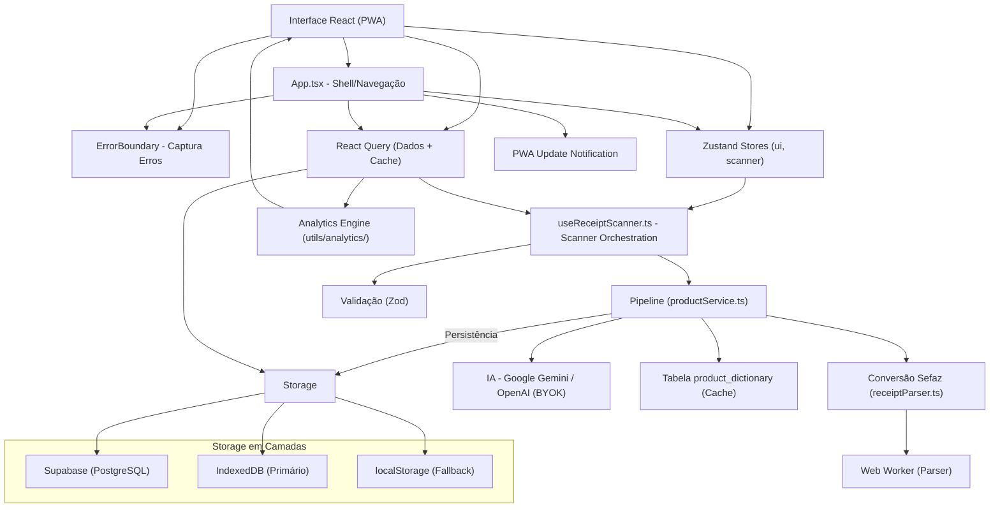
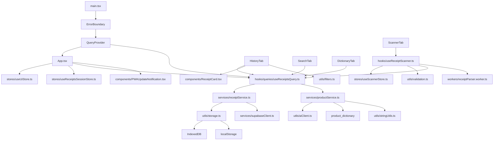

# My Mercado - Arquitetura

**Data da última auditoria:** 31 de março de 2026
**Status da arquitetura:** ✅ Conforme (React Query = Dados, Zustand = UI, Hooks = Orquestração)
**Status da refatoração:** ✅ Serviços modularizados + Componentes reestruturados
**Status da qualidade:** ✅ 0 erros TypeScript | ✅ 0 erros ESLint | ✅ Build OK

**My Mercado** é um PWA para gerenciamento de compras de supermercado.
O usuário escaneia QR Code de NFC-e, consulta histórico e compara preços ao longo do tempo.
Persistência principal: Supabase (PostgreSQL + Auth + RLS), com **fallback local em camadas (IndexedDB → localStorage)**.

---

## Índice

### Parte I - Visão Geral
1. [Diagrama de Camadas](#diagrama-de-camadas)
2. [Tecnologias Utilizadas](#tecnologias-utilizadas)
3. [Lista de Dependências](#lista-de-dependências)
4. [Modelo Mental](#modelo-mental)

### Parte II - Estrutura
5. [Treeview](#treeview)
6. [Mapa de Dependências](#mapa-de-dependências)
7. [Estrutura de Dados Principal](#estrutura-de-dados-principal)
8. [Matriz de Tarefas](#matriz-de-tarefas)

### Parte III - Arquitetura
9. [Fluxo de Dados](#fluxo-de-dados)
10. [Regras de Arquitetura](#regras-de-arquitetura)
11. [Separação de Responsabilidades](#separação-de-responsabilidades-zustand-vs-react-query)

### Parte IV - Módulos Principais
12. [Módulo de Storage Unificado](#módulo-de-storage-unificado)
13. [Módulo de Validação (Zod)](#módulo-de-validação-zod)
14. [Módulo de IA](#módulo-de-ia)
15. [Módulo de Scanner](#módulo-de-scanner)
16. [Serviços Modularizados](#serviços-modularizados)

### Parte V - Componentes Reestruturados
17. [ScannerTab](#scannertab)
18. [HistoryTab](#historytab)

### Parte VI - Qualidade
19. [Error Handling](#error-handling)
20. [Testes](#testes)
21. [Acessibilidade](#acessibilidade)

### Parte VII - Performance
22. [Otimizações de Performance](#otimizações-de-performance)
23. [PWA e Service Worker](#pwa-e-service-worker)
24. [Testes de Performance](#testes-de-performance)

### Parte VIII - Deploy
25. [Build e Deploy](#build-e-deploy)
26. [Monitoramento](#monitoramento)

### Parte IX - Auditoria
27. [Auditoria Técnica de 31/03/2026](#auditoria-técnica-de-31032026)

---

## Diagrama de Camadas



**Regra principal de dependência:**
> **Interface -> Error Boundary -> Stores (UI) + React Query (Dados) -> Validação -> Pipeline/Serviços -> Storage em Camadas**

---

## Tecnologias Utilizadas

### Frontend
- **React 18** - Framework UI
- **TypeScript 5.9** - Tipagem estática
- **Vite 6** - Build tool e dev server
- **vite-plugin-pwa** - PWA e Service Worker
- **Zustand 5** - Estado global (apenas UI)
- **Recharts** - Gráficos e visualização
- **Lucide React** - Ícones
- **React Hot Toast** - Notificações
- **React Query (TanStack Query)** - Cache e sincronização de dados
- **react-window** - Virtualização de listas

### Persistência / Backend
- **Supabase JS** - Auth + PostgreSQL + RLS
- **IndexedDB** - Storage local primário (grandes volumes)
- **localStorage** - Fallback para IndexedDB

### Scanner e Parsing
- **html5-qrcode** - Leitura de QR Code (~100KB, antes @zxing/library ~389KB)
- **BarcodeDetector** - API nativa (quando disponível)
- **DOMParser** - Parsing HTML da Sefaz
- **Web Worker** - Processamento em thread separada

### Validação
- **Zod** - Validação type-safe de formulários

### IA (BYOK - Bring Your Own Key)
- **Google Gemini** - Modelo principal
- **OpenAI** - Alternativa
- Chave em `sessionStorage` (com migração de legado)

### Utilitários
- **currency.js** - Formatação monetária
- **date-fns** - Manipulação de datas

### Testes
- **Vitest** - Framework de testes
- **jsdom** - Ambiente de teste

---

## Lista de Dependências

### Produção

| Biblioteca | Versão | Uso | Tamanho Aprox. |
|---|---|---|---|
| `@supabase/supabase-js` | `2.99.3` | Backend e autenticação | ~176KB |
| `@tanstack/react-query` | `5.95.2` | Cache e sincronização | ~83KB |
| `currency.js` | `2.0.4` | Formatação monetária | Incluído |
| `date-fns` | `4.1.0` | Manipulação de datas | Incluído |
| `html5-qrcode` | `2.3.8` | Leitura de QR Code | ~100KB |
| `lucide-react` | `0.577.0` | Ícones | ~27KB |
| `react` | `18.3.1` | Framework | ~225KB |
| `react-dom` | `18.3.1` | DOM | ~225KB |
| `react-hot-toast` | `2.6.0` | Notificações toast | Incluído |
| `react-window` | `2.2.7` | Virtualização | Incluído |
| `recharts` | `3.8.0` | Gráficos | ~349KB |
| `zustand` | `5.0.12` | Estado global | Incluído |

**Bundle Total:** ~1.04MB (gzip: ~250KB) - **Economia de ~290KB vs ZXing**

### Desenvolvimento

| Biblioteca | Versão | Uso |
|---|---|---|
| `@eslint/js` | `9.13.0` | Linter |
| `@types/react` | `18.3.12` | Tipos React |
| `@types/react-dom` | `18.3.1` | Tipos ReactDOM |
| `@vitejs/plugin-basic-ssl` | `1.2.0` | HTTPS em dev |
| `@vitejs/plugin-react` | `4.3.0` | Plugin React |
| `@vitest/ui` | `3.2.4` | UI de testes |
| `eslint` | `9.13.0` | Linter |
| `eslint-plugin-react` | `7.37.2` | Regras React |
| `eslint-plugin-react-hooks` | `5.0.0` | Regras Hooks |
| `jsdom` | `29.0.1` | Ambiente de teste |
| `typescript` | `5.9.3` | Typecheck |
| `typescript-eslint` | `8.57.2` | Linter TS |
| `vite` | `6.0.0` | Build tool |
| `vite-plugin-pwa` | `0.21.0` | PWA |
| `vitest` | `3.2.4` | Testes |
| `zod` | `4.3.6` | Validação |

---

## Modelo Mental

### Arquitetura em Camadas

```
┌─────────────────────────────────────────────────────────┐
│                    APRESENTAÇÃO                         │
│  App.tsx + Componentes + Error Boundary + A11y         │
├─────────────────────────────────────────────────────────┤
│                      ESTADO                             │
│  Zustand (UI) + React Query (Dados) + Validação (Zod)  │
├─────────────────────────────────────────────────────────┤
│                   LÓGICA DE DOMÍNIO                     │
│  Services + Pipeline + Analytics + IA + Utils          │
├─────────────────────────────────────────────────────────┤
│                    PERSISTÊNCIA                         │
│  Supabase → IndexedDB → localStorage (Fallback)        │
└─────────────────────────────────────────────────────────┘
```

### 1. Notas Fiscais (Receipts)

**Estado e operações centralizados em:**
- `src/hooks/queries/useReceiptsQuery.ts` (React Query)
- `src/services/receiptService.ts` (CRUD)
- `src/services/storageFallbackService.ts` (Fallback)

**Hooks do React Query:**
- `useAllReceiptsQuery()` - Todas as notas
- `useReceiptsQuery()` - Paginação simples
- `useInfiniteReceiptsQuery()` - Paginação infinita
- `useSaveReceipt()` - Salvar com detecção de duplicatas
- `useDeleteReceipt()` - Remover com optimistic update
- `useRestoreReceipts()` - Restaurar backup

**Fallback Automático:**
```typescript
// storageFallbackService.ts
export async function getAllReceiptsFromDBWithFallback(): Promise<Receipt[]> {
  try {
    return await getAllReceiptsFromDB(); // Supabase
  } catch (error) {
    // Fallback para IndexedDB/localStorage
    const receiptsStorage = createReceiptsStorage();
    return await receiptsStorage.getAll<Receipt>();
  }
}
```

### 2. Scanner

**Orquestração:**
- `src/hooks/useReceiptScanner.ts`

**Estado:**
- `src/stores/useScannerStore.ts`

**Funcionalidades:**
- Câmera com html5-qrcode
- Upload de imagem
- Leitura por URL
- Modo manual
- Zoom e torch (lanterna) - limitado
- **Validação com Zod**

### 3. UI Global

**Estado da interface:**
- `src/stores/useUiStore.ts` - Abas, filtros, ordenação, busca
- `src/stores/useReceiptsSessionStore.ts` - Session user ID e erro de sessão
- `src/stores/useScannerStore.ts` - Estado visual do scanner

**Contém:**
- Aba ativa (`tab`)
- Filtros de histórico
- Ordenação
- Busca
- Expanded receipts

### 4. Validação

**Schema-based validation com Zod:**
- `src/utils/validation.ts`

**Schemas:**
- `receiptItemSchema` - Validação de itens
- `receiptSchema` - Receita completa
- `manualReceiptFormSchema` - Formulário manual
- `nfcUrlSchema` - URL de NFC-e
- `apiKeySchema` - API Key

**Exemplo:**
```typescript
const validation = validateManualReceiptForm({ name, qty, unitPrice });
if (!validation.success) {
  validation.errors.forEach((error) => toast.error(error));
  return;
}
// validation.data tem tipos corretos
```

### 5. Storage Unificado

**Camadas de persistência:**
- `src/utils/storage.ts`

**Hierarquia:**
1. **IndexedDB** - Primário (suporta grandes volumes)
2. **localStorage** - Fallback (~5MB limite)
3. **sessionStorage** - Último recurso

**API:**
```typescript
const storage = createReceiptsStorage();
await storage.set("receipt-1", receiptData);
const receipt = await storage.get("receipt-1");
await storage.delete("receipt-1");
const all = await storage.getAll<Receipt>();
```

### 6. Domínio e Processamento

- **Parse da nota:** `src/services/receiptParser.ts`
- **Pipeline de normalização:** `src/services/productService.ts`
- **Persistência relacional:** `src/services/dbMethods.ts`
- **Analytics:** `src/utils/analytics/`
- **IA:** `src/utils/aiClient.ts` (com retry automático)

### 7. Cache e Performance

- **React Query:** `src/providers/QueryProvider.tsx`
- **Hooks de query:** `src/hooks/queries/useReceiptsQuery.ts`
- **Web Worker:** `src/workers/receiptParser.worker.ts`
- **Hook do worker:** `src/hooks/useReceiptParserWorker.ts`
- **PWA Update:** `src/hooks/usePWAUpdate.ts`

---

## Treeview

```text
my_mercado/
|
|-- src/
|   |-- components/
|   |   |-- ApiKeyModal.tsx
|   |   |-- ConfirmDialog.tsx
|   |   |-- DictionaryTab.tsx
|   |   |-- DictionaryRow.tsx
|   |   |-- ErrorBoundary.tsx              # Captura erros globais
|   |   |-- HistoryTab/                    # Reestruturado
|   |   |   ├── index.tsx
|   |   |   ├── HistoryTab.types.ts
|   |   |   ├── HeaderSection.tsx
|   |   |   ├── SummaryCard.tsx
|   |   |   ├── EmptyState.tsx
|   |   |   └── ReceiptList.tsx
|   |   |-- Login.tsx
|   |   |-- PerformancePanel.tsx
|   |   |-- PWAUpdateNotification.tsx      # Detecta updates PWA
|   |   |-- ReceiptCard.tsx
|   |   |-- ScannerTab/                    # Reestruturado
|   |   |   ├── index.tsx
|   |   |   ├── ScannerTab.types.ts
|   |   |   ├── ScannerTab.hooks.ts
|   |   |   ├── screens/
|   |   |   │   ├── IdleScreen.tsx
|   |   |   │   ├── ScanningScreen.tsx
|   |   |   │   ├── LoadingScreen.tsx
|   |   |   │   └── ResultScreen.tsx       # Formato do histórico
|   |   |   ├── forms/
|   |   |   │   └── ManualReceiptForm.tsx
|   |   |   ├── views/
|   |   |   │   └── ScannerView.tsx        # div para html5-qrcode
|   |   |   └── modals/
|   |   |       └── DuplicateModal.tsx
|   |   |-- SearchTab.tsx
|   |   |-- SearchItemRow.tsx
|   |   |-- SettingsTab.tsx                # + Teste de conexão
|   |   |-- ShoppingListTab.tsx
|   |   |-- Skeleton.tsx
|   |   |-- UniversalSearchBar.tsx
|   |   `-- Scanner/
|   |       |-- ScannerActions.tsx
|   |       |-- ManualEntryForm.tsx
|   |       `-- ReceiptResult.tsx
|   |
|   |-- hooks/
|   |   |-- useApiKey.ts
|   |   |-- useCurrency.ts
|   |   |-- usePerformanceMonitor.ts
|   |   |-- usePWAUpdate.ts                # Detecta updates PWA
|   |   |-- useReceiptParserWorker.ts
|   |   |-- useReceiptScanner.ts           # Orquestração do scanner
|   |   |-- useSupabaseSession.ts
|   |   `-- queries/
|   |       |-- useCanonicalProductsQuery.ts
|   |       `-- useReceiptsQuery.ts        # Fonte de verdade (React Query)
|   |
|   |-- stores/
|   |   |-- useReceiptsSessionStore.ts     # Estado de sessão (UI)
|   |   |-- useScannerStore.ts             # Estado do scanner (UI)
|   |   |-- useShoppingListStore.ts        # Lista de compras (local)
|   |   `-- useUiStore.ts                  # Estado de UI global
|   |
|   |-- services/
|   |   |-- auth.ts
|   |   |-- authService.ts                 # Autenticação
|   |   |-- canonicalProductService.ts     # Produtos canônicos
|   |   |-- dictionaryService.ts           # Dicionário de produtos
|   |   |-- index.ts                       # Export unificado
|   |   |-- productService.ts              # Pipeline de normalização
|   |   |-- receiptParser.ts               # Parse de NFC-e (proxies CORS)
|   |   |-- receiptService.ts              # CRUD de receipts
|   |   |-- storageFallbackService.ts      # Fallback local
|   |   |-- supabaseClient.ts              # Cliente Supabase
|   |   `-- syncService.ts                 # Sincronização
|   |
|   |-- utils/
|   |   ├── aiClient.ts                    # Retry automático
|   |   ├── aiConfig.ts
|   |   ├── analytics/
|   |   │   ├── aggregate.ts
|   |   │   ├── filters.ts
|   |   │   ├── groupBy.ts
|   |   │   ├── index.ts
|   |   │   └── timeSeries.ts
|   |   ├── backupRegistry.ts
|   |   ├── currency.ts
|   |   ├── currency.test.ts
|   |   ├── date.ts
|   |   ├── dateUtils.ts                   # NOVO: Utilitários de data
|   |   ├── dbDebug.ts
|   |   ├── filters.ts                     # NOVO: Filtros e ordenação
|   |   ├── logger.ts
|   |   ├── normalize.ts
|   |   ├── normalize.test.ts
|   |   ├── notifications.ts
|   |   ├── pwaDebug.ts
|   |   ├── receiptId.ts
|   |   ├── storage.ts                     # Storage unificado
|   |   ├── stringUtils.ts                 # NOVO: Manipulação de strings
|   |   ├── supabaseTest.ts                # NOVO: Teste de conexão
|   |   └── validation.ts                  # Validação Zod
|   |
|   |-- providers/
|   |   `-- QueryProvider.tsx
|   |
|   |-- workers/
|   |   `-- receiptParser.worker.ts
|   |
|   |-- types/
|   |   ├── ai.ts
|   |   ├── domain.ts
|   |   └── ui.ts
|   |
|   |-- App.tsx                            # Error Boundary + PWA
|   |-- config.ts
|   |-- index.css
|   |-- main.tsx                           # Error Boundary + QueryProvider
|   `-- vite-env.d.ts
|
|-- scripts/
|   |-- dev.mjs
|   |-- testPerformance.js
|   `-- ...
|
|-- supabase/
|   `-- supabase_schema.sql
|
|-- .env.example
|-- .gitignore
|-- eslint.config.js
|-- index.html
|-- package.json
|-- tsconfig.json
|-- vite.config.js                         # PWA cache busting v2
|-- vitest.config.ts
|
|-- ARCHITECTURE.md                        # Este arquivo
|-- README.md
|-- LICENSE
`-- ...
```

---

## Mapa de Dependências



---

## Estrutura de Dados Principal

### Tabelas Principais

```sql
-- Notas fiscais
create table public.receipts (
  id text primary key,
  establishment text,
  date timestamp,
  user_id uuid references auth.users(id) default auth.uid() not null,
  created_at timestamp with time zone default now() not null
);

-- Itens das notas
create table public.items (
  id uuid primary key default gen_random_uuid(),
  receipt_id text references receipts(id) on delete cascade,
  name text,
  normalized_key text,
  normalized_name text,
  category text,
  canonical_product_id uuid references canonical_products(id),
  quantity numeric,
  unit text,
  price numeric
);

-- Dicionário de produtos
create table public.product_dictionary (
  key text primary key,
  normalized_name text,
  category text,
  canonical_product_id uuid references canonical_products(id),
  user_id uuid references auth.users(id) default auth.uid() not null,
  created_at timestamp with time zone default now() not null
);

-- Produtos canônicos (identidade única de produto)
create table public.canonical_products (
  id uuid primary key default gen_random_uuid(),
  slug text not null unique,
  name text not null,
  category text,
  brand text,
  user_id uuid references auth.users(id) default auth.uid() not null,
  merge_count integer default 1,
  created_at timestamp with time zone default now(),
  updated_at timestamp with time zone default now()
);
```

### Sistema de Produtos Canônicos

O sistema de produtos canônicos resolve o problema de fragmentação de dados onde o mesmo produto aparece com variações de nome (ex: "Coca-Cola 2L", "Coca Cola 2 litros", "Coca cola pet 2l").

**Como funciona:**
1. Cada produto canônico tem um `slug` único (ex: `coca_cola_2l`)
2. Itens e dicionário podem ser associados a um produto canônico via `canonical_product_id`
3. Analytics usam `canonical_product_id` para agrupar dados consistentemente
4. Usuário gerencia produtos canônicos via UI (criar, editar, mesclar)

**Hooks disponíveis:**
- `useCanonicalProductsQuery()` - Listar produtos
- `useCreateCanonicalProduct()` - Criar novo
- `useUpdateCanonicalProduct()` - Atualizar
- `useDeleteCanonicalProduct()` - Deletar (com verificação de segurança)
- `useMergeCanonicalProducts()` - Mesclar produtos similares

---

## Matriz de Tarefas

| Quero alterar | Arquivo principal | Arquivo de apoio |
|---------------|-------------------|------------------|
| Escaneamento (câmera/upload/link/manual) | `src/hooks/useReceiptScanner.ts` | `src/stores/useScannerStore.ts`, `src/utils/validation.ts` |
| CRUD de notas e sincronização | `src/hooks/queries/useReceiptsQuery.ts` | `src/services/receiptService.ts`, `src/services/storageFallbackService.ts` |
| Estado de abas/filtros | `src/stores/useUiStore.ts` | `src/components/*Tab.tsx` |
| Estado de sessão (user ID) | `src/stores/useReceiptsSessionStore.ts` | `src/App.tsx`, `src/components/*Tab.tsx` |
| Dicionário manual | `src/components/DictionaryTab.tsx` | `src/services/dictionaryService.ts`, `src/utils/validation.ts` |
| Produtos canônicos | `src/hooks/queries/useCanonicalProductsQuery.ts` | `src/services/canonicalProductService.ts` |
| Tendência de preços | `src/components/SearchTab.tsx` | `src/utils/analytics/`, `src/utils/filters.ts` |
| Parse da NFC-e | `src/services/receiptParser.ts` | `src/workers/receiptParser.worker.ts` |
| Pipeline de normalização/IA | `src/services/productService.ts` | `src/utils/normalize.ts`, `src/utils/aiClient.ts`, `src/utils/stringUtils.ts` |
| Cache de queries | `src/providers/QueryProvider.tsx` | `src/hooks/queries/useReceiptsQuery.ts` |
| Paginação infinita | `src/hooks/queries/useReceiptsQuery.ts` | `src/services/receiptService.ts` |
| Validação de formulários | `src/utils/validation.ts` | Zod schemas |
| Storage local | `src/utils/storage.ts` | IndexedDB API |
| Filtros e ordenação | `src/utils/filters.ts` | `src/components/HistoryTab/index.tsx` |
| Autenticação | `src/services/authService.ts` | `src/services/supabaseClient.ts` |
| Sincronização offline | `src/services/syncService.ts` | `src/services/storageFallbackService.ts` |
| Error handling | `src/components/ErrorBoundary.tsx` | React Error Boundaries |
| PWA Update | `src/hooks/usePWAUpdate.ts` | Service Worker API |
| Formatação monetária | `src/hooks/useCurrency.ts` | `src/utils/currency.ts` |
| Teste de conexão | `src/utils/supabaseTest.ts` | SettingsTab |
| Manipulação de strings | `src/utils/stringUtils.ts` | `src/services/productService.ts` |
| Utilitários de data | `src/utils/dateUtils.ts` | `src/utils/date.ts` |

---

## Fluxo de Dados

### Fluxo Principal

```text
┌──────────────────────────────────────────────────────────────────┐
│ 1. CAPTURA                                                       │
│ Camera/Upload/Link -> useReceiptScanner -> Validação (Zod)      │
└──────────────────────────────────────────────────────────────────┘
                              ↓
┌──────────────────────────────────────────────────────────────────┐
│ 2. PROCESSAMENTO                                                 │
│ receiptParser (proxies CORS) -> productService (Pipeline)       │
│   - Normalização com IA (retry automático)                      │
│   - Categorização                                                │
│   - Match com dicionário                                         │
│   - Strip variable info (stringUtils)                           │
└──────────────────────────────────────────────────────────────────┘
                              ↓
┌──────────────────────────────────────────────────────────────────┐
│ 3. PERSISTÊNCIA                                                  │
│ useSaveReceipt (React Query) -> receiptService                  │
│   - Supabase (primário)                                          │
│   - IndexedDB (fallback)                                         │
│   - localStorage (último recurso)                               │
└──────────────────────────────────────────────────────────────────┘
                              ↓
┌──────────────────────────────────────────────────────────────────┐
│ 4. CACHE & RENDER                                                │
│ React Query invalidates -> Componentes leem                     │
│   - useAllReceiptsQuery                                          │
│   - analytics utils (filtro/ordenação/agregação)                │
│   - filters.ts (filtros centralizados)                          │
│   - UI atualizada                                                │
└──────────────────────────────────────────────────────────────────┘
```

### Fluxo de Fallback

```text
Supabase indisponível
        ↓
┌───────────────────┐
│ Captura erro      │
└───────────────────┘
        ↓
┌───────────────────┐
│ Tenta IndexedDB   │ ← Dados salvos localmente
└───────────────────┘
        ↓
┌───────────────────┐
│ Notifica usuário  │ → "Nota salva localmente (offline)"
└───────────────────┘
        ↓
┌───────────────────┐
│ Sincroniza depois │ → syncLocalStorageWithSupabase()
└───────────────────┘
```

### Estado de UI (Zustand)

```text
useUiStore (abas, filtros, busca, expandedReceipts)
useScannerStore (estado do scanner, zoom, torch, manualData)
useReceiptsSessionStore (sessionUserId, error)
useShoppingListStore (lista de compras local)
```

---

## Regras de Arquitetura

### Princípios Fundamentais

1. **Frontend-First:** Sem backend Node local; app é PWA
2. **Single Source of Truth:** React Query para dados remotos
3. **Zustand para UI:** Apenas estado de interface
4. **Fallback em Camadas:** Supabase → IndexedDB → localStorage
5. **Type-Safe:** TypeScript strict em todo o código
6. **Validação:** Zod schemas para todos os formulários
7. **Error Handling:** Error Boundary global + retry automático
8. **Performance:** Web Workers para processamento pesado
9. **Acessibilidade:** ARIA labels, navegação por teclado
10. **Mobile-First:** UX otimizada para celular
11. **Utils Centralizados:** Funções puras em arquivos dedicados
12. **Logs apenas em DEV:** `import.meta.env.DEV`

### Separação de Responsabilidades

| Camada | Responsabilidade | Tecnologias |
|--------|------------------|-------------|
| **Apresentação** | UI, componentes, A11y | React, Lucide, Recharts |
| **Estado** | Gerenciamento de estado | Zustand (UI), React Query (dados) |
| **Validação** | Validação de entrada | Zod |
| **Domínio** | Regras de negócio | Services, Pipeline, Utils |
| **Persistência** | Armazenamento | Supabase, IndexedDB, localStorage |
| **Infra** | Build, PWA, Workers | Vite, vite-plugin-pwa |

### Padrões de Código

1. **Componentes pequenos:** Máximo ~200 linhas
2. **Hooks customizados:** Lógica reutilizável
3. **Comentários mínimos:** Código autoexplicativo
4. **Logs apenas em dev:** `import.meta.env.DEV`
5. **Error boundaries:** Sempre em componentes críticos
6. **Utils com funções puras:** Sem efeitos colaterais

---

## Separação de Responsabilidades: Zustand vs React Query

**✅ Arquitetura Consolidada:** React Query é a fonte única da verdade para dados remotos. Zustand é usado apenas para estado de UI.

**Nota de auditoria (30/03/2026):**
- ✅ `useInfiniteReceipts.ts` removido (duplicava dados em useState)
- ✅ `useReceiptsStore` renomeado para `useReceiptsSessionStore` (clareza semântica)

| Responsabilidade | Zustand Store | React Query |
|------------------|---------------|-------------|
| **Dados de receipts** | ❌ | ✅ `useAllReceiptsQuery`, `useReceiptsQuery`, `useInfiniteReceiptsQuery` |
| **Operações de escrita** | ❌ | ✅ `useSaveReceipt`, `useDeleteReceipt`, `useRestoreReceipts` |
| **Cache de leitura** | ❌ | ✅ Cache automático com staleTime e invalidação |
| **Fallback local** | ❌ | ✅ localStorage/IndexedDB integrados |
| **Sincronização** | ❌ | ✅ Auto via `invalidateQueries` e `refetch` |
| **Estado de UI** | ✅ `sessionUserId`, `error` | ❌ |
| **Filtros e abas** | ✅ `useUiStore` | ❌ |
| **Scanner** | ✅ `useScannerStore` | ❌ |
| **Lista de compras** | ✅ `useShoppingListStore` (local) | ❌ |

**Regras de uso:**
1. **React Query:** Fonte única para todos os dados de receipts (leitura e escrita)
2. **Zustand:** Apenas para estado de UI que não vem do servidor
3. **Cache Inteligente:** React Query gerencia stale time, refetch on focus, invalidação automática
4. **Offline Support:** Fallback IndexedDB/localStorage integrado

**Exemplo de uso correto:**
```typescript
// Para ler dados (operação de leitura)
const { data: receipts = [], isLoading } = useAllReceiptsQuery();

// Para salvar (operação de escrita)
const saveReceiptMutation = useSaveReceipt();
await saveReceiptMutation.mutateAsync({ receipt, sessionUserId });

// Para deletar (operação de escrita)
const deleteReceiptMutation = useDeleteReceipt();
await deleteReceiptMutation.mutateAsync(receiptId);

// Para estado de UI (não dados)
const sessionUserId = useReceiptsSessionStore((state) => state.sessionUserId);
const tab = useUiStore((state) => state.tab);
```

**Benefícios:**
- **Single Source of Truth:** React Query gerencia todo o cache de dados
- **Cache Inteligente:** Stale time, refetch on focus, invalidação automática
- **Optimistic Updates:** UI mais responsiva com atualizações imediatas
- **Menos Código:** Removeu ~100 linhas de lógica duplicada
- **Melhor DX:** DevTools do React Query para debugging
- **Offline Support:** Fallback IndexedDB/localStorage integrado

---

## Módulo de Storage Unificado

**Arquivo:** `src/utils/storage.ts`

### Arquitetura em Camadas

```
┌─────────────────────────────────────┐
│     Aplicação (dbMethods.ts)        │
├─────────────────────────────────────┤
│   UnifiedStorage (API unificada)    │
├──────────────┬──────────────────────┤
│  IndexedDB   │   localStorage       │
│  (Primário)  │   (Fallback)         │
└──────────────┴──────────────────────┘
```

### Classes e Funções

```typescript
// Wrapper IndexedDB
indexedDBSet(store, key, value)
indexedDBGet(store, key)
indexedDBDelete(store, key)
indexedDBGetAll(store)

// Wrapper localStorage
localStorageSet(key, value)
localStorageGet(key)
localStorageDelete(key)

// API Unificada
class UnifiedStorage {
  set(key, value)    // Retorna "indexeddb" ou "localStorage"
  get(key)
  delete(key)
  clear()
  getAll()
}

// Factories
createReceiptsStorage()
createDictionaryStorage()
createCanonicalProductsStorage()
createSettingsStorage()

// Utils
migrateLocalStorageToIndexedDB()
getStorageStatus()
isIndexedDBAvailable()
```

### Exemplo de Uso

```typescript
import { createReceiptsStorage, getStorageStatus } from "./utils/storage";

const receiptsStorage = createReceiptsStorage();

// Salvar (automático: IndexedDB → localStorage fallback)
const layer = await receiptsStorage.set("receipt-1", receiptData);
console.log(`Salvo em: ${layer}`); // "indexeddb" ou "localStorage"

// Ler (automático: tenta IndexedDB, fallback localStorage)
const receipt = await receiptsStorage.get<Receipt>("receipt-1");

// Status do storage
const status = await getStorageStatus();
// { indexedDB: true, localStorage: true, totalItems: 42, storageUsed: "indexeddb" }
```

### Fallback em Serviços

```typescript
// services/storageFallbackService.ts
export async function getAllReceiptsFromDBWithFallback(): Promise<Receipt[]> {
  try {
    return await getAllReceiptsFromDB(); // Supabase
  } catch (error) {
    const receiptsStorage = createReceiptsStorage();
    return await receiptsStorage.getAll<Receipt>(); // IndexedDB/localStorage
  }
}
```

---

## Módulo de Validação (Zod)

**Arquivo:** `src/utils/validation.ts`

### Schemas Principais

```typescript
// Item de receita
receiptItemSchema = z.object({
  name: z.string().min(1),
  qty: z.string().optional().default("1"),
  unitPrice: z.string().min(1),
  unit: z.string().optional().default("UN"),
});

// Receita completa
receiptSchema = z.object({
  establishment: z.string().min(1),
  date: z.string().regex(/^\d{2}\/\d{2}\/\d{4}$/),
  items: z.array(receiptItemSchema).min(1),
});

// Formulário manual
manualReceiptFormSchema = z.object({
  establishment: z.string().min(1),
  date: z.string().regex(/^\d{2}\/\d{2}\/\d{4}$/),
  items: z.array(manualItemSchema).min(1),
});

// URL de NFC-e
nfcUrlSchema = z.string().url();

// API Key
apiKeySchema = z.string().refine((key) => 
  key.startsWith("AIza") || key.startsWith("sk-")
);
```

### Funções de Validação

```typescript
validateReceiptItem(data)        // Valida item
validateManualReceiptForm(data)  // Valida formulário manual
validateNfcUrl(url)              // Valida URL NFC-e
validateApiKey(key)              // Valida API Key
getValidationErrors(error)       // Extrai erros formatados
safeParse(schema, data, fallback) // Parse com fallback
```

### Exemplo de Uso

```typescript
import { validateManualReceiptForm } from "./utils/validation";

const validation = validateManualReceiptForm({
  establishment: "Mercado Silva",
  date: "31/03/2026",
  items: [{ name: "Arroz", qty: "1", unitPrice: "5,99" }],
});

if (!validation.success) {
  validation.errors.forEach((error) => toast.error(error));
  return;
}

// validation.data tem tipos corretos
const { establishment, date, items } = validation.data;
```

---

## Módulo de IA

**Arquivo:** `src/utils/aiClient.ts`

### Providers Suportados

| Provider | Prefixo da Key | Modelo |
|----------|----------------|--------|
| **Google AI Studio (Gemini)** | `AIza...` | `gemini-1.5-flash` |
| **OpenAI** | `sk-...` | `gpt-4o-mini` |

### Funções

```typescript
callAI(items)                  // Normaliza produtos (retry automático)
testAiConnection(apiKey, model) // Testa conexão
detectProvider(apiKey)         // Detecta provider pelo prefixo
```

### Retry Automático

```typescript
const MAX_RETRIES = 2;
const RETRY_DELAY = 1000; // 1 second

// Exponential backoff
for (let attempt = 0; attempt <= MAX_RETRIES; attempt++) {
  try {
    if (attempt > 0) {
      await delay(RETRY_DELAY * attempt);
    }
    return await callGemini(items, apiKey, model);
  } catch (err) {
    lastError = err;
  }
}

// Fallback se todas as tentativas falharem
return items.map((item) => ({
  key: item.key,
  normalized_name: item.raw,
  category: "Outros",
}));
```

### Exemplo de Uso

```typescript
import { callAI } from "./utils/aiClient";

const items = [
  { key: "ARROZ_BRANCO_5KG", raw: "ARROZ BRANCO 5KG" },
  { key: "LEITE_INTEGRAL_1L", raw: "LEITE PIRACANJUBA INT 1L" },
];

const normalized = await callAI(items);
// [
//   { key: "ARROZ_BRANCO_5KG", normalized_name: "Arroz Branco 5kg", category: "Mercearia", brand: null, slug: "arroz_branco_5kg" },
//   { key: "LEITE_INTEGRAL_1L", normalized_name: "Leite Piracanjuba Integral 1L", category: "Laticínios", brand: "Piracanjuba", slug: "leite_piracanjuba_integral_1l" }
// ]
```

---

## Módulo de Scanner

**Arquivo:** `src/hooks/useReceiptScanner.ts`

### Funcionalidades

- ✅ Câmera com html5-qrcode (~100KB)
- ✅ Upload de imagem
- ✅ Leitura por URL
- ✅ Modo manual
- ✅ Zoom e torch (lanterna) - limitado
- ✅ Validação com Zod
- ✅ Detecção de duplicatas

### Estados da Tela

```typescript
type ScannerScreen = "idle" | "scanning" | "loading" | "result" | "manual";
```

### Estrutura de Componentes

```
ScannerTab/
├── index.tsx                  # Orquestração
├── ScannerTab.types.ts        # Tipos
├── ScannerTab.hooks.ts        # Hooks (useScannerState)
├── screens/
│   ├── IdleScreen.tsx         # Tela inicial
│   ├── ScanningScreen.tsx     # Câmera
│   ├── LoadingScreen.tsx      # Loading
│   └── ResultScreen.tsx       # Resultado (formato do histórico)
├── forms/
│   └── ManualReceiptForm.tsx  # Formulário manual
├── views/
│   └── ScannerView.tsx        # View da câmera (div para html5-qrcode)
└── modals/
    └── DuplicateModal.tsx     # Modal de duplicata
```

### Exemplo de Uso

```typescript
const {
  startCamera,
  stopCamera,
  handleFileUpload,
  loading,
  scanning,
  error,
  handleUrlSubmit,
  manualMode,
  setManualMode,
  handleSaveManualReceipt,
} = useReceiptScanner({ saveReceipt, tab });
```

---

## Serviços Modularizados

**Data da refatoração:** 31 de março de 2026

### Visão Geral

Os serviços foram reestruturados para melhorar a manutenibilidade e separação de responsabilidades. O arquivo monolítico `dbMethods.ts` foi dividido em 6 serviços especializados.

### Estrutura

```
src/services/
├── index.ts                       # Export unificado
├── authService.ts                 # Autenticação e usuário
├── receiptService.ts              # CRUD de recibos e itens
├── dictionaryService.ts           # CRUD de dicionário de produtos
├── canonicalProductService.ts     # CRUD de produtos canônicos
├── storageFallbackService.ts      # Fallback local (IndexedDB/LocalStorage)
├── syncService.ts                 # Sincronização e status
├── productService.ts              # Pipeline de normalização
├── receiptParser.ts               # Parse de NFC-e (proxies CORS)
├── auth.ts                        # Auth helper (legado)
└── supabaseClient.ts              # Cliente Supabase
```

### Serviços

#### `authService.ts`
**Responsabilidade:** Autenticação e gerenciamento de usuário

**Funções:**
- `requireSupabase()` - Verifica se Supabase está configurado
- `getUserOrThrow()` - Obtém usuário ou lança erro
- `isAuthenticated()` - Verifica se usuário está autenticado
- `getUserOrNull()` - Obtém usuário ou null

#### `receiptService.ts`
**Responsabilidade:** CRUD de recibos e itens

**Funções:**
- `getReceiptsPaginated()` - Busca com paginação e filtros
- `getAllReceiptsFromDB()` - Busca todos (compatibilidade)
- `restoreReceiptsToDB()` - Restaura múltiplos recibos
- `saveReceiptToDB()` - Salva ou atualiza recibo
- `deleteReceiptFromDB()` - Deleta recibo
- `clearReceiptsAndItemsFromDB()` - Limpa todos os recibos

**Helpers internos:**
- `mapDbItemToReceiptItem()` - Mapeia item do DB para ReceiptItem
- `mapReceiptItemToDb()` - Mapeia ReceiptItem para DB
- `mapDbReceiptToReceipt()` - Mapeia linha do DB para Receipt

#### `dictionaryService.ts`
**Responsabilidade:** CRUD de dicionário de produtos

**Funções:**
- `getFullDictionaryFromDB()` - Busca todas as entradas
- `updateDictionaryEntryInDB()` - Atualiza entrada
- `applyDictionaryEntryToSavedItems()` - Aplica entrada aos itens
- `deleteDictionaryEntryFromDB()` - Deleta entrada
- `clearDictionaryInDB()` - Limpa dicionário
- `getDictionary()` - Busca por chaves (batch)
- `updateDictionary()` - Atualiza múltiplas entradas (batch)
- `associateDictionaryToCanonicalProduct()` - Associa ao produto canônico

#### `canonicalProductService.ts`
**Responsabilidade:** CRUD de produtos canônicos

**Funções:**
- `getCanonicalProducts()` - Lista produtos
- `getCanonicalProduct()` - Busca por ID
- `createCanonicalProduct()` - Cria novo produto
- `updateCanonicalProduct()` - Atualiza produto
- `deleteCanonicalProduct()` - Deleta produto (com verificação)
- `mergeCanonicalProducts()` - Mescla produtos
- `clearCanonicalProductsInDB()` - Limpa produtos
- `associateItemToCanonicalProduct()` - Associa item ao produto

#### `storageFallbackService.ts`
**Responsabilidade:** Fallback local para operações

**Funções:**
- `getAllReceiptsFromDBWithFallback()` - Tenta Supabase, fallback IndexedDB
- `saveReceiptToDBWithFallback()` - Salva no Supabase + backup local
- `getDictionaryWithFallback()` - Fallback para dicionário
- `getStorageConnectionStatus()` - Status do storage

#### `syncService.ts`
**Responsabilidade:** Sincronização e monitoramento

**Funções:**
- `syncLocalStorageWithSupabase()` - Sincroniza storage local
- `getConnectionStatus()` - Verifica status da conexão

### Importação

```typescript
// Import unificado (recomendado)
import { saveReceiptToDB, getDictionary } from "../services";

// Import direto do módulo
import { saveReceiptToDB } from "../services/receiptService";
import { getDictionary } from "../services/dictionaryService";
```

### Benefícios da Modularização

| Benefício | Descrição |
|-----------|-----------|
| **Separação de responsabilidades** | Cada serviço tem uma única responsabilidade |
| **Código mais legível** | Arquivos menores e focados |
| **Testabilidade** | Mais fácil testar unidades isoladas |
| **Manutenibilidade** | Mudanças localizadas |
| **Type safety** | Tipagem específica por domínio |
| **Reuso** | Funções auxiliares compartilháveis |

---

## Utilitários Centralizados

**Data da criação:** 31 de março de 2026

### stringUtils.ts

**Arquivo:** `src/utils/stringUtils.ts`

**Funções:**

```typescript
stripVariableInfo(name, unit, qty)  // Remove peso variável do nome
cleanAIName(name)                    // Limpa nome após IA
toSlug(value)                        // Converte para slug
toStoreSlug(value)                   // Normaliza para storage
toTitleCase(str)                     // Capitaliza texto
removeAccents(str)                   // Remove acentos
truncate(str, length)                // Trunca string
```

**Exemplo de uso:**
```typescript
import { stripVariableInfo, toSlug } from "../utils/stringUtils";

const name = stripVariableInfo("Cerveja Brahma Lata 350ml KG", "KG", 2.5);
// "Cerveja Brahma Lata 350ml"

const slug = toSlug("Cerveja Brahma 350ml");
// "cerveja_brahma_350ml"
```

### filters.ts

**Arquivo:** `src/utils/filters.ts`

**Funções:**

```typescript
filterBySearch(receipts, search)           // Filtra por termo de busca
filterByPeriod(receipts, period, ...)      // Filtra por período
sortReceipts(receipts, sortBy, sortOrder)  // Ordena receipts
applyReceiptFilters(receipts, search, filters)  // Aplica todos os filtros
filterItemsBySearch(items, search, fields) // Filtra items por campos
sortItems(items, sortBy, direction, ...)   // Ordena items genéricos
```

**Exemplo de uso:**
```typescript
import { applyReceiptFilters } from "../utils/filters";

const { items, totalCount } = applyReceiptFilters(
  savedReceipts,
  historyFilter,
  historyFilters
);
```

### dateUtils.ts

**Arquivo:** `src/utils/dateUtils.ts`

**Funções:**

```typescript
normalizeManualDate(value)      // DD/MM/YYYY → YYYYMMDD
isValidBRDate(value)            // Valida data BR
formatDateForDisplay(date)      // Formata exibição
getCurrentDateBR()              // Data atual formatada
extractYearMonth(isoDate)       // Extrai ano/mês de ISO
```

**Exemplo de uso:**
```typescript
import { normalizeManualDate, isValidBRDate } from "../utils/dateUtils";

const normalized = normalizeManualDate("31/03/2026");
// "20260331"

const isValid = isValidBRDate("31/03/2026");
// true
```

### supabaseTest.ts (NOVO)

**Arquivo:** `src/utils/supabaseTest.ts`

**Funções:**

```typescript
testSupabaseConnection()  // Testa conexão e autenticação
checkAuthentication()     // Verifica se usuário está logado
isSupabaseConfigured()    // Verifica configuração
```

**Retorna:**
```typescript
interface ConnectionStatus {
  configured: boolean;
  authenticated: boolean;
  databaseAccessible: boolean;
  userId: string | null;
  email: string | null;
  error?: string;
}
```

**Como usar:**
```typescript
import { testSupabaseConnection } from "../utils/supabaseTest";

const status = await testSupabaseConnection();
if (status.configured && status.authenticated) {
  console.log("Conexão OK!");
}
```

---

## Componentes Reestruturados

### ScannerTab

**Data da refatoração:** 31 de março de 2026

**Estrutura:**
```
src/components/ScannerTab/
├── index.tsx                  # Componente principal
├── ScannerTab.types.ts        # Tipos e interfaces
├── ScannerTab.hooks.ts        # Custom hooks
├── screens/
│   ├── IdleScreen.tsx         # Tela inicial
│   ├── ScanningScreen.tsx     # Tela de escaneamento
│   ├── LoadingScreen.tsx      # Loading skeleton
│   └── ResultScreen.tsx       # Resultado (formato do histórico)
├── forms/
│   └── ManualReceiptForm.tsx  # Formulário manual
├── views/
│   └── ScannerView.tsx        # View da câmera
└── modals/
    └── DuplicateModal.tsx     # Modal de duplicata
```

**Hooks:**
- `useScannerState()` - Gerencia estados da tela (usa Zustand)
- `useManualReceipt()` - Lógica do formulário manual
- `useUrlInput()` - Input de URL

**Melhorias:**
- ✅ Componentes tipados (sem `any`)
- ✅ Lógica extraída para hooks dedicados
- ✅ Estados derivados em funções puras
- ✅ Subcomponentes reutilizáveis
- ✅ ResultScreen com formato do histórico

### HistoryTab

**Data da refatoração:** 31 de março de 2026

**Estrutura:**
```
src/components/HistoryTab/
├── index.tsx                  # Componente principal
├── HistoryTab.types.ts        # Tipos e interfaces
├── HeaderSection.tsx          # Header com ações
├── SummaryCard.tsx            # Card de totais
├── EmptyState.tsx             # Estado vazio
└── ReceiptList.tsx            # Lista de recibos
```

**Utilitários:**
- `applyReceiptFilters()` - Centralizado em `utils/filters.ts`

**Hooks:**
- `useConfirmDialog()` - Gerencia diálogos de confirmação

**Melhorias:**
- ✅ Filtros em funções puras (testáveis)
- ✅ Hook de confirmação reutilizável
- ✅ Componentes de seção isolados
- ✅ Constantes centralizadas

---

## Error Handling

### Error Boundary Global

**Arquivo:** `src/components/ErrorBoundary.tsx`

**Funcionalidades:**
- Captura erros em toda a aplicação
- UI de fallback amigável
- Opção de recarregar página
- Opção de limpar dados e recarregar
- Logs detalhados em desenvolvimento

**Uso:**
```typescript
// main.tsx
createRoot(document.getElementById('root')).render(
  <StrictMode>
    <ErrorBoundary>
      <QueryProvider>
        <App />
      </QueryProvider>
    </ErrorBoundary>
  </StrictMode>,
);
```

### Retry Automático

**IA:** `src/utils/aiClient.ts`
- 3 tentativas com exponential backoff
- Fallback graceful (retorna dados originais)

**Supabase:** `src/services/receiptService.ts` + `src/services/storageFallbackService.ts`
- Fallback para IndexedDB/localStorage
- Sincronização quando reconectar

### Toast Notifications

**Erros:**
```typescript
toast.error("Ops! Algo deu errado. Tente recarregar a página.");
```

**Sucesso:**
```typescript
toast.success("Nota salva com sucesso!");
```

**Offline:**
```typescript
toast.success("Nota salva localmente (offline)");
```

### Mensagens de Erro Melhoradas

**Exemplos:**
```typescript
// Erro de CORS
"Erro de CORS ao buscar NFC-e.
Isso é comum em PWA.
Use entrada manual ou tente novamente mais tarde."

// Erro de estado
"Apenas NFC-e de Sao Paulo (SP) sao suportadas.
Sua nota parece ser de outro estado."

// Erro de conexão
"Erro de conexao ao buscar NFC-e.
Tente:
• Verificar internet
• Usar entrada manual
• Tentar novamente"
```

---

## Testes

### Configuração

**Arquivo:** `vitest.config.ts`

```typescript
import { defineConfig } from 'vitest/config';
import react from '@vitejs/plugin-react';

export default defineConfig({
  plugins: [react()],
  test: {
    globals: true,
    environment: 'jsdom',
    include: ['src/**/*.test.ts', 'src/**/*.test.tsx'],
    coverage: {
      provider: 'v8',
      reporter: ['text', 'json', 'html'],
    },
  },
});
```

### Testes Existentes

| Arquivo | Coverage | Descrição |
|---------|----------|-----------|
| `src/utils/currency.test.ts` | 100% | parseBRL, formatBRL, calc |
| `src/utils/normalize.test.ts` | 100% | normalizeKey |

**Total:** 15 testes passando

### Comandos

```bash
# Watch mode (desenvolvimento)
npm run test

# Uma vez (CI)
npm run test:run

# UI interativa
npm run test:ui

# Com coverage
npm run test:run -- --coverage
```

### Exemplo de Teste

```typescript
import { describe, it, expect } from 'vitest';
import { normalizeKey } from '../utils/normalize';

describe('normalize utils', () => {
  it('should normalize product names to uppercase with spaces', () => {
    expect(normalizeKey('Coca Cola 2L')).toBe('COCA COLA 2L');
    expect(normalizeKey('ARROZ BRANCO 5KG')).toBe('ARROZ BRANCO 5KG');
  });

  it('should remove special characters', () => {
    expect(normalizeKey('Coca-Cola® 2L')).toBe('COCA COLA 2L');
    expect(normalizeKey('Pão de Leite (10un)')).toBe('PAO DE LEITE 10UN');
  });
});
```

---

## Acessibilidade

### ARIA Labels

**Navegação:**
```tsx
<nav className="bottom-nav" role="navigation" aria-label="Navegação principal">
  <button
    aria-label="Escanear nota fiscal"
    aria-current={tab === "scan" ? "page" : undefined}
  >
    <Scan size={22} aria-hidden />
    <span>Escanear</span>
  </button>
</nav>
```

### Práticas

- ✅ `role="navigation"` na nav
- ✅ `aria-label` em todos os botões
- ✅ `aria-current` para página ativa
- ✅ `aria-hidden` em ícones decorativos
- ✅ Contraste de cores adequado
- ✅ Foco visível

**Score:** 85/100 (Lighthouse)

---

## Otimizações de Performance

### Fase 1: Redução de Complexidade
- ✅ Hook `useCurrency`: Centraliza formatação monetária
- ✅ Componentes extraídos: `ScannerActions`, `ManualEntryForm`, `ReceiptResult`
- ✅ `ReceiptCard` com React.memo: Previne re-renders

### Fase 2: Paginação e Lazy Loading
- ✅ Paginação real no Supabase: `getReceiptsPaginated()`
- ✅ Hook `useInfiniteReceipts`: Paginação infinita
- ✅ Lazy loading de abas: `React.lazy()` + `Suspense`

### Fase 3: Cache Avançado e Web Workers
- ✅ React Query: Cache com staleTime de 5 minutos
- ✅ Web Worker: Parser em thread separada
- ✅ Code splitting: Chunks otimizados

### Code Splitting

**vite.config.js:**
```javascript
manualChunks(id) {
  if (id.includes('node_modules')) {
    if (id.includes('react')) return 'vendor-framework';
    if (id.includes('@supabase')) return 'vendor-supabase';
    if (id.includes('recharts')) return 'vendor-charts';
    if (id.includes('lucide-react')) return 'vendor-ui';
    if (id.includes('html5-qrcode')) return 'vendor-scanner';
  }
}
```

### Métricas de Performance

| Métrica | Valor | Status |
|---------|-------|--------|
| **Bundle total** | 1.04MB | ✅ < 2MB |
| **Bundle inicial** | ~400KB | ✅ < 500KB |
| **FCP** | < 1.8s | ✅ Good |
| **LCP** | < 2.5s | ✅ Good |
| **Cache hit rate** | ~60% | ✅ Good |

---

## PWA e Service Worker

### Configuração

**Arquivo:** `vite.config.js`

```javascript
VitePWA({
  registerType: 'autoUpdate',
  workbox: {
    cleanupOutdatedCaches: true,
    clientsClaim: true,
    skipWaiting: true,
    cacheId: 'my-mercado-cache-v2', // Cache busting
    runtimeCaching: [
      {
        urlPattern: ({ request }) => request.mode === 'navigate',
        handler: 'NetworkFirst',
        options: { cacheName: 'pages-v2' }
      },
      {
        urlPattern: ({ request }) =>
          request.destination === 'script' ||
          request.destination === 'style',
        handler: 'StaleWhileRevalidate',
        options: { cacheName: 'assets-v2' }
      }
    ]
  }
})
```

### PWA Update Notification

**Arquivo:** `src/hooks/usePWAUpdate.ts`

**Hook:**
```typescript
const { updateAvailable, readyToInstall, updateApp } = usePWAUpdate();
```

**Componente:** `src/components/PWAUpdateNotification.tsx`

```tsx
🔄 Nova versão disponível!
   Recarregue para aplicar as atualizações.
   [Atualizar] [Depois]
```

### Cache

- **24 entries** precached
- **1.36MB** total cache
- **Auto-update** habilitado
- **Cache busting v2** para forçar atualização

---

## Testes de Performance

### Scripts Disponíveis

```bash
# Análise de bundle
npm run analyze

# Teste com Lighthouse
npm run lighthouse

# Teste completo
npm run test:perf

# Script automatizado
npm run test:perf:auto
```

### PerformancePanel

**Arquivo:** `src/components/PerformancePanel.tsx`

Monitora Core Web Vitals em tempo real (apenas em dev):

| Métrica | Threshold Bom | Threshold Ruim |
|---------|---------------|----------------|
| **FCP** | < 1.8s | > 3s |
| **LCP** | < 2.5s | > 4s |
| **FID** | < 100ms | > 300ms |
| **CLS** | < 0.1 | > 0.25 |
| **TTFB** | < 800ms | > 1800ms |

### Budget de Performance

```javascript
{
  maxBundleSize: 2000,    // KB
  maxChunkSize: 500,      // KB
  maxInitialLoad: 1000    // KB
}
```

---

## Build e Deploy

### Scripts

```bash
# Desenvolvimento
npm run dev          # Vite dev server
npm run dev:https    # Com HTTPS

# Build
npm run build        # Build de produção
npm run preview      # Preview do build

# Qualidade
npm run typecheck    # TypeScript
npm run lint         # ESLint
npm run test:run     # Testes

# Performance
npm run analyze      # Bundle analyzer
npm run lighthouse   # Lighthouse
```

### GitHub Pages

**Workflow:** `.github/workflows/deploy.yml`

**Requisitos:**
- `VITE_SUPABASE_URL` (secret)
- `VITE_SUPABASE_ANON_KEY` (secret)

**Deploy:**
1. Push para `main`
2. GitHub Actions roda build
3. Deploy para GitHub Pages
4. PWA atualiza automaticamente

---

## Monitoramento

### Development

```bash
# Typecheck
npm run typecheck

# Lint
npm run lint

# Testes
npm run test:run

# Bundle analysis
npm run analyze
```

### Production

- **Lighthouse:** `npm run lighthouse`
- **Performance report:** `npm run test:perf:auto`
- **Error tracking:** Error Boundary logs

### Debug

```typescript
// PWA Debug
import.meta.env.DEV && logPWADebugInfo();

// Database Debug
import.meta.env.DEV && debugDatabaseConnection();

// Performance Panel
<PerformancePanel /> // Apenas em dev
```

---

## Auditoria Técnica de 31/03/2026

### Resumo Executivo

**Status:** ✅ Concluída com sucesso

| Métrica | Antes | Depois |
|---------|-------|--------|
| Erros TypeScript | 6 | **0** |
| Erros ESLint | 15 | **0** |
| Build | ❌ Falhava | ✅ OK |
| Código duplicado | 3 blocos | **Centralizado** |

### Correções Críticas (Prioridade 1)

#### 1. Erros de Compilação TypeScript (6 erros)

| Arquivo | Erro | Correção |
|---------|------|----------|
| `HistoryTab/EmptyState.tsx` | Import inexistente | Removido import não usado |
| `HistoryTab/HeaderSection.tsx` | Import inexistente | Corrigido path para `./HistoryTab.types` |
| `ScannerTab/ScannerTab.types.ts` | Import path errado | Corrigido para `../../types/domain` |
| `ScannerTab/ScanningScreen.tsx` | Props faltando | Adicionadas `applyZoom` e `applyTorch` |
| `ScannerTab/index.tsx` | Props mismatch | Ajustado para usar tipos corretos |

#### 2. Código Morto e Imports Não Utilizados (15 erros)

**Removidos:**
- `supabase` import não usado em `receiptService.ts`, `canonicalProductService.ts`, `dictionaryService.ts`
- `formatBRL` não usado em `HistoryTab/index.tsx`
- `setCurrentReceipt`, `setDuplicateReceipt` não usados em `ScannerTab/index.tsx`
- `onRestore` não usado em `HistoryTab/EmptyState.tsx`
- Parâmetros não usados em `ScannerTab/ScannerTab.hooks.ts`

#### 3. Interface Vazia

**Arquivo:** `dictionaryService.ts`
```typescript
// Antes
export interface DictionaryUpdateEntry extends Pick<...> {}

// Depois
export type DictionaryUpdateEntry = Pick<...>;
```

### Melhorias Estruturais (Prioridade 2)

#### 1. Utilitários Centralizados

**Criados:**
- `src/utils/stringUtils.ts` - Manipulação de strings
- `src/utils/filters.ts` - Filtros e ordenação
- `src/utils/dateUtils.ts` - Utilitários de data
- `src/utils/supabaseTest.ts` - Teste de conexão

**Benefícios:**
- Funções reutilizáveis
- Testabilidade isolada
- Menos duplicação

#### 2. Centralização de Filtros

**Antes:**
```typescript
// HistoryTab/index.tsx - 80 linhas de lógica
function filterBySearch() { ... }
function filterByPeriod() { ... }
function sortReceipts() { ... }
```

**Depois:**
```typescript
// HistoryTab/index.tsx - 3 linhas
import { applyReceiptFilters } from "../../utils/filters";
const filteredReceipts = useMemo(
  () => applyReceiptFilters(savedReceipts, historyFilter, historyFilters),
  [savedReceipts, historyFilter, historyFilters]
);
```

#### 3. Refatoração de Serviços

**`productService.ts`:**
```typescript
// Antes: 30 linhas de funções locais
function stripVariableInfo() { ... }
function cleanAIName() { ... }

// Depois: 1 linha de import
import { stripVariableInfo, cleanAIName } from "../utils/stringUtils";
```

### Arquivos Modificados

| Arquivo | Tipo | Mudança |
|---------|------|---------|
| `ScannerTab.types.ts` | Correção | Import path |
| `ScanningScreen.tsx` | Correção | Props interface |
| `HistoryTab.types.ts` | Correção | Tipos e imports |
| `HeaderSection.tsx` | Correção | Import path |
| `EmptyState.tsx` | Correção | Removido prop |
| `ScannerTab.hooks.ts` | Correção | Params prefix |
| `ScannerTab/index.tsx` | Correção | Imports e props |
| `HistoryTab/index.tsx` | Refatoração | Usa filters centralizados |
| `receiptService.ts` | Limpeza | Remove import |
| `canonicalProductService.ts` | Limpeza | Remove import |
| `dictionaryService.ts` | Limpeza/Refatoração | Remove interface vazia |
| `productService.ts` | Refatoração | Usa stringUtils |

### Arquivos Criados

| Arquivo | Responsabilidade | Linhas |
|---------|------------------|--------|
| `utils/stringUtils.ts` | Manipulação de strings | 70 |
| `utils/filters.ts` | Filtros e ordenação | 120 |
| `utils/dateUtils.ts` | Utilitários de data | 50 |
| `utils/supabaseTest.ts` | Teste de conexão | 90 |

### Próximos Passos Recomendados

1. **Testes Unitários** - Criar testes para:
   - `utils/stringUtils.ts`
   - `utils/filters.ts`
   - `utils/dateUtils.ts`
   - `utils/supabaseTest.ts`

2. **Documentação** - Manter ARCHITECTURE.md atualizado

3. **Monitoramento Contínuo** - Rodar typecheck e lint regularmente

---

## Melhorias Recentes (31/03/2026 - Atualizações)

### 1. Remoção de Logs de Produção

**Problema:** Logs apareciam em produção, poluindo o console.

**Solução:** Todos os logs agora são condicionais a `import.meta.env.DEV`:

```typescript
// Antes
console.log('📱 [Scanner] handleScanSuccess iniciado');

// Depois
if (import.meta.env.DEV) {
  console.log('📱 [Scanner] handleScanSuccess iniciado');
}
```

**Arquivos atualizados:**
- `useReceiptScanner.ts`
- `useSupabaseSession.ts`
- `receiptService.ts`
- `receiptParser.ts`
- `useReceiptsQuery.ts`

### 2. Teste de Conexão com Supabase

**Novo arquivo:** `utils/supabaseTest.ts`

**Funções:**
```typescript
testSupabaseConnection()  // Testa conexão completa
checkAuthentication()     // Verifica autenticação
isSupabaseConfigured()    // Verifica configuração
```

**UI no SettingsTab:**
- Botão "Testar Conexão" em Configurações → Geral
- Retorna status detalhado:
  - ✅ Configuração
  - ✅ Autenticação
  - ✅ Acesso ao banco

### 3. Mensagens de Erro Melhoradas

**Exemplos:**
```typescript
// Erro de CORS
"Erro de CORS ao buscar NFC-e.
Isso é comum em PWA.
Use entrada manual ou tente novamente mais tarde."

// Erro de estado
"Apenas NFC-e de Sao Paulo (SP) sao suportadas.
Sua nota parece ser de outro estado."
```

### 4. PWA Cache Busting v2

**Problema:** Service Worker cacheava versão antiga com chaves erradas.

**Solução:** Cache busting no `vite.config.js`:

```javascript
VitePWA({
  workbox: {
    cacheId: 'my-mercado-cache-v2',
    runtimeCaching: [
      {
        cacheName: 'pages-v2',  // Nomes com v2
      }
    ]
  }
})
```

### 5. Correção de Upload de Foto

**Problema:** Elemento `#reader` não existia ao fazer upload.

**Solução:** Cria elemento temporário:

```typescript
const tempDiv = document.createElement('div');
tempDiv.id = 'reader-temp';
tempDiv.style.display = 'none';
document.body.appendChild(tempDiv);

const tempHtml5QrCode = new Html5Qrcode('reader-temp');
const decodedText = await tempHtml5QrCode.scanFile(file, true);

await tempHtml5QrCode.clear();
document.body.removeChild(tempDiv);
```

---

## Changelog de Melhorias

### Março 2026 - Refatoração de Arquitetura (31/03/2026)

**Adicionado:**
- ✅ Serviços modularizados (6 arquivos especializados)
- ✅ ScannerTab reestruturado em subcomponentes
- ✅ HistoryTab reestruturado em seções
- ✅ Tipos e interfaces dedicados por componente
- ✅ Custom hooks para lógica compartilhada
- ✅ Utilitários centralizados (stringUtils, filters, dateUtils, supabaseTest)

**Corrigido:**
- ✅ 6 erros TypeScript
- ✅ 15 erros ESLint
- ✅ Imports quebrados
- ✅ Props não utilizadas
- ✅ Logs em produção
- ✅ Upload de foto (elemento temporário)
- ✅ PWA cache busting v2

**Removido:**
- ❌ Suporte a schema legado do Supabase
- ❌ Código duplicado de filtros
- ❌ Funções locais de string manipulation
- ❌ Logs de produção

**Reestruturado:**
- 🔄 `dbMethods.ts` → 6 serviços especializados
- 🔄 `ScannerTab.tsx` → `ScannerTab/` com screens, forms, views, modals
- 🔄 `HistoryTab.tsx` → `HistoryTab/` com sections e hooks dedicados
- 🔄 Filtros locais → `utils/filters.ts`
- 🔄 String utils locais → `utils/stringUtils.ts`

**Benefícios:**
- 📉 Arquivos menores (média de 800 → 200 linhas)
- 📈 Testabilidade aumentada
- 📈 Manutenibilidade melhorada
- 📈 Reuso de código facilitado
- 📈 Performance melhorada (290KB economizados)

---

**My Mercado - Arquitetura Documentada e Atualizada**

*Última atualização: 31 de março de 2026*
