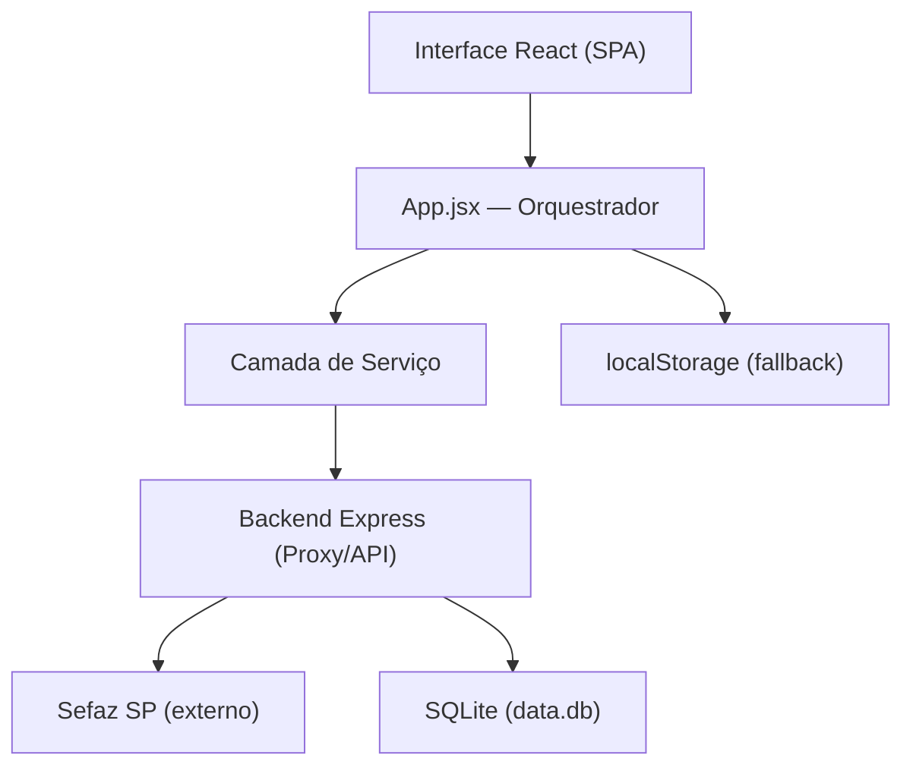
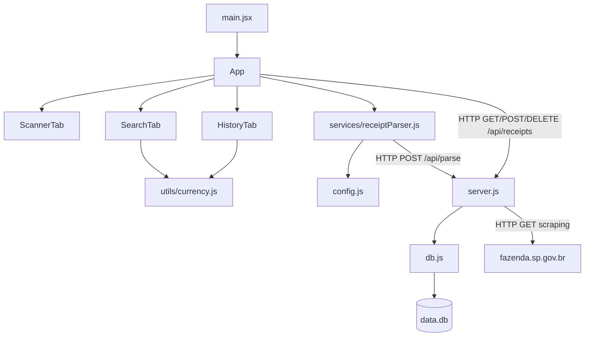

# My Mercado — Arquitetura

**My Mercado** é uma aplicação web para gerenciamento de compras de supermercado.
O usuário escaneia o QR Code de notas fiscais eletrônicas brasileiras (NFC-e), consulta o histórico de compras e compara preços de produtos ao longo do tempo.

---

<a id="índice"></a>

## Índice

1. [Diagrama de Camadas](#diagrama-de-camadas)
2. [Modelo Mental](#modelo-mental)
3. [Treeview](#treeview)
4. [Mapa de Dependências](#mapa-de-dependências)
5. [Glossário de Domínio](#glossário-de-domínio)
6. [Estrutura de Dados Principal](#estrutura-de-dados-principal)
7. [Matriz de Tarefas](#matriz-de-tarefas)
8. [Fluxo de Dados](#fluxo-de-dados)
9. [Regras de Arquitetura](#regras-de-arquitetura)
10. [Registro de Decisões](#registro-de-decisões)
11. [Não-Objetivos](#não-objetivos)
12. [Estado Atual de Desenvolvimento](#estado-atual-de-desenvolvimento)
13. [Como Executar](#como-executar)
14. [Variáveis de Ambiente](#variáveis-de-ambiente)
15. [Estratégia de Tratamento de Erros](#estratégia-de-tratamento-de-erros)
16. [Pontos Frágeis](#pontos-frágeis)
17. [Convenções do Projeto](#convenções-do-projeto)
18. [Estratégia de Testes](#estratégia-de-testes)

---

<a id="diagrama-de-camadas"></a>

# Diagrama de Camadas



A regra principal de dependência é:
**Interface → App → Serviços → Backend → Persistência / Externo**

[↑ Voltar ao índice](#índice)

---

<a id="modelo-mental"></a>

# Modelo Mental

## 1. Nota Fiscal (Receipt)

A entidade central do sistema. Uma nota é criada a partir da leitura do QR Code de uma NFC-e ou inserida manualmente pelo usuário.

Arquivo principal: `src/App.jsx` — funções `saveReceipt`, `deleteReceipt`, `loadReceipts`

Fluxo de escaneamento:

```
Usuário aponta câmera para o QR Code
↓
html5-qrcode decodifica a URL da NFC-e
↓
receiptParser.js envia a URL ao backend
↓
Backend faz scraping na Sefaz SP
↓
Itens e dados do estabelecimento são retornados
↓
App.jsx verifica duplicata, salva no SQLite e espelha no localStorage
```

---

## 2. Proxy Backend (Sefaz)

O navegador não consegue acessar diretamente o portal da Sefaz SP por restrições de CORS e bloqueio de bots. O backend Express atua como proxy, simulando um navegador real com headers customizados.

Arquivo principal: `server.js` — rota `POST /api/parse`
Apoio: `src/services/receiptParser.js`

Fluxo:

```
Frontend envia URL da NFC-e para /api/parse
↓
Backend faz GET na Sefaz com headers de navegador real
↓
HTML retornado é parseado com cheerio
↓
{ id, establishment, date, items[] } devolvido ao frontend
```

---

## 3. Persistência Dupla

O sistema grava no SQLite via API e espelha no `localStorage` como fallback offline. As duas fontes são mantidas em paralelo sem transação distribuída.

Arquivo principal: `db.js`
Apoio: `App.jsx` — funções `saveReceipt`, `loadReceipts`

Fluxo:

```
Nota salva → POST /api/receipts → SQLite
                ↓ (em paralelo)
             localStorage.setItem

App carrega → GET /api/receipts
                ↓ (fallback se API offline)
             localStorage.getItem
```

---

## 4. Comparação de Preços

Todos os itens de todas as notas são achatados em uma lista única para permitir busca e comparação de preços ao longo do tempo.

Arquivo principal: `src/components/SearchTab.jsx`
Apoio: `src/utils/currency.js`

Fluxo:

```
Usuário digita nome do produto
↓
Itens de todas as notas são filtrados
↓
Resultados agrupados por nome do produto
↓
Gráfico de tendência de preço exibido (Recharts)
```

[↑ Voltar ao índice](#índice)

---

<a id="treeview"></a>

# Treeview

```text
my_mercado/
│
├── src/                        # Frontend React (Vite)
│   ├── components/             # Componentes de interface por aba
│   │   ├── ScannerTab.jsx      # Escaneamento QR, upload e entrada manual
│   │   ├── HistoryTab.jsx      # Histórico, filtros, export CSV e backup JSON
│   │   └── SearchTab.jsx       # Pesquisa de itens e gráfico de preços
│   │
│   ├── services/
│   │   └── receiptParser.js    # Bridge entre frontend e backend proxy
│   │
│   ├── utils/
│   │   └── currency.js         # Parsing e formatação de valores BRL
│   │
│   ├── config.js               # Resolução dinâmica da URL da API
│   ├── App.jsx                 # Orquestrador: estado global e lógica de negócio
│   ├── main.jsx                # Entry point React
│   └── index.css               # Estilos globais e design tokens (variáveis CSS)
│
├── server.js                   # Backend Express: proxy Sefaz + CRUD de notas
├── db.js                       # Camada SQLite: initDb, queries, CRUD
├── data.db                     # Banco de dados SQLite (gerado em runtime)
├── index.html                  # Entry point HTML (Vite)
└── vite.config.js              # Configuração do bundler
```

[↑ Voltar ao índice](#índice)

---

<a id="mapa-de-dependências"></a>

# Mapa de Dependências



[↑ Voltar ao índice](#índice)

---

<a id="glossário-de-domínio"></a>

# Glossário de Domínio

| Termo | Definição |
|---|---|
| **NFC-e** | Nota Fiscal de Consumidor Eletrônica — nota fiscal eletrônica emitida pelo varejo brasileiro no momento da venda. É o "cupom fiscal digital". |
| **Sefaz** | Secretaria da Fazenda — órgão fiscal estadual responsável pela emissão e custódia das NFC-e. Cada estado tem seu próprio portal. |
| **Fazenda SP** | Portal da Sefaz do Estado de São Paulo (`fazenda.sp.gov.br`). Único estado suportado atualmente. |
| **Chave de Acesso** | Código numérico de 44 dígitos que identifica unicamente cada NFC-e. Presente na URL do QR Code após o parâmetro `p=`. |
| **QR Code NFC-e** | QR Code impresso no cupom fiscal contendo a URL do portal da Sefaz com a chave de acesso. |
| **Estabelecimento** | Nome do mercado ou loja emitente da nota, extraído do campo `.txtTopo` do HTML da Sefaz. |
| **Nota Manual** | Nota criada pelo usuário sem escanear QR Code. Identificada pelo prefixo `manual_` no ID. |
| **BRL** | Formato monetário brasileiro (ex: `"12,90"`). Tratado como string em todo o sistema; conversão numérica ocorre apenas via `parseBRL()`. |

[↑ Voltar ao índice](#índice)

---

<a id="estrutura-de-dados-principal"></a>

# Estrutura de Dados Principal

```text
Receipt {
  id:            string     // Chave de acesso da NFC-e ou "manual_<date>_<store>"
  establishment: string     // Nome do estabelecimento
  date:          string     // "DD/MM/YYYY HH:mm:ss" ou "DD/MM/YYYY"
  items:         Item[]
}

Item {
  name:       string   // Nome do produto como consta na nota
  qty:        string   // Quantidade (ex: "2", "1,5")
  unitPrice:  string   // Preço unitário em formato BRL (ex: "12,90")
  total:      string   // Preço total em formato BRL (ex: "25,80")
}
```

**Schema SQLite** (`data.db`):

```text
receipts (
  id            TEXT PRIMARY KEY,
  establishment TEXT,
  date          TEXT,
  items_json    TEXT   -- JSON.stringify(Item[])
)
```

> Os valores monetários são armazenados e trafegados como strings BRL em todo o sistema.
> A conversão para número ocorre apenas no momento do cálculo, via `parseBRL()` em `src/utils/currency.js`.

[↑ Voltar ao índice](#índice)

---

<a id="matriz-de-tarefas"></a>

# Matriz de Tarefas

| Quero alterar | Arquivo principal | Arquivo de apoio |
|---|---|---|
| Lógica de escaneamento da câmera | `src/App.jsx` | `src/components/ScannerTab.jsx` |
| Parsing da NFC-e (scraping) | `server.js` — rota `/api/parse` | `src/services/receiptParser.js` |
| Entrada manual de nota | `src/components/ScannerTab.jsx` | `src/App.jsx` — `handleSaveManualReceipt` |
| Salvar / deletar nota | `src/App.jsx` — `saveReceipt`, `deleteReceipt` | `db.js` |
| Filtros e ordenação do histórico | `src/components/HistoryTab.jsx` | — |
| Export CSV / Backup JSON | `src/components/HistoryTab.jsx` | — |
| Pesquisa e comparação de preços | `src/components/SearchTab.jsx` | `src/utils/currency.js` |
| Gráfico de tendência de preços | `src/components/SearchTab.jsx` | — |
| Schema e queries do banco | `db.js` | `server.js` |
| URL da API (dev vs produção) | `src/config.js` | `vite.config.js` |
| Detecção de nota duplicada | `src/App.jsx` — `saveReceipt` | — |
| Conversão de valores monetários | `src/utils/currency.js` | — |

[↑ Voltar ao índice](#índice)

---

<a id="fluxo-de-dados"></a>

# Fluxo de Dados

## Escaneamento de NFC-e

```
Câmera / Upload de imagem
↓
html5-qrcode → URL da NFC-e decodificada
↓
receiptParser.js → POST /api/parse
↓
server.js → GET fazenda.sp.gov.br (scraping com cheerio)
↓
{ id, establishment, date, items[] }
↓
App.jsx verifica duplicata
  ↓ duplicata detectada → toast.warning + modal de confirmação
  ↓ nova nota → continua
↓
POST /api/receipts → db.js → SQLite
↓ (em paralelo)
localStorage.setItem
↓
Estado React atualizado → UI re-renderiza
```

## Pesquisa de Preços

```
Usuário digita no campo de busca
↓
SearchTab filtra allPurchasedItems
(todos os itens de todas as notas achatados em array único)
↓
Itens agrupados por nome exato do produto
↓ (botão "Analisar Histórico de Preços")
Recharts renderiza LineChart com eixo X = data, eixo Y = preço unitário
```

## Carregamento Inicial

```
App monta (useEffect)
↓
GET /api/receipts
  ↓ sucesso → setSavedReceipts(data)
  ↓ falha (backend offline) → lê localStorage → setSavedReceipts(stored)
```

[↑ Voltar ao índice](#índice)

---

<a id="regras-de-arquitetura"></a>

# Regras de Arquitetura

1. **Componentes de interface não acessam a API ou o banco diretamente.**
   Todo acesso a dados passa pelo `App.jsx`, que distribui via props e callbacks.

2. **Chamadas externas à Sefaz são exclusivas do backend.**
   O browser não faz requisições diretas ao portal da Fazenda — restrição de CORS e anti-bot.

3. **`localStorage` é fallback, não a fonte de verdade.**
   O SQLite (via API) é a fonte primária. O localStorage é atualizado em paralelo para uso offline emergencial.

4. **Lógica de negócio fica no `App.jsx`.**
   Validação de duplicatas, detecção de erros e gerenciamento de estado global não pertencem aos componentes filhos.

5. **Parsing de valores monetários sempre passa por `parseBRL()`.**
   Nenhum componente deve converter strings BRL para número manualmente.

6. **Erros visíveis ao usuário sempre passam por `react-hot-toast`.**
   Sem `alert()`, sem erros silenciosos na UI.

7. **Rotas não implementadas retornam `501 Not Implemented`.**
   Stubs existentes (`/api/chat`) não devem fingir sucesso.

[↑ Voltar ao índice](#índice)

---

<a id="registro-de-decisões"></a>

# Registro de Decisões

> 📌 **Incluir quando possível** — Se o motivo de uma decisão não for conhecido, registre apenas a decisão e deixe o campo motivo como `—`.

| Decisão | Alternativas consideradas | Motivo |
|---|---|---|
| Backend Express como proxy para a Sefaz | Fetch direto do browser; CORS proxies públicos (`cors-anywhere`) | A Sefaz SP bloqueia CORS e detecta bots via User-Agent. O proxy próprio simula um browser real com headers customizados. |
| SQLite como banco de dados | PostgreSQL, MongoDB, arquivo JSON plano | App local, single-user, sem necessidade de infraestrutura adicional. Zero config, funciona como arquivo único. |
| Estado global centralizado em `App.jsx` | Redux, Zustand, React Context API | Escopo pequeno; biblioteca de gerenciamento de estado seria over-engineering para a complexidade atual. |
| `localStorage` como fallback de persistência | Apenas SQLite via API | Permite que o app continue funcional para leitura mesmo com o backend offline. |
| `html5-qrcode` para leitura de QR Code | zxing-js, instascan, jsQR | Suporte nativo a câmera mobile (`facingMode: environment`) e leitura via upload de arquivo de imagem com a mesma API. |
| React + Vite como stack frontend | Next.js, Remix, vanilla JS | SPA simples sem necessidade de SSR, roteamento complexo ou geração estática. |
| Recharts para gráficos | Chart.js, Victory, D3 | Integração declarativa nativa com React e API simples para `ResponsiveContainer`. |
| Valores monetários trafegados como string BRL | Número float, centavos como inteiro | Os dados vêm da Sefaz já em formato `"12,90"`. Converter cedo introduziria risco de arredondamento; a conversão ocorre apenas no cálculo. |

[↑ Voltar ao índice](#índice)

---

<a id="não-objetivos"></a>

# Não-Objetivos

O que o sistema **explicitamente não faz**. Evita que sugestões de melhoria violem o escopo intencional do projeto.

- **Sem autenticação.** O app é single-user e local por design.
- **Sem sincronização em nuvem.** O backend é local e intencional; não há plano de sync remoto no momento.
- **Sem suporte a NFC-e de outros estados.** Apenas o portal da Sefaz SP (`fazenda.sp.gov.br`) é suportado. Outros estados têm portais com estrutura HTML diferente.
- **Sem categorização inteligente de itens.** A rota `/api/categorize` existe como stub e retorna `"Geral"` para todos os itens.
- **Sem chat ou assistente IA.** A rota `/api/chat` existe como placeholder e retorna `501`.
- **Sem modo multi-usuário.** Não há conceito de contas, perfis ou compartilhamento de dados.
- **Sem notificações push ou lembretes.**

[↑ Voltar ao índice](#índice)

---

<a id="estado-atual-de-desenvolvimento"></a>

# Estado Atual de Desenvolvimento

| Módulo / Funcionalidade | Status | Observação |
|---|---|---|
| Scan de QR Code via câmera | ✅ Estável | Requer HTTPS em dispositivos móveis |
| Scan via upload de imagem | ✅ Estável | — |
| Entrada manual de nota | ✅ Estável | — |
| Histórico com filtros e ordenação | ✅ Estável | — |
| Export CSV do histórico | ✅ Estável | — |
| Backup e restore via JSON | ✅ Estável | — |
| Busca de itens por nome | ✅ Estável | — |
| Gráfico de tendência de preços | ✅ Estável | — |
| Backend proxy Sefaz SP | ✅ Estável | Frágil por natureza — ver [Pontos Frágeis](#pontos-frágeis) |
| CRUD de notas via API | ✅ Estável | — |
| Detecção de nota duplicada | ✅ Estável | — |
| Fallback para `localStorage` | ✅ Estável | — |
| Categorização de itens | ⚠️ Stub | `/api/categorize` retorna `"Geral"` para todos |
| Chat / Assistente IA | ❌ Não implementado | `/api/chat` retorna `501` |
| Suporte a NFC-e de outros estados | 🚧 Não iniciado | Apenas Sefaz SP |

[↑ Voltar ao índice](#índice)

---

<a id="como-executar"></a>

# Como Executar

**Pré-requisitos:** Node.js 18+

```bash
# 1. Instalar dependências
npm install

# 2. Iniciar o backend (porta 3001) — manter rodando
node server.js

# 3. Em outro terminal, iniciar o frontend (porta 5173)
npm run dev
```

Os dois processos devem rodar **em paralelo**. O frontend detecta automaticamente o IP do host e acessa o backend em `http://<hostname>:3001`.

> ⚠️ **Dispositivos móveis** — Câmeras em mobile exigem HTTPS. Para desenvolvimento mobile na rede local, use `@vitejs/plugin-basic-ssl` (já incluído no projeto). O frontend chama `/api` e o Vite faz proxy para o backend local (evita mixed-content). Defina `VITE_API_URL` apenas se precisar apontar para um backend externo.

[↑ Voltar ao índice](#índice)

---

<a id="variáveis-de-ambiente"></a>

# Variáveis de Ambiente

| Variável | Contexto | Padrão | Descrição |
|---|---|---|---|
| `VITE_API_URL` | Frontend (`.env`) | (vazio) | URL base do backend Express. Se não definida, o frontend usa same-origin (`/api`) e o Vite faz proxy no desenvolvimento. |
| `PORT` | Backend | `3001` | Porta do servidor Express. |
| `NODE_ENV` | Backend | `development` | Controla CORS permissivo e `rejectUnauthorized` do HTTPS. Em `production`, o CORS é restrito a `ALLOWED_ORIGIN`. |
| `ALLOWED_ORIGIN` | Backend | `http://localhost:5173` | Origem permitida quando `NODE_ENV=production`. |

A lógica de resolução da URL está em `src/config.js`:

```
VITE_API_URL definida → usa o valor da variável
VITE_API_URL ausente  → usa same-origin (`/api`) (recomendado com proxy do Vite em dev)
```

[↑ Voltar ao índice](#índice)

---

<a id="estratégia-de-tratamento-de-erros"></a>

# Estratégia de Tratamento de Erros

**Filosofia geral:**
- Erros visíveis ao usuário sempre passam por `react-hot-toast` — nunca `alert()`, nunca falha silenciosa na UI.
- Backend offline não bloqueia o usuário: `App.jsx` faz fallback para `localStorage` e registra o aviso no console.
- O backend responde erros com `{ error: "mensagem descritiva" }` e o status HTTP adequado.

| Cenário | Comportamento no frontend | Comportamento no backend |
|---|---|---|
| Sefaz retorna captcha ou bloqueio | `toast.error()` com mensagem específica | Retorna `400` com `{ error: "..." }` |
| Backend offline ao salvar nota | Salva no `localStorage`, `console.warn` | — |
| Backend offline ao carregar histórico | Carrega do `localStorage` | — |
| QR Code inválido ou ilegível | `toast.error()` | — |
| Câmera sem permissão ou sem HTTPS | `toast.error()` orientando sobre HTTPS | — |
| Nota duplicada detectada | `toast.warning()` + modal de confirmação | — |
| Erro interno do servidor | `toast.error()` genérico | `500` + `console.error` |
| Rota não encontrada | — | `404` + `{ error: "Rota não encontrada" }` |

[↑ Voltar ao índice](#índice)

---

<a id="pontos-frágeis"></a>

# Pontos Frágeis

Áreas que exigem atenção especial ao modificar. Diferente das regras de arquitetura, estes são **avisos práticos** sobre riscos conhecidos.

---

### 1. Scraping da Sefaz SP
**Arquivo:** `server.js` — rota `POST /api/parse`

O parser depende da estrutura HTML do portal `fazenda.sp.gov.br`. Qualquer mudança no layout da página, adição de captcha mais agressivo ou bloqueio de IP quebra o parsing — silenciosamente ou com erro 400. Não há testes automatizados cobrindo este ponto. Ao modificar o parser, valide manualmente com QR Codes reais.

---

### 2. Sync `localStorage` ↔ SQLite
**Arquivo:** `src/App.jsx` — função `saveReceipt`

A gravação no `localStorage` e no banco ocorre em paralelo, sem transação distribuída. Se o `POST /api/receipts` falhar após o `setItem`, as fontes ficam divergentes. Na próxima abertura com backend online, o `GET /api/receipts` sobrescreve o estado React com os dados do banco, potencialmente descartando dados que só existiam no `localStorage`.

---

### 3. Colisão de ID em notas manuais
**Arquivo:** `src/App.jsx` — função `handleSaveManualReceipt`

O ID é gerado como `manual_<date>_<store>` (sem espaços). Duas notas manuais criadas no mesmo dia e mesma loja produzem o mesmo ID — a segunda sobrescreve a primeira silenciosamente via `INSERT OR REPLACE` no SQLite.

[↑ Voltar ao índice](#índice)

---

<a id="convenções-do-projeto"></a>

# Convenções do Projeto

| Contexto | Convenção | Exemplo |
|---|---|---|
| Componentes React | PascalCase, sufixo `Tab` para componentes de aba | `ScannerTab.jsx`, `HistoryTab.jsx` |
| Arquivos de serviço | camelCase | `receiptParser.js` |
| Funções utilitárias | camelCase, exports nomeados individuais | `parseBRL()`, `formatBRL()` |
| Chaves do `localStorage` | Prefixo `@MyMercado:` para evitar colisões | `@MyMercado:receipts`, `@MyMercado:tab` |
| Estado da aplicação | Centralizado em `App.jsx`, distribuído via props | — |
| Estilos | CSS global em `index.css` com variáveis CSS | `var(--primary)`, `var(--success)`, `var(--card-border)` |
| Ícones | Lucide React exclusivamente | `<Scan />`, `<Search />`, `<History />` |
| Notificações ao usuário | `react-hot-toast` exclusivamente | `toast.success()`, `toast.error()`, `toast.warning()` |

[↑ Voltar ao índice](#índice)

---

<a id="estratégia-de-testes"></a>

# Estratégia de Testes

> 📌 **Status atual:** Não há testes automatizados. A validação é feita manualmente via browser.

**Candidatos prioritários para testes futuros:**

| Alvo | Tipo de teste | Motivo |
|---|---|---|
| `src/utils/currency.js` — `parseBRL()`, `formatBRL()` | Unitário | Lógica pura, sem dependências, casos de borda com formatos BRL variados |
| `server.js` — rota `/api/parse` | Integração | Parser de HTML frágil; testes com HTML mockado da Sefaz detectariam regressões |
| `src/App.jsx` — `saveReceipt` | Unitário | Lógica de deduplicação e fallback para `localStorage` |
| `src/services/receiptParser.js` | Integração | Mock do backend para validar o contrato de dados retornado |

[↑ Voltar ao índice](#índice)
