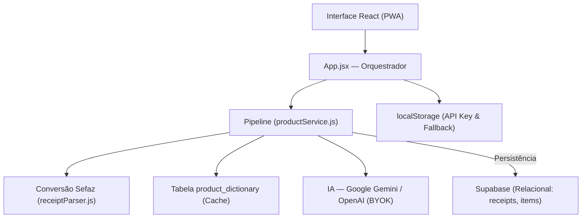
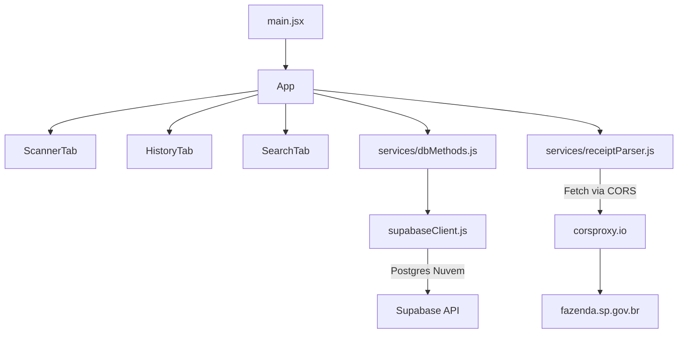

# My Mercado — Arquitetura

**My Mercado** é um PWA (Progressive Web App) para gerenciamento de compras de supermercado.
O usuário escaneia o QR Code de notas fiscais eletrônicas brasileiras (NFC-e), consulta o histórico de compras e compara preços de produtos ao longo do tempo. Toda a persistência é feita via nuvem (Supabase) sem necessidade de servidor Node.js local.

---

<a id="índice"></a>

## Índice

1. [Diagrama de Camadas](#diagrama-de-camadas)
2. [Modelo Mental](#modelo-mental)
3. [Treeview](#treeview)
4. [Mapa de Dependências](#mapa-de-dependências)
5. [Glossário de Domínio](#glossário-de-domínio)
6. [Estrutura de Dados Principal](#estrutura-de-dados-principal)
7. [Matriz de Tarefas](#matriz-de-tarefas)
8. [Fluxo de Dados](#fluxo-de-dados)
9. [Regras de Arquitetura](#regras-de-arquitetura)
10. [Registro de Decisões](#registro-de-decisões)
11. [Não-Objetivos](#não-objetivos)
12. [Estado Atual de Desenvolvimento](#estado-atual-de-desenvolvimento)
13. [Como Executar](#como-executar)
14. [Variáveis de Ambiente](#variáveis-de-ambiente)
15. [Estratégia de Tratamento de Erros](#estratégia-de-tratamento-de-erros)
16. [Pontos Frágeis](#pontos-frágeis)
17. [Convenções do Projeto](#convenções-do-projeto)

---

<a id="diagrama-de-camadas"></a>

# Diagrama de Camadas



A regra principal de dependência é:
**Interface → App → Serviços → Backend como Serviço (Supabase) / Proxy Externo**

[↑ Voltar ao índice](#índice)

---

<a id="modelo-mental"></a>

# Modelo Mental

## 1. Nota Fiscal (Receipt)

A entidade central do sistema. Uma nota é criada a partir da leitura do QR Code de uma NFC-e ou inserida manualmente pelo usuário.

Arquivo principal: `src/App.jsx` — funções `saveReceipt`, `deleteReceipt`, `loadReceipts`

Fluxo de escaneamento:

```
Usuário aponta câmera para o QR Code (ou cola link)
↓
receiptParser.js extrai os itens brutos do HTML da Sefaz (via corsproxy.io)
↓
productService.js (Pipeline): normaliza chaves e busca no Dicionário local
↓
Itens desconhecidos são enviados em lote para a IA (Gemini 2.5 Flash Lite) via BYOK
↓
Dicionário é atualizado com novos nomes e categorias aprendidos
↓
dbMethods.js persiste a nota em 'receipts' e itens em 'items' (Relacional)
```

---

## 2. Scraping Frontend-Only (Sefaz)

Navegadores bloqueiam requisições diretas a portais governamentais (Sefaz SP) por CORS. Como não rodamos mais um servidor Node.js, contornamos isso passando a requisição por um proxy de CORS gratuito na web (`corsproxy.io`). O navegador recebe o texto em HTML sujo e o converte nativamente via `DOMParser` no serviço `receiptParser.js`.

---

## 3. Persistência em Nuvem (BaaS)

A estrutura antiga em SQLite foi completamente suprimida a favor do Supabase (BaaS em PostgreSQL). Todo o tratamento (`select`, `upsert`, `delete`) acontece no cliente usando o SDK do Supabase. O `localStorage` da aplicação continua sendo atualizado apenas como fallback emergencial ou para leitura rápida offline.

---

Todos os itens são armazenados individualmente na tabela `items`. Isso permite uma normalização poderosa via IA, onde um item "ARROZ TIO JOAO 5KG" é vinculado a uma chave única, permitindo rastrear o menor preço de "Arroz" independente da variação do nome na nota.

Arquivo principal: `src/components/SearchTab.jsx`
Apoio: `src/utils/currency.js`

Fluxo:
```
Usuário digita nome ou categoria
↓
Busca filtrada na tabela 'items' vinculada à 'receipts'
↓
Agrupamento por 'normalized_key'
↓
Gráfico de tendência de preço e histórico exibido
```

[↑ Voltar ao índice](#índice)

---

<a id="treeview"></a>

# Treeview

```text
my_mercado/
│
├── public/                     # Assets estáticos e ícones do PWA
├── src/                        # Frontend React (Vite)
│   ├── components/
│   │   ├── ApiKeyModal.jsx     # Configuração de chave própria (BYOK)
│   │   ├── ScannerTab.jsx      
│   │   ├── HistoryTab.jsx      
│   │   └── SearchTab.jsx       
│   │
│   ├── hooks/
│   │   └── useApiKey.js        # Hook para gestão de estado da Key/IA
│   │
│   ├── services/
│   │   ├── productService.js   # Pipeline de IA, Dicionário e Normalização
│   │   ├── dbMethods.js        # Persistência Relacional (CRUD)
│   │   ├── receiptParser.js    # Decodificação do HTML da Sefaz
│   │   └── auth.js             # Lógica Supabase Auth
│   │
│   ├── utils/
│   │   ├── aiConfig.js         # Persistência local da API Key
│   │   └── currency.js         # Parsing e formatação BRL
│   │
│   ├── App.jsx                 # Orquestrador global
│   └── index.css               # Design System
├── .env                        # Chaves e URLs do Supabase (VITE_SUPABASE_...)
├── index.html                  # Entry point HTML & PWA manifest link
└── vite.config.js              # Configuração Vite & vite-plugin-pwa
```

[↑ Voltar ao índice](#índice)

---

<a id="mapa-de-dependências"></a>

# Mapa de Dependências



[↑ Voltar ao índice](#índice)

---

<a id="glossário-de-domínio"></a>

# Glossário de Domínio

| Termo | Definição |
|---|---|
| **PWA** | Progressive Web App: Permite que a página se instale como um app falso no celular, acessando a câmera nativamente mesmo sendo feito apenas de HTML/JS. |
| **Supabase** | Backend-as-a-Service, alternativa ao Firebase baseada em Postgres que expõe APIs baseadas nas próprias tabelas do banco. |
| **Sefaz** | Secretaria da Fazenda — órgão responsável pelas NFC-e. Apenas Sefaz SP é suportada. |
| **BRL** | Formato monetário brasileiro mantido como `string` em armazenamento (`"12,90"`) para evitar arredondamento de JS. |

[↑ Voltar ao índice](#índice)

---

<a id="estrutura-de-dados-principal"></a>

**Schema Supabase (Nuvem)** com RLS e Autenticação Atrelada:

```sql
-- Tabela de Notas
create table public.receipts (
  id text primary key,
  establishment text,
  date timestamp,
  user_id uuid references auth.users(id) default auth.uid() not null,
  created_at timestamp with time zone default now() not null
);

-- Tabela de Itens (Relacional)
create table public.items (
  id uuid primary key default gen_random_uuid(),
  receipt_id text references receipts(id) on delete cascade,
  name text,
  normalized_key text,
  normalized_name text,
  category text,
  quantity numeric,
  unit text,
  price numeric
);

-- Tabela de Dicionário (Cache de IA)
create table public.product_dictionary (
  key text primary key,
  normalized_name text,
  category text
);
alter table public.receipts enable row level security;

create policy "Usuário vê as próprias notas" 
on public.receipts for select 
using (auth.uid() = user_id);

create policy "Usuário insere as próprias notas" 
on public.receipts for insert 
with check (auth.uid() = user_id);

create policy "Usuário atualiza as próprias notas" 
on public.receipts for update 
using (auth.uid() = user_id)
with check (auth.uid() = user_id);

create policy "Usuário deleta as próprias notas" 
on public.receipts for delete 
using (auth.uid() = user_id);
```

> **Migração Relacional:** O campo `items_json` foi removido. Agora os itens são entidades independentes, o que permite consultas complexas de cross-shopping e análise de categorias. O sistema utiliza um pipeline de IA para garantir que itens com nomes diferentes (ex: "ARROZ TIO JOAO" e "ARROZ T. JOAO") sejam agrupados sob a mesma `normalized_key`.

[↑ Voltar ao índice](#índice)

---

<a id="matriz-de-tarefas"></a>

# Matriz de Tarefas

| Quero alterar | Arquivo principal | Arquivo de apoio |
|---|---|---|
| Lógica de escaneamento da câmera | `src/App.jsx` | `src/components/ScannerTab.jsx` |
| Configuração de IA (BYOK) | `src/components/ApiKeyModal.jsx` | `src/utils/aiConfig.js` |
| Processamento de Itens / IA | `src/services/productService.js` | `src/hooks/useApiKey.js` |
| Scraping / Captura de dados da nota | `src/services/receiptParser.js` | — |
| Comunicação com banco de dados | `src/services/dbMethods.js` | `src/services/supabaseClient.js` |
| Gráfico de tendência de preços | `src/components/SearchTab.jsx` | `src/services/dbMethods.js` |
| Arquitetura PWA/Manifest | `vite.config.js` | `index.html` |

[↑ Voltar ao índice](#índice)

---

<a id="fluxo-de-dados"></a>

# Fluxo de Dados

## Escaneamento da NFC-e
```
Câmera ou Link → itens extraídos via receiptParser.js
↓
productService.js: os itens são normalizados (remoção de KG, UN, etc)
↓
Consulta ao product_dictionary via Supabase para identificar itens conhecidos
↓
Itens desconhecidos são enviados em lote (max 10) para Google Gemini via BYOK
↓
Novas categorizações são salvas no dicionário (aprendizagem contínua)
↓
Nota é salva no banco relacional (receipts + items)
```

[↑ Voltar ao índice](#índice)

---

<a id="regras-de-arquitetura"></a>

# Regras de Arquitetura

1. **Sem servidor Node.js backend local.** O app deve se manter leve como PWA. Toda interligação externa (Sefaz, Postgres) deve ser feita usando o ecossistema frontend (React, Fetch, APIs de Supabase).
2. **`localStorage` atua apenas como cópia.** O histórico primordial vive no bucket do Supabase. O localStorage garante que a leitura não crashe se a pessoa abrir o PWA no celular sem internet.
3. **Parseamento unicamente em `.js` puros (separação das Views).** Lógica pesada de `DOMParser` fica isolada em `receiptParser.js` e não suja o `App.jsx`.
4. **Erros interceptados pelo Toaster.** Falhas no fetch ou ausência da tabela resultam em `toast.error()` via UI limpa.

[↑ Voltar ao índice](#índice)

---

<a id="registro-de-decisões"></a>

# Registro de Decisões

| Decisão | Alternativas consideradas | Motivo |
|---|---|---|
| Migração Relacional (Adeus JSONB) | Guardar itens dentro da nota como JSON | O modelo JSONB dificultava buscas cross-nota (ex: "Qual o preço médio da maçã em todas as notas?"). O modelo relacional de `items` torna a pesquisa instantânea e rica. |
| BYOK (Bring Your Own Key) | API Key fixa no servidor / Proxy | Como o app não tem backend centralizado, a abordagem BYOK (o usuário fornece sua chave Gemini/OpenAI) garante privacidade, custo zero para o desenvolvedor e longevidade do app. |
| IA em Lote (Batching) | IA por item individual | Chamar a IA para cada item separadamente é lento e consome tokens de forma ineficiente. O pipeline agrupa itens desconhecidos em lotes de 10, reduzindo latência e custos. |
| Dicionário como Cache | IA em cada scan | O dicionário evita chamar a IA para produtos já conhecidos, tornando o scan instantâneo para compras recorrentes. |

[↑ Voltar ao índice](#índice)

---

<a id="não-objetivos"></a>

# Não-Objetivos

- **Confirmação de E-mail:** A autenticação é simples ("Email / Senha" nativo do Supabase) e a confirmação de e-mail deve estar sempre desativada no painel web do Supabase para facilitar a usabilidade contínua.
- **Portais Governamentais Adicionais:** A estrutura da Sefaz SP é hardcoded e delicada. Expandir de cara para MT, PR, RJ implicaria em muitos if/elses de parsers distintos.

[↑ Voltar ao índice](#índice)

---

<a id="estado-atual-de-desenvolvimento"></a>

# Estado Atual de Desenvolvimento

| Funcionalidade | Status | Observação |
|---|---|---|
| IA e Categorização | ✅ Estável | Suporta Gemini 2.5 Flash / OpenAI via BYOK |
| Modelo Relacional | ✅ Estável | `items` normalizados e vinculados a `receipts` |
| Dicionário de Produtos | ✅ Estável | Aprendizagem contínua via banco global |
| Histórico de Preços | ✅ Estável | Gráficos baseados em itens normalizados |

[↑ Voltar ao índice](#índice)

---

<a id="como-executar"></a>

# Como Executar

**Pré-requisitos:**
1. Ter uma conta no [Supabase](https://supabase.com/).
2. Copiar suas chaves (`URL` e `ANON_KEY`) e colar nas respectivas chaves do seu `.env`.

**Passos:**
```bash
# 1. Instalar dependências (PWA, Recharts, Supabase-js, Toast, etc)
npm install

# 2. Iniciar a aplicação localmente
npm run dev

# 3. Iniciar com HTTPS forçado na rede Wi-Fi (Permite testar PWA e câmera pelo celular)
npm run dev:https
```

[↑ Voltar ao índice](#índice)

---

<a id="variáveis-de-ambiente"></a>

# Variáveis de Ambiente

| Variável | Descrição |
|---|---|
| `VITE_SUPABASE_URL` | URL do seu projeto Supabase. |
| `VITE_SUPABASE_ANON_KEY` | Chave anônima pública de API do Supabase. |
| `VITE_BASIC_SSL` | Quando `true` via `dev:https`, fornece certificado para testar leitura de QRCode. |

[↑ Voltar ao índice](#índice)

---

<a id="pontos-frágeis"></a>

# Pontos Frágeis

### 1. Robustez do Proxy de CORS (`corsproxy.io`)
Servidores governamentais detestam requisições massivas. Ao utilizarmos um public CORS proxy, nossa requisição passa pela rede de terceiros. Se a Sefaz SP bloquear os IPs do servidor proxy utilizado pelo corsproxy, o scan falhará. É uma pechincha por abandonar o Node local. Em caso de instabilidade, alterar a URL do parser (`receiptParser.js`) para concorrentes ex: `api.allorigins.win/raw?url=` pode surtir efeito temporário.

### 2. Tratamento de Sincronia
Quando abrimos a aplicação ela bate no `supabaseClient.js` resgatando o backend para sincronizar com localStorage. Caso o PWA seja manipulado longo tempo 100% offline (no meio de um supermercado de metal grosso que bloqueia sinal), as inserções e remoções poderão falhar as promisses silenciadas, exigindo ser reenviadas na volta da conexão de forma não determinística se não tratadas num robusto Service Worker.

[↑ Voltar ao índice](#índice)
