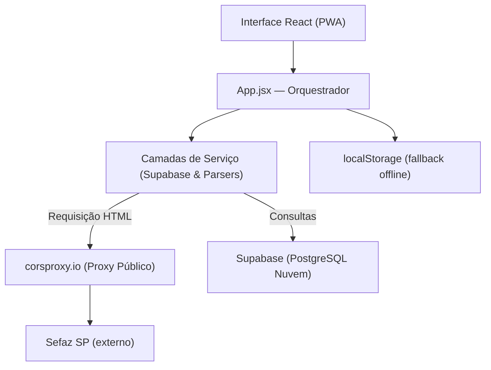
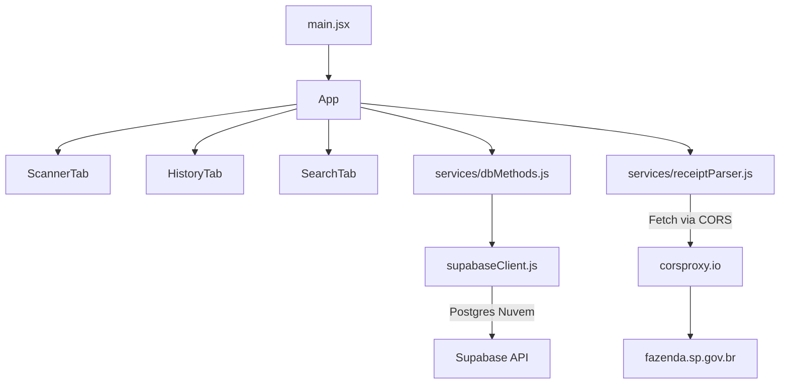

# My Mercado — Arquitetura

**My Mercado** é um PWA (Progressive Web App) para gerenciamento de compras de supermercado.
O usuário escaneia o QR Code de notas fiscais eletrônicas brasileiras (NFC-e), consulta o histórico de compras e compara preços de produtos ao longo do tempo. Toda a persistência é feita via nuvem (Supabase) sem necessidade de servidor Node.js local.

---

<a id="índice"></a>

## Índice

1. [Diagrama de Camadas](#diagrama-de-camadas)
2. [Modelo Mental](#modelo-mental)
3. [Treeview](#treeview)
4. [Mapa de Dependências](#mapa-de-dependências)
5. [Glossário de Domínio](#glossário-de-domínio)
6. [Estrutura de Dados Principal](#estrutura-de-dados-principal)
7. [Matriz de Tarefas](#matriz-de-tarefas)
8. [Fluxo de Dados](#fluxo-de-dados)
9. [Regras de Arquitetura](#regras-de-arquitetura)
10. [Registro de Decisões](#registro-de-decisões)
11. [Não-Objetivos](#não-objetivos)
12. [Estado Atual de Desenvolvimento](#estado-atual-de-desenvolvimento)
13. [Como Executar](#como-executar)
14. [Variáveis de Ambiente](#variáveis-de-ambiente)
15. [Estratégia de Tratamento de Erros](#estratégia-de-tratamento-de-erros)
16. [Pontos Frágeis](#pontos-frágeis)
17. [Convenções do Projeto](#convenções-do-projeto)

---

<a id="diagrama-de-camadas"></a>

# Diagrama de Camadas



A regra principal de dependência é:
**Interface → App → Serviços → Backend como Serviço (Supabase) / Proxy Externo**

[↑ Voltar ao índice](#índice)

---

<a id="modelo-mental"></a>

# Modelo Mental

## 1. Nota Fiscal (Receipt)

A entidade central do sistema. Uma nota é criada a partir da leitura do QR Code de uma NFC-e ou inserida manualmente pelo usuário.

Arquivo principal: `src/App.jsx` — funções `saveReceipt`, `deleteReceipt`, `loadReceipts`

Fluxo de escaneamento:

```
Usuário aponta câmera para o QR Code
↓
html5-qrcode decodifica a URL da NFC-e
↓
receiptParser.js envia a URL via corsproxy.io
↓
O HTML retornado é mastigado nativamente com DOMParser
↓
Itens e dados do estabelecimento são retornados
↓
App.jsx verifica duplicata, salva no Supabase (dbMethods) e espelha no localStorage
```

---

## 2. Scraping Frontend-Only (Sefaz)

Navegadores bloqueiam requisições diretas a portais governamentais (Sefaz SP) por CORS. Como não rodamos mais um servidor Node.js, contornamos isso passando a requisição por um proxy de CORS gratuito na web (`corsproxy.io`). O navegador recebe o texto em HTML sujo e o converte nativamente via `DOMParser` no serviço `receiptParser.js`.

---

## 3. Persistência em Nuvem (BaaS)

A estrutura antiga em SQLite foi completamente suprimida a favor do Supabase (BaaS em PostgreSQL). Todo o tratamento (`select`, `upsert`, `delete`) acontece no cliente usando o SDK do Supabase. O `localStorage` da aplicação continua sendo atualizado apenas como fallback emergencial ou para leitura rápida offline.

---

## 4. Comparação de Preços

Todos os itens de todas as notas são achatados em uma lista única para permitir busca e comparação de preços ao longo do tempo.

Arquivo principal: `src/components/SearchTab.jsx`
Apoio: `src/utils/currency.js`

Fluxo:
```
Usuário digita nome do produto
↓
Itens de todas as notas do banco em nuvem são filtrados localmente
↓
Resultados agrupados por nome do produto
↓
Gráfico de tendência de preço exibido (Recharts)
```

[↑ Voltar ao índice](#índice)

---

<a id="treeview"></a>

# Treeview

```text
my_mercado/
│
├── public/                     # Assets estáticos e ícones do PWA
├── src/                        # Frontend React (Vite)
│   ├── components/             # Componentes de interface por aba
│   │   ├── ScannerTab.jsx      # Escaneamento QR, upload e entrada manual
│   │   ├── HistoryTab.jsx      # Histórico, filtros, export CSV e backup JSON
│   │   └── SearchTab.jsx       # Pesquisa de itens e gráfico de preços
│   │
│   ├── services/
│   │   ├── supabaseClient.js   # Instância do cliente Supabase
│   │   ├── dbMethods.js        # Wrapper de operações do banco (CRUD)
│   │   └── receiptParser.js    # Decodificação do HTML da Sefaz
│   │
│   ├── utils/
│   │   └── currency.js         # Parsing e formatação BRL
│   │
│   ├── config.js               # Legado ou utilitários config
│   ├── App.jsx                 # Orquestrador: estado global e lógica
│   ├── main.jsx                # Entry point
│   └── index.css               # Design tokens
│
├── .env                        # Chaves e URLs do Supabase (VITE_SUPABASE_...)
├── index.html                  # Entry point HTML & PWA manifest link
└── vite.config.js              # Configuração Vite & vite-plugin-pwa
```

[↑ Voltar ao índice](#índice)

---

<a id="mapa-de-dependências"></a>

# Mapa de Dependências



[↑ Voltar ao índice](#índice)

---

<a id="glossário-de-domínio"></a>

# Glossário de Domínio

| Termo | Definição |
|---|---|
| **PWA** | Progressive Web App: Permite que a página se instale como um app falso no celular, acessando a câmera nativamente mesmo sendo feito apenas de HTML/JS. |
| **Supabase** | Backend-as-a-Service, alternativa ao Firebase baseada em Postgres que expõe APIs baseadas nas próprias tabelas do banco. |
| **Sefaz** | Secretaria da Fazenda — órgão responsável pelas NFC-e. Apenas Sefaz SP é suportada. |
| **BRL** | Formato monetário brasileiro mantido como `string` em armazenamento (`"12,90"`) para evitar arredondamento de JS. |

[↑ Voltar ao índice](#índice)

---

<a id="estrutura-de-dados-principal"></a>

**Schema Supabase (Nuvem)** com RLS e Autenticação Atrelada:

```sql
create table public.receipts (
  id text primary key,
  establishment text,
  date text,
  items_json jsonb,
  user_id uuid references auth.users(id) default auth.uid() not null,
  created_at timestamp with time zone default timezone('utc'::text, now()) not null
);

alter table public.receipts enable row level security;

create policy "Usuário vê as próprias notas" 
on public.receipts for select 
using (auth.uid() = user_id);

create policy "Usuário insere as próprias notas" 
on public.receipts for insert 
with check (auth.uid() = user_id);

create policy "Usuário atualiza as próprias notas" 
on public.receipts for update 
using (auth.uid() = user_id)
with check (auth.uid() = user_id);

create policy "Usuário deleta as próprias notas" 
on public.receipts for delete 
using (auth.uid() = user_id);
```

> **Atenção:** Os dados inseridos no banco são protegidos de forma segura e estrita usando Políticas de Segurança por Nível de Linha (RLS), garantindo a isolação entre inquilinos onde o Supabase injeta o `default auth.uid()` com o valor associado ao JWT. Em código web, os valores de `items_json` são serializados/deserializados pelo `dbMethods.js` para um array de objetos `Item { name, qty, unitPrice, total }`.

[↑ Voltar ao índice](#índice)

---

<a id="matriz-de-tarefas"></a>

# Matriz de Tarefas

| Quero alterar | Arquivo principal | Arquivo de apoio |
|---|---|---|
| Lógica de escaneamento da câmera | `src/App.jsx` | `src/components/ScannerTab.jsx` |
| Autenticação (Login / Registro) | `src/components/Login.jsx` | `src/services/auth.js` |
| Scraping / Captura de dados da nota | `src/services/receiptParser.js` | — |
| Comunicação com banco de dados | `src/services/dbMethods.js` | `src/services/supabaseClient.js` |
| Entrada manual de nota | `src/components/ScannerTab.jsx` | `src/App.jsx` — `handleSaveManualReceipt` |
| Filtros e ordenação do histórico | `src/components/HistoryTab.jsx` | `src/App.jsx` |
| Restaurar de Backup JSON | `src/components/HistoryTab.jsx` | `src/services/dbMethods.js` |
| Gráfico de tendência de preços | `src/components/SearchTab.jsx` | `src/utils/currency.js` |
| Arquitetura PWA/Manifest | `vite.config.js` | `index.html` |

[↑ Voltar ao índice](#índice)

---

<a id="fluxo-de-dados"></a>

# Fluxo de Dados

## Escaneamento da NFC-e
```
Câmera → URL Sefaz decodificada
↓
receiptParser.js faz fetch em `https://corsproxy.io/?url...`
↓
Navegador processa o HTML com DOMParser nativo e filtra o conteúdo da nota
↓
App.jsx verifica duplicatas em memória
↓
dbMethods.js executa 'upsert' no Supabase
↓
O histórico de localStorage é atualizado e o App renderiza a nova nota
```

[↑ Voltar ao índice](#índice)

---

<a id="regras-de-arquitetura"></a>

# Regras de Arquitetura

1. **Sem servidor Node.js backend local.** O app deve se manter leve como PWA. Toda interligação externa (Sefaz, Postgres) deve ser feita usando o ecossistema frontend (React, Fetch, APIs de Supabase).
2. **`localStorage` atua apenas como cópia.** O histórico primordial vive no bucket do Supabase. O localStorage garante que a leitura não crashe se a pessoa abrir o PWA no celular sem internet.
3. **Parseamento unicamente em `.js` puros (separação das Views).** Lógica pesada de `DOMParser` fica isolada em `receiptParser.js` e não suja o `App.jsx`.
4. **Erros interceptados pelo Toaster.** Falhas no fetch ou ausência da tabela resultam em `toast.error()` via UI limpa.

[↑ Voltar ao índice](#índice)

---

<a id="registro-de-decisões"></a>

# Registro de Decisões

| Decisão | Alternativas consideradas | Motivo |
|---|---|---|
| Migração para Supabase / remoção do Node.js backend | SQLite + Express local, MongoDB Remoto | O plano tornou-se focar o aplicativo num poderoso PWA sem depender de um computador desktop rodando Node. Supabase atende gratuitamente bancos robustos de uso serverless direto no JS do PWA. |
| Fetch via domínio `corsproxy.io` em vez de Backend Node | Edge Functions do Supabase, Cloudflare Workers | Maior facilidade imediata. Corta drasticamente a complexidade de deploy sem exigir setup extra além do banco de dados de notas. |
| Vite PWA Plugin | Configuração manual de Service Workers | `vite-plugin-pwa` controla o caching e manifest de instalação `standalone` automaticamente durante o build com configuração absurdamente simples no `vite.config.js`. |

[↑ Voltar ao índice](#índice)

---

<a id="não-objetivos"></a>

# Não-Objetivos

- **Confirmação de E-mail:** A autenticação é simples ("Email / Senha" nativo do Supabase) e a confirmação de e-mail deve estar sempre desativada no painel web do Supabase para facilitar a usabilidade contínua.
- **Portais Governamentais Adicionais:** A estrutura da Sefaz SP é hardcoded e delicada. Expandir de cara para MT, PR, RJ implicaria em muitos if/elses de parsers distintos.

[↑ Voltar ao índice](#índice)

---

<a id="estado-atual-de-desenvolvimento"></a>

# Estado Atual de Desenvolvimento

| Funcionalidade | Status | Observação |
|---|---|---|
| Autenticação Simples | ✅ Estável | Usa `Supabase Auth` e bloqueia acesso do App |
| Banco Seguro (Multi-inquilino) | ✅ Estável | Controle de Acesso Restrito via Supabase RLS |
| Escaneamento via Câmera/Upload | ✅ Estável | Depende de HTTPS para rodar |
| Banco de dados Serverless | ✅ Concluído | App 100% Frontend |
| Instalação PWA | ✅ Concluído | Falta gerar e customizar imagens na pasta `public/` caso necessário |
| Fetch Sefaz Frontend-only | ✅ Estável | Dependência do `corsproxy.io` funcionar |
| Histórico de Preços | ✅ Estável | Comunica muito bem com o DB novo |

[↑ Voltar ao índice](#índice)

---

<a id="como-executar"></a>

# Como Executar

**Pré-requisitos:**
1. Ter uma conta no [Supabase](https://supabase.com/).
2. Copiar suas chaves (`URL` e `ANON_KEY`) e colar nas respectivas chaves do seu `.env`.

**Passos:**
```bash
# 1. Instalar dependências (PWA, Recharts, Supabase-js, Toast, etc)
npm install

# 2. Iniciar a aplicação localmente
npm run dev

# 3. Iniciar com HTTPS forçado na rede Wi-Fi (Permite testar PWA e câmera pelo celular)
npm run dev:https
```

[↑ Voltar ao índice](#índice)

---

<a id="variáveis-de-ambiente"></a>

# Variáveis de Ambiente

| Variável | Descrição |
|---|---|
| `VITE_SUPABASE_URL` | URL do seu projeto Supabase. |
| `VITE_SUPABASE_ANON_KEY` | Chave anônima pública de API do Supabase. |
| `VITE_BASIC_SSL` | Quando `true` via `dev:https`, fornece certificado para testar leitura de QRCode. |

[↑ Voltar ao índice](#índice)

---

<a id="pontos-frágeis"></a>

# Pontos Frágeis

### 1. Robustez do Proxy de CORS (`corsproxy.io`)
Servidores governamentais detestam requisições massivas. Ao utilizarmos um public CORS proxy, nossa requisição passa pela rede de terceiros. Se a Sefaz SP bloquear os IPs do servidor proxy utilizado pelo corsproxy, o scan falhará. É uma pechincha por abandonar o Node local. Em caso de instabilidade, alterar a URL do parser (`receiptParser.js`) para concorrentes ex: `api.allorigins.win/raw?url=` pode surtir efeito temporário.

### 2. Tratamento de Sincronia
Quando abrimos a aplicação ela bate no `supabaseClient.js` resgatando o backend para sincronizar com localStorage. Caso o PWA seja manipulado longo tempo 100% offline (no meio de um supermercado de metal grosso que bloqueia sinal), as inserções e remoções poderão falhar as promisses silenciadas, exigindo ser reenviadas na volta da conexão de forma não determinística se não tratadas num robusto Service Worker.

[↑ Voltar ao índice](#índice)
