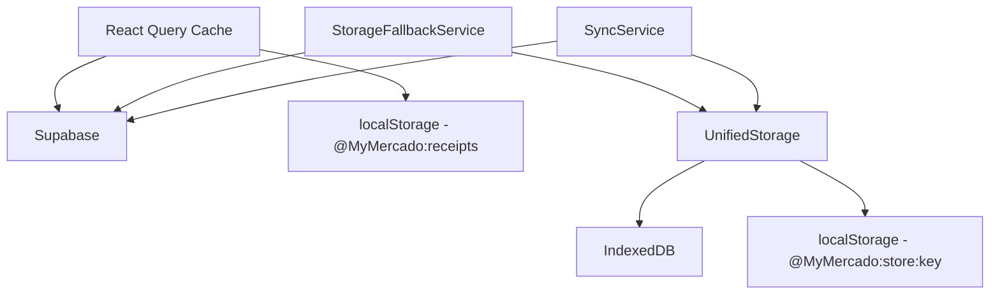
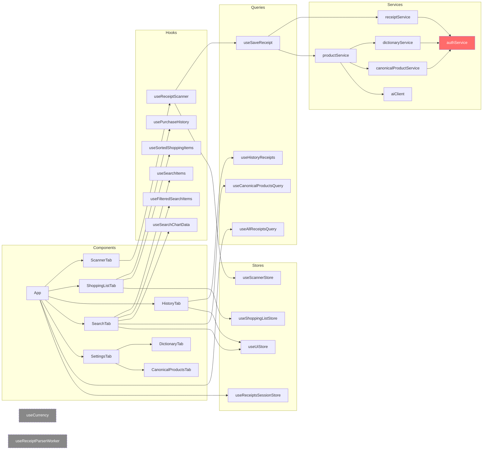

# Auditoria Técnica — My Mercado PWA

> **Data:** 31/03/2026  
> **Escopo:** Arquitetura, manutenção e qualidade de código  
> **Foco:** Erros, duplicações, responsabilidades, acoplamento, performance

---

## Sumário Executivo

O My Mercado é um PWA bem estruturado com separação razoável de camadas (services → hooks/queries → stores → components). A stack (React 18 + Zustand + React Query + Supabase + Vite) é moderna e adequada. No entanto, a codebase acumulou **duplicações significativas**, **código morto**, e **mistura de responsabilidades** que, se não tratados, vão dificultar a evolução do app.

---

## 1. CORREÇÕES CRÍTICAS 🔴

### 1.1. Duplicação de Serviços de Autenticação

> [!CAUTION]
> Existem **dois arquivos de auth quase idênticos**: [auth.ts](file:///c:/Trabalhos/my_mercado/src/services/auth.ts) e [authService.ts](file:///c:/Trabalhos/my_mercado/src/services/authService.ts)

| Arquivo | Funções | Usado por |
|---------|---------|-----------|
| `auth.ts` | `login`, `register`, `logout`, `getCurrentUser`, `requireSupabase` (privado) | `Login.tsx`, `SettingsTab.tsx` |
| `authService.ts` | `requireSupabase` (exportado), `getUserOrThrow`, `isAuthenticated`, `getUserOrNull` | `receiptService`, `dictionaryService`, `canonicalProductService`, barrel `index.ts` |

**Problema:** A função `requireSupabase` está implementada em ambos. `getCurrentUser` e `getUserOrNull` são equivalentes. Dois conceitos de auth sem coordenação.

**Solução:** Unificar em um único `authService.ts` que exporta tudo: `login`, `register`, `logout`, `requireSupabase`, `getUserOrThrow`, `getUserOrNull`, `isAuthenticated`. Eliminar `auth.ts`.

---

### 1.2. Funções Duplicadas em Múltiplos Locais

> [!WARNING]
> Múltiplas funções idênticas ou quase-idênticas existem em locais diferentes.

#### `toNumber()`
- [productService.ts:14](file:///c:/Trabalhos/my_mercado/src/services/productService.ts#L14) — definição local privada
- [shoppingList.ts:8](file:///c:/Trabalhos/my_mercado/src/utils/shoppingList.ts#L8) — definição exportada

Ambas convertem string/number para number. A de `productService` usa `parseFloat`, a de `shoppingList` usa `parseBRL`. Comportamento levemente diferente = **bug potencial** (parsing de `"1.234,56"` dá resultados diferentes).

#### `toStoreSlug()`
- [stringUtils.ts:55](file:///c:/Trabalhos/my_mercado/src/utils/stringUtils.ts#L55) — definição exportada
- [receiptId.ts:30](file:///c:/Trabalhos/my_mercado/src/utils/receiptId.ts#L30) — redefinida inline
- [useReceiptScanner.ts:405](file:///c:/Trabalhos/my_mercado/src/hooks/useReceiptScanner.ts#L405) — redefinida inline no hook

**3 cópias** da mesma função. As versões inline divergem sutilmente (fallback "mercado" vs. "default").

#### `normalizeManualDate()`
- [dateUtils.ts:10](file:///c:/Trabalhos/my_mercado/src/utils/dateUtils.ts#L10) — definição exportada
- [receiptId.ts:39](file:///c:/Trabalhos/my_mercado/src/utils/receiptId.ts#L39) — redefinida inline
- [useReceiptScanner.ts:415](file:///c:/Trabalhos/my_mercado/src/hooks/useReceiptScanner.ts#L415) — redefinida inline no hook

**3 cópias** idênticas da mesma transformação de data.

#### `filterBySearch()` e `sortItems()`
- [filters.ts](file:///c:/Trabalhos/my_mercado/src/utils/filters.ts#L16) — `filterBySearch` para receipts, `sortItems` genérica
- [analytics/filters.ts](file:///c:/Trabalhos/my_mercado/src/utils/analytics/filters.ts#L1) — `filterBySearch` genérica, `sortItems` genérica

Duas versões de cada função. As de `analytics/filters.ts` são genéricas (corretas). As de `filters.ts` têm assinatura específica de `Receipt[]` **e** versão genérica (`filterItemsBySearch`). Confusão de qual importar.

---

### 1.3. Tipagem Frouxa nos Domain Types

> [!WARNING]
> Os tipos base usam `[key: string]: unknown` (index signatures) em `ReceiptItem`, `Receipt`, `DictionaryEntry`, etc.

```typescript
// types/domain.ts
export interface ReceiptItem {
  qty?: string | number;     // string OU number?
  quantity?: string | number; // qty OU quantity?
  unitPrice?: string | number;
  price?: string | number;   // unitPrice OU price?
  total?: string | number;
  [key: string]: unknown;    // aceita qualquer coisa
}
```

**Problemas:**
- `qty` vs `quantity` e `unitPrice` vs `price` são usados alternadamente. O código precisa checar ambos com `item.qty ?? item.quantity` em vários lugares (ver `usePurchaseHistory.ts:78`, `receiptService.ts:56`)
- A index signature `[key: string]: unknown` desabilita checagem de typos em properties
- Impossível saber se um `ReceiptItem` vem do parser (strings) ou do DB (numbers) sem inspecionar em runtime

---

### 1.4. `useCurrency` Hook — Código Morto

O hook [useCurrency.ts](file:///c:/Trabalhos/my_mercado/src/hooks/useCurrency.ts) **não é importado por nenhum arquivo**. Ele replica funcionalidade que já existe em [currency.ts](file:///c:/Trabalhos/my_mercado/src/utils/currency.ts) (`parseBRL`, `formatBRL`, `formatCurrency`).

O hook envolve funções puras em `useCallback` sem dependências — os callbacks nunca mudam, então o hook não agrega valor sobre as funções utils diretamente.

---

### 1.5. `useReceiptParserWorker` — Código Morto

O hook [useReceiptParserWorker.ts](file:///c:/Trabalhos/my_mercado/src/hooks/useReceiptParserWorker.ts) e o worker [receiptParser.worker.ts](file:///c:/Trabalhos/my_mercado/src/workers/receiptParser.worker.ts) **não são usados em nenhum componente ou hook**. O parsing acontece diretamente em `receiptParser.ts` na thread principal (via `parseNFCeSP`).

---

### 1.6. Leak de Streams de Mídia no Scanner

Em [useReceiptScanner.ts:240-248](file:///c:/Trabalhos/my_mercado/src/hooks/useReceiptScanner.ts#L240-L248), durante `startCamera`, um segundo `getUserMedia` é solicitado **apenas para verificar se torch é suportado**. O track é parado (`track.stop()`), mas o stream inteiro não é liberado. Além disso, `applyTorch` abre **mais um stream** (linha 287-288) que nunca é fechado:

```typescript
// applyTorch abre stream novo que nunca é limpo
const stream = await navigator.mediaDevices.getUserMedia({ 
  video: { facingMode: 'environment' } 
});
```

**Resultado:** Múltiplos streams de câmera ativos simultâneos, LED da câmera pode ficar ligado.

---

### 1.7. Serialização sincronizada `JSON.parse/stringify` de todo localStorage

Em [useReceiptsQuery.ts](file:///c:/Trabalhos/my_mercado/src/hooks/queries/useReceiptsQuery.ts), a cada save/delete, todo o array de receipts é serializado e escrito no localStorage:

```typescript
localStorage.setItem(LOCAL_STORAGE_KEY, JSON.stringify(newList)); // linha 166
```

Com muitos receipts (cada um com dezenas de items), isso bloqueia a thread principal. Além disso, se `newList` for grande, pode exceder o limite de 5MB do localStorage silenciosamente.

---

## 2. MELHORIAS ESTRUTURAIS 🟡

### 2.1. Mistura de Regra de Negócio com Hook/UI

#### `useReceiptScanner.ts` (495 linhas)
Este é o **maior hook** do app e faz demais:

| Responsabilidade | Deveria estar em |
|---|---|
| Lógica de geração de ID manual (`toStoreSlug`, `normalizeManualDate`, construção do `manualId`) | `utils/receiptId.ts` (já existe parcialmente!) |
| Validação de formulário manual | `utils/validation.ts` (já está lá, ok) |
| Controle da câmera (html5-qrcode) | Hook dedicado `useCameraScanner` |
| Controle de torch/zoom | Hook dedicado `useCameraControls` |
| Processamento de URL/QR Code | Hook dedicado `useQRCodeProcessor` |
| Upload + scan de arquivo | Poderia ser um handler isolado |

**Recomendação:** Extrair em 2-3 hooks menores com responsabilidades claras.

#### `handleSaveManualReceipt` inline business logic
A função [useReceiptScanner.ts:380-457](file:///c:/Trabalhos/my_mercado/src/hooks/useReceiptScanner.ts#L380-L457) contém lógica de geração de ID de receipt que já existe em [receiptId.ts](file:///c:/Trabalhos/my_mercado/src/utils/receiptId.ts). A lógica deveria usar a função utilitária existente.

---

### 2.2. Data Layer Fragmentado (3 Estratégias de Storage Concorrentes)

O app tem três estratégias de persistência que se sobrepõem:



| Layer | Quando usa | Quem controla |
|---|---|---|
| `localStorage (@MyMercado:receipts)` | React Query fallback, sync manual | `useReceiptsQuery.ts` |
| `IndexedDB (MyMercadoDB)` | Storage unificado, fallback | `storage.ts` |
| `localStorage (@MyMercado:store:key)` | Fallback do IndexedDB | `storage.ts` |

**Problema:** `useReceiptsQuery` escreve diretamente em `localStorage` com chave `@MyMercado:receipts`, enquanto `storageFallbackService` escreve via `UnifiedStorage` com chaves `@MyMercado:receipts:id`. **São namespaces diferentes!** Os dados não se cruzam.

---

### 2.3. Arquivo `dateUtils.ts` Redundante

[dateUtils.ts](file:///c:/Trabalhos/my_mercado/src/utils/dateUtils.ts) exporta 5 funções que se sobrepõem com [date.ts](file:///c:/Trabalhos/my_mercado/src/utils/date.ts):

| `dateUtils.ts` | Equivalente em `date.ts` |
|---|---|
| `normalizeManualDate` | Não existe (deveria absorver) |
| `isValidBRDate` | É feito por `parseToDate` + check null |
| `formatDateForDisplay` | `formatToBR(date, false)` |
| `getCurrentDateBR` | `new Date().toLocaleDateString('pt-BR')` inline |
| `extractYearMonth` | Sem equivalente, mas pouco usado |

**Resultado:** Dois módulos de data competindo. Unificar em `date.ts`.

---

### 2.4. `filters.ts` e `analytics/filters.ts` Sobrepostos

| `utils/filters.ts` | `utils/analytics/filters.ts` |
|---|---|
| `filterBySearch(Receipt[])` — específico | `filterBySearch<T>(items, query, fields)` — genérico |
| `filterItemsBySearch<T>` — genérico | — |
| `sortItems<T>` | `sortItems<T>` (implementação ligeiramente diferente!) |
| `filterByPeriod`, `filterItemsByPeriod`, `sortReceipts`, `applyReceiptFilters` | — |

A versão genérica de `analytics/filters.ts` é a correta. `filterItemsBySearch` em `filters.ts` é equivalente ao `filterBySearch` de `analytics/` e **não é importada por ninguém**.

---

### 2.5. ScannerStore Muito Granular

O [useScannerStore](file:///c:/Trabalhos/my_mercado/src/stores/useScannerStore.ts) tem **19 propriedades individuais** com setter dedicado cada. O hook `useReceiptScanner` importa cada uma individualmente (**24 linhas** de `useScannerStore(state => ...)` em sequência, linhas 36-59). 

Melhor agrupar em sub-slices:
```typescript
type ScannerState = {
  scan: { receipt: Receipt | null; loading: boolean; scanning: boolean; error: string | null; };
  camera: { zoom: number; zoomSupported: boolean; torch: boolean; torchSupported: boolean; };
  manual: { mode: boolean; data: ScannerManualData; item: ScannerManualItem; };
  // actions...
}
```

---

### 2.6. Formatação Monetária Inconsistente

O app tem **3 abordagens** de formatação de moeda:

1. `utils/currency.ts` — `parseBRL`, `formatBRL`, `formatCurrency`, `calc` (usa `currency.js` + `Intl`)
2. `hooks/useCurrency.ts` — hook com `format`, `formatDecimal`, `parse`, `sum` (usa `parseFloat` + `toLocaleString`)
3. `services/productService.ts:155-157` — inline `toFixed(2).replace(".", ",")`

Cada uma parse formatos brasileiros de forma ligeiramente diferente. A de `currency.ts` é a mais correta (usa `currency.js`).

---

### 2.7. Constantes de Categoria Soltas

As categorias são definidas em [constants/domain.ts](file:///c:/Trabalhos/my_mercado/src/constants/domain.ts) mas também hardcoded no prompt da IA ([aiClient.ts:24](file:///c:/Trabalhos/my_mercado/src/utils/aiClient.ts#L24)) e com fallback `"Outros"` espalhado pelo código.

---

### 2.8. `ReceiptItem` com Campos Ambíguos

O tipo `ReceiptItem` tem pares de campos conflitantes:
- `qty` (string) vs `quantity` (string | number) — ambos significam quantidade
- `unitPrice` (string | number) vs `price` (string | number) — ambos significam preço unitário

**Todo código que consome `ReceiptItem` precisa fazer:**
```typescript
const quantity = item.qty ?? item.quantity;
const unitPrice = item.unitPrice ?? item.price;
```

Isso acontece em: `receiptService.ts:56`, `productService.ts:151-152`, `usePurchaseHistory.ts:78-79`, `filters.ts:128`.

---

### 2.9. Imports Não-Utilizados e Código Comentado

| Arquivo | Item |
|---|---|
| `SettingsTab.tsx:23` | `// import { useUiStore } from "../stores/useUiStore";` |
| `SettingsTab.tsx:12` | `// WifiOff` (import comentado) |
| `SettingsTab.tsx:38` | `// const setTab = useUiStore(...)` |
| `App.tsx:60-61` | `// const DictionaryTab = lazy(...)`, `// const CanonicalProductsTab = lazy(...)` |
| `useReceiptScanner.ts:260` | `// eslint-disable-next-line react-hooks/exhaustive-deps` (supressão) |

---

### 2.10. Regras Inline no `SettingsTab`

O [SettingsTab.tsx](file:///c:/Trabalhos/my_mercado/src/components/SettingsTab.tsx) importa e renderiza `DictionaryTab` e `CanonicalProductsTab` **diretamente** (linhas 25-26, 301-303), sem lazy loading. Isso puxa ~44KB de componentes pesados para o bundle do settings, mesmo que o usuário nunca acesse essas sub-abas.

---

## 3. OTIMIZAÇÕES E REUTILIZAÇÃO 🟢

### 3.1. Web Worker Não-Utilizado

O [receiptParser.worker.ts](file:///c:/Trabalhos/my_mercado/src/workers/receiptParser.worker.ts) e [useReceiptParserWorker.ts](file:///c:/Trabalhos/my_mercado/src/hooks/useReceiptParserWorker.ts) estão prontos mas não são usados. O parsing de NFC-e (que involve `DOMParser` + regex) roda na thread principal. Para notas com muitos itens, mover para o worker melhoraria a responsividade da UI.

### 3.2. Hardcoded Pagination Limits

- `applyReceiptFilters` retorna no máximo 50 items (`.slice(0, 50)`)
- `useFilteredSearchItems` retorna no máximo 100 items (`.slice(0, 100)`)
- `getAllReceiptsFromDB` pagina com `pageSize: 2000`
- `usePurchaseHistory` gera no máximo 40 sugestões

Estes limites são dispersos e não-configuráveis. Um módulo `constants/limits.ts` centralizaria.

### 3.3. Componente `PriceChart` Inline

O componente `PriceChart` está definido dentro de [SearchTab.tsx](file:///c:/Trabalhos/my_mercado/src/components/SearchTab.tsx#L34-L115). Deveria ser extraído para arquivo próprio e lazy loaded (só carrega `recharts` se o usuário clicar "Gráfico").

### 3.4. Skeleton Inline no `SearchTab`

O skeleton de loading (linhas 242-253) tem styling inline pesado repetido 6 vezes. O componente [Skeleton.tsx](file:///c:/Trabalhos/my_mercado/src/components/Skeleton.tsx) já existe mas o skeleton composto deveria ser um `SearchItemSkeleton` reutilizável.

### 3.5. `_isAiNormalizationResult` Não-Utilizado

A função [_isAiNormalizationResult](file:///c:/Trabalhos/my_mercado/src/utils/aiClient.ts#L135) tem prefixo `_` e é definida mas **nunca chamada**. É um type guard que deveria ser usado em `parseJsonFromText` para validar cada entry.

### 3.6. `sanitizeShoppingList` Chamado a Cada Render

Em [ShoppingListTab.tsx:39](file:///c:/Trabalhos/my_mercado/src/components/ShoppingListTab.tsx#L39):
```typescript
const shoppingItems = sanitizeShoppingList(rawShoppingItems);
```
Isso roda a cada render sem memoização. Deveria estar em `useMemo` com `rawShoppingItems` como dependência.

### 3.7. Toaster Duplicado

Em [App.tsx](file:///c:/Trabalhos/my_mercado/src/App.tsx), há **dois** `<Toaster>` renderizados:
- Linha 203 (dentro do bloco de Login) com config simples
- Linhas 227-251 (no app principal) com config completa

Se o login é exibido, o Toaster da linha 203 não tem as mesmas opções de estilo.

### 3.8. Query `useAllReceiptsQuery` Sempre Enabled

[useReceiptsQuery.ts:217](file:///c:/Trabalhos/my_mercado/src/hooks/queries/useReceiptsQuery.ts#L217): `enabled: true` — mas recebe um parâmetro `enabled: boolean` (linha 185) que é **ignorado** para decidir se a query roda. O parâmetro controla se tenta Supabase vs. só localStorage, mas a nomenclatura é confusa.

---

## Plano de Refatoração por Prioridade

### Fase 1: Correções Críticas (1-2 dias)

| # | Ação | Impacto | Risco |
|---|------|---------|-------|
| 1 | Unificar `auth.ts` + `authService.ts` → único `authService.ts` | Alto | Baixo |
| 2 | Eliminar `toStoreSlug` e `normalizeManualDate` duplicados no hook; usar os de `stringUtils.ts` / `dateUtils.ts` | Alto | Baixo |
| 3 | Unificar `toNumber()` — usar o de `shoppingList.ts` em `productService.ts` | Médio | Médio |
| 4 | Remover código morto: `useCurrency.ts`, `useReceiptParserWorker.ts`, `workers/`, `_isAiNormalizationResult`, imports comentados | Baixo | Nenhum |
| 5 | Fix leak de streams no `useReceiptScanner` (torch/zoom) | Médio | Baixo |
| 6 | Remover Toaster duplicado no login | Baixo | Nenhum |

### Fase 2: Melhorias Estruturais (3-5 dias)

| # | Ação | Impacto |
|---|------|---------|
| 7 | Refinar `ReceiptItem`: separar `RawReceiptItem` (parser output, strings) de `ProcessedReceiptItem` (DB format, numbers). Eliminar `qty`/`quantity` e `unitPrice`/`price` ambíguos |  Alto |
| 8 | Unificar `dateUtils.ts` em `date.ts` | Médio |
| 9 | Unificar `filters.ts` e `analytics/filters.ts` — manter apenas versão genérica, mover lógica de receipt para `utils/receiptFilters.ts` | Médio |
| 10 | Extrair `useReceiptScanner` em 2-3 hooks menores (`useCameraScanner`, `useManualReceipt`, `useQRProcessor`) | Alto |
| 11 | Reagrupar `useScannerStore` em sub-slices (scan, camera, manual) | Médio |
| 12 | Lazy-load `DictionaryTab` e `CanonicalProductsTab` dentro de `SettingsTab` | Médio |
| 13 | Centralizar constantes de paginação em `constants/limits.ts` | Baixo |
| 14 | Resolver a sobreposição de camadas de storage (localStorage direto vs UnifiedStorage) | Alto |

### Fase 3: Otimizações e Reutilização (2-3 dias)

| # | Ação | Impacto |
|---|------|---------|
| 15 | Extrair `PriceChart` para componente próprio com lazy loading (`recharts` ~200KB) | Médio |
| 16 | Criar `SearchItemSkeleton` componente reutilizável | Baixo |
| 17 | Memoizar `sanitizeShoppingList` com `useMemo` | Baixo |
| 18 | Usar `_isAiNormalizationResult` como runtime validation em `parseJsonFromText` | Baixo |
| 19 | Integrar Web Worker para parsing de NFC-e (usar infra já pronta) | Médio |
| 20 | Centralizar categorias em `constants/domain.ts` e usar no prompt da IA dinamicamente | Baixo |
| 21 | Remover index signatures (`[key: string]: unknown`) dos tipos base quando as interfaces ficarem corretas | Alto (testabilidade) |

---

## Mapa de Dependências Atual



> Legenda: 🔴 Vermelho = duplicação | Tracejado = código morto

---

> [!IMPORTANT]
> A Fase 1 pode ser executada sem risco de breaking changes e deve ser priorizada imediatamente. A Fase 2 requer testes cuidadosos (especialmente os itens 7 e 14). A Fase 3 são otimizações que podem ser implementadas incrementalmente.
